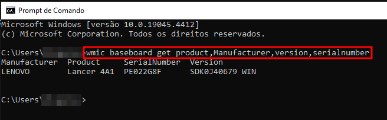
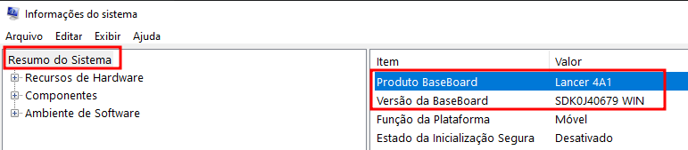

Descobrir o **modelo da placa-mãe** do seu computador pode parecer uma tarefa complicada, mas, na verdade, é mais simples do que você imagina. Seja para **realizar um upgrade**, **substituir uma peça** ou simplesmente satisfazer sua curiosidade, conhecer o **modelo da sua placa-mãe** é essencial. 

Neste artigo, vamos explorar três formas principais de descobrir essa informação valiosa. E não se preocupe, vamos fazer isso de uma maneira **fácil e direta, sem complicações técnicas.**

## Conteúdo

1. [O Que é uma Placa-Mãe?](#o-que-e-uma-placa-mae)
2. [Por Que Saber o Modelo da Placa-Mãe é Importante?](#por-que-saber-o-modelo-da-placa-mae-e-importante)
3. [Métodos para Identificar o Modelo da Placa-Mãe](#metodos-para-identificar-o-modelo-da-placa-mae)
4. [Método 1: Utilizando o Prompt de Comando](#metodo-1-utilizando-o-prompt-de-comando)
    1. [Passo a Passo para Usar o Prompt de Comando](#passo-a-passo-para-usar-o-prompt-de-comando)
    2. [Vantagens de Usar o Prompt de Comando](#vantagens-de-usar-o-prompt-de-comando)
5. [Método 2: Utilizando Softwares de Terceiros](#metodo-2-utilizando-softwares-de-terceiros)
    1. [Softwares Recomendados](#softwares-recomendados)
    2. [Passo a Passo para Usar Softwares de Terceiros](#passo-a-passo-para-usar-softwares-de-terceiros)
    3. [Vantagens de Usar Softwares de Terceiros](#vantagens-de-usar-softwares-de-terceiros)
6. [Método 3: Utilizando o “msinfo32”](#metodo-3-utilizando-o-msinfo-32)
    1. [Passo a Passo para Usar o msinfo32](#passo-a-passo-para-usar-o-msinfo-32)
    2. [Vantagens de Usar o msinfo32](#vantagens-de-usar-o-msinfo-32)
7. [Comparação entre os Métodos](#comparacao-entre-os-metodos)
8. [Dicas Adicionais sobre identificação do modelo da placa-mãe](#dicas-adicionais-sobre-identificacao-do-modelo-da-placa-mae)
9. [Conclusão](#conclusao)
10. [Perguntas Frequentes](#perguntas-frequentes)
11. [Principais Conclusões do Post](#principais-conclusoes-do-post)

## O Que é uma Placa-Mãe?

**A [placa-mãe](https://tecextreme.com.br/o-que-e-uma-placa-mae-e-como-escolher-a-ideal/) é o componente crucial do seu computador. É a peça de hardware que aloca e conecta todos as peças do sistema, como o [processador](https://tecextreme.com.br/o-que-e-cpu-unidade-central-de-processamento/), a memória RAM, o [armazenamento](https://tecextreme.com.br/ssd-ou-hd-entenda-as-diferencas-e-qual-o-melhor/) e outros periféricos, permitindo que eles se comuniquem entre si.** 

Imagine a placa-mãe como o sistema nervoso central do corpo humano que coordena e regula todas as funções e atividades. Assim como o cérebro envia e recebe sinais para e de diferentes partes do corpo, a placa-mãe gerencia a comunicação entre os vários componentes do computador.

## Por Que Saber o Modelo da Placa-Mãe é Importante?

Saber o **modelo da placa-mãe** é fundamental por várias razões. 

Por exemplo, se você pretende **fazer um upgrade**, como **adicionar mais memória RAM** ou trocar o **processador**, você precisa ter certeza de que os novos componentes são **compatíveis** com sua placa-mãe. 

Além disso, para solucionar **problemas de hardware ou atualizar drivers**, conhecer o modelo exato facilita bastante o processo.

## Métodos para Identificar o Modelo da Placa-Mãe

Existem várias formas de descobrir o **modelo da sua placa-mãe**, mas vamos focar nas três mais práticas e eficientes: utilizando o prompt de comando, softwares de terceiros e o msinfo32.

## Método 1: Utilizando o Prompt de Comando

O primeiro método envolve o uso do prompt de comando do Windows. Este método é rápido e não requer a instalação de nenhum software adicional.

### Passo a Passo para Usar o Prompt de Comando

1. **Abrir o Prompt de Comando**: Para acessar o Prompt de Comando, siga estes passos: vá até o menu Iniciar, insira “cmd” no campo de pesquisa e confirme com a tecla Enter. Pode-se também abrir a caixinha de do Executar pela tecla Windows + R e escrever na caixinha “cmd”.

3. **Insira o Comando:** No prompt de comando, você deve inserir

```
wmic baseboard get product,Manufacturer,version,serialnumber 
```

e pressione Enter.

3. **Ver os Resultados**: O modelo da placa-mãe será exibido na tela com outras informações como fabricante e número de série.



### Vantagens de Usar o Prompt de Comando

- **Sem necessidade de software adicional**: Tudo o que você precisa já está no seu sistema operacional.

- **Rápido e fácil**: Em apenas alguns passos, você terá a informação que precisa.

## Método 2: Utilizando Softwares de Terceiros

O segundo método envolve o uso de **softwares de terceiros**. Esses programas são especialmente projetados para fornecer informações detalhadas sobre o hardware do seu computador.

### Softwares Recomendados

Existem diversos softwares disponíveis, mas alguns dos mais populares incluem:

- [**CPU-Z**:](https://www.cpuid.com/softwares/cpu-z.html) Um programa leve que fornece informações detalhadas sobre o processador, memória e placa-mãe.

- [**Speccy**:](https://www.ccleaner.com/pt-br/speccy/download) Desenvolvido pela mesma equipe do CCleaner, este software oferece uma visão geral abrangente de todo o hardware do seu PC.

- [**HWInfo**:](https://www.hwinfo.com/download/) Fornece um panorama completo e minucioso de todos os componentes do seu computador.

### Passo a Passo para Usar Softwares de Terceiros

1. **Baixar e Instalar o Software**: Escolha um dos softwares recomendados e faça o download a partir do site oficial.

3. **Executar o Software**: Após a instalação, abra o programa.

5. **Navegar até a Seção de Placa-Mãe**: Cada software tem uma interface diferente, mas geralmente há uma seção dedicada à placa-mãe onde você pode encontrar o modelo e outras informações relevantes.

### Vantagens de Usar Softwares de Terceiros

- **Informações detalhadas**: Além do modelo da placa-mãe, esses programas fornecem uma visão completa de todos os componentes do seu computador.

- **Interface amigável**: Geralmente, esses softwares têm interfaces gráficas intuitivas que facilitam a navegação.

## Método 3: Utilizando o “msinfo32”

O terceiro método envolve o uso da ferramenta **msinfo32** do Windows. Este aplicativo nativo do Windows oferece uma visão geral detalhada tanto do hardware quanto do software do seu computador pessoal, permitindo que você tenha um entendimento completo do funcionamento interno do seu sistema.

### Passo a Passo para Usar o msinfo32

1. **Abrir o msinfo32**: Pressione as teclas Win (Windows) + R, para aparecer a janelinha do “Executar”, depois digite "msinfo32" no campo (caixinha de texto) e pressione Enter.

3. **Acessar a Seção de Informações do Sistema**: Na janela que se abre, você verá uma visão geral de várias categorias de hardware.

5. **Encontrar as Informações da Placa-Mãe**: Na janela que se abre, procure por “BaseBoard Product” (Produto Baseboard) na seção “System Summary ” (Resumo do Sistema). É possível ver a versão da placa pelo campo de “Baseboard Version” (Versão da Baseboard).



### Vantagens de Usar o msinfo32

- **Integrado ao Windows**: Não há necessidade de instalar software adicional.

- **Informações detalhadas**: Além do modelo da placa-mãe, você obterá uma visão geral completa do hardware e software do seu sistema.

## Comparação entre os Métodos

Cada método tem suas vantagens. O **prompt de comando** é rápido e direto, ideal para quem busca uma solução sem instalar nada. Os **softwares de terceiros** oferecem mais detalhes e uma interface amigável, enquanto o **msinfo32** é uma ferramenta integrada no Windows que pode ser utilizada sem complicações adicionais.

## Dicas Adicionais sobre identificação do modelo da placa-mãe

- **Manter os Drivers Atualizados**: Após descobrir o modelo da sua placa-mãe, é importante manter os drivers sempre atualizados para garantir o melhor desempenho.

- **Verificar a Compatibilidade de Componentes**: Antes de realizar qualquer upgrade, sempre verifique a compatibilidade dos novos componentes com sua placa-mãe.

- **Consultar o Manual do Usuário**: Se encontrar dificuldades, pode-se verificar o manual do usuário da sua placa-mãe, que pode ser encontrado no site do fabricante.

## Conclusão

Identificar o **modelo da placa-mãe** do seu computador não tem que ser um processo difícil. Com os métodos que abordamos, você pode facilmente obter essa informação crucial de maneira rápida e eficiente. Seja utilizando o **prompt de comando**, **softwares de terceiros** ou o **msinfo32**, agora você está bem equipado para entender melhor o hardware do seu PC.

## Perguntas Frequentes

**1\. Posso danificar meu computador ao usar o prompt de comando?**

Não, usar o prompt de comando para obter informações sobre o hardware é completamente seguro e não causará nenhum dano ao seu computador.

**2\. Os softwares de terceiros são gratuitos?**

Muitos softwares de terceiros, como o CPU-Z e o Speccy, oferecem versões gratuitas com todas as funcionalidades necessárias para identificar o modelo da placa-mãe.

**3\. Preciso desinstalar o software após usá-lo?**

Não é necessário, mas você pode desinstalá-lo se preferir liberar espaço no seu disco rígido. A decisão é sua.

**4\. Qual método é melhor para iniciantes?**

Para iniciantes, o uso de softwares de terceiros é geralmente mais fácil devido às interfaces gráficas intuitivas.

**5\. É possível descobrir o modelo da placa-mãe em um laptop?**

Sim, todos os métodos mencionados funcionam tanto para desktops quanto para laptops.

## Principais Conclusões do Post

- **A importância de saber o modelo da placa-mãe**: Entender o modelo da sua placa-mãe é crucial para realizar upgrades, solucionar problemas e garantir a compatibilidade de novos componentes.

- **Três métodos fáceis**: Exploramos três formas práticas e acessíveis para identificar o modelo da sua placa-mãe:
    - Utilizando o **prompt de comando** do Windows para uma solução rápida e sem necessidade de instalar software adicional.
    
    - Usando **softwares de terceiros** como CPU-Z e Speccy, que fornecem informações detalhadas sobre o hardware do seu computador.
    
    - Verificando o modelo pela ferramenta **msinfo32** integrada ao Windows, que oferece uma visão geral detalhada do sistema.

- **Passo a passo detalhado**: Cada método é explicado minuciosamente para garantir que qualquer pessoa possa seguir e obter as informações necessárias sem complicações.

- **Comparação de métodos**: Discutimos as vantagens de cada método para que você possa escolher o mais adequado às suas necessidades, seja pela rapidez, detalhamento das informações ou facilidade de uso.

- **Dicas adicionais**: Fornecemos orientações úteis para manter os drivers do seu sistema atualizados e verificar a compatibilidade dos componentes antes de realizar upgrades.
