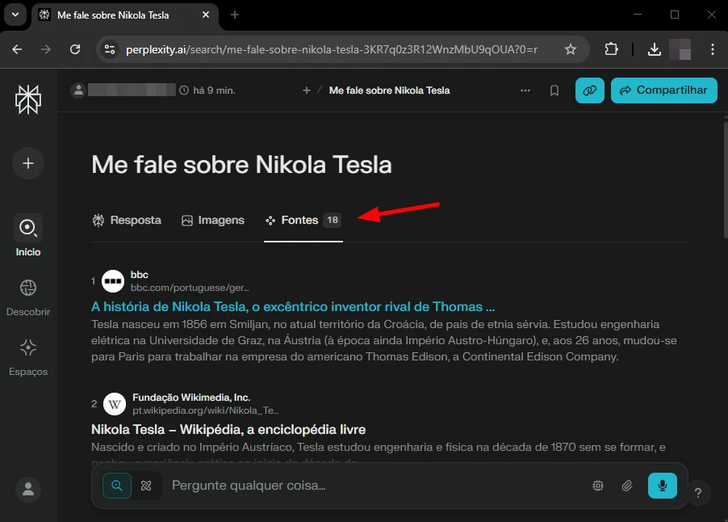
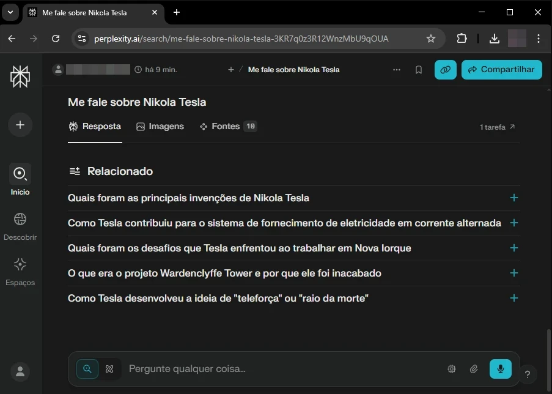
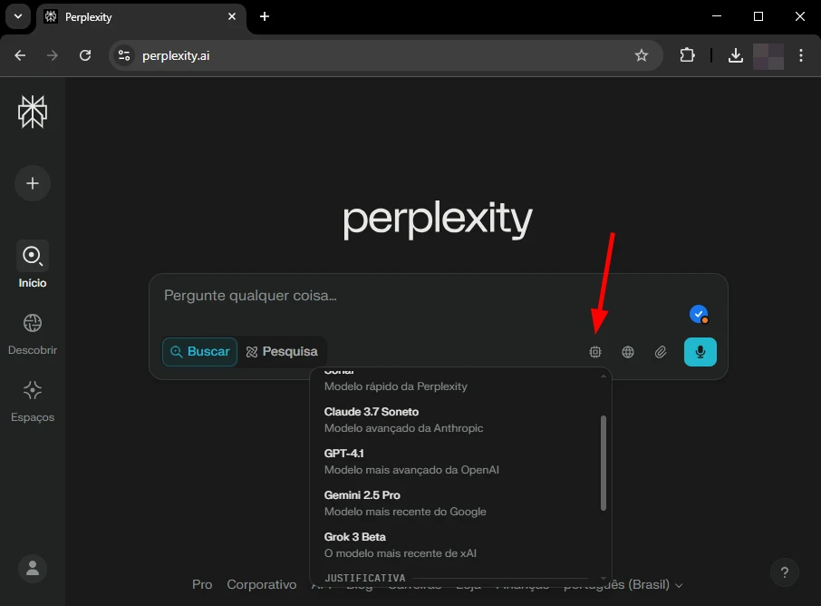
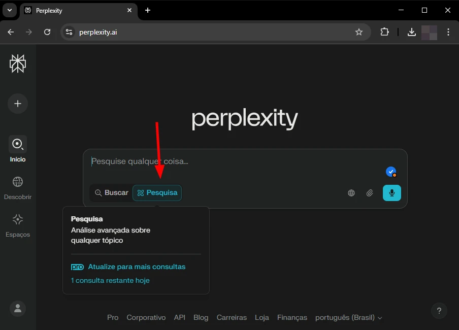
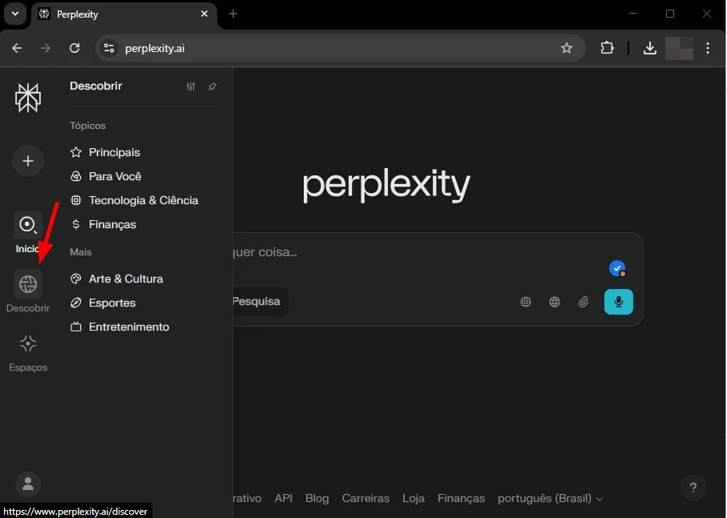

As **funcionalidades do Perplexity** apresentam diferenciais notáveis no cenário de **IAs generativas**. Sabemos que a **[inteligência artificial](https://tecextreme.com.br/categoria/inteligencia-artificial/)** mais conhecida é o **ChatGPT**, criado pela **[OpenAI](https://en.wikipedia.org/wiki/OpenAI)**, mas o Perplexity tem chamado atenção por focar em respostas mais diretas e recursos voltados à pesquisa inteligente. Compreender essas características distintas é fundamental para otimizar buscas e obter informações confiáveis, indo além das respostas básicas.

Neste artigo de blog, será apresentado **5 recursos exclusivos encontrados no Perplexity AI**. A análise foca em aspectos como citação de fontes, modos de pesquisa direcionada e organização. O objetivo é fornecer uma visão clara das vantagens que essas **funcionalidades do Perplexity** oferecem para quem busca mais controle e profundidade.

## Conteúdo do Post...

1. [O Que é Perplexity AI?](#o-que-e-perplexity-ai)
2. [#1. Citação Automática de Fontes: Transparência nas Respostas](#1-citacao-automatica-de-fontes-transparencia-nas-respostas)
3. [#2. Perguntas Relacionadas: Sugestão das pesquisas realizadas por outras pessoas](#2-perguntas-relacionadas-sugestao-das-pesquisas-realizadas-por-outras-pessoas)
4. [#3. Escolha do modelo de IA's diferentes para realizar as consultas](#3-escolha-do-modelo-de-i-as-diferentes-para-realizar-as-consultas)
5. [#4. Deep Research: Respostas turbinadas com Perplexity](#4-deep-research-respostas-turbinadas-com-perplexity)
6. [#5. Funcionalidade Discover:](#5-funcionalidade-discover)
7. [Conclusão](#conclusao)
8. [Seção de FAQs (Perguntas Frequentes)](#secao-de-fa-qs-perguntas-frequentes)

## O Que é Perplexity AI?

O Perplexity AI é como um buscador moderno que usa inteligência artificial para entender melhor o que está sendo pesquisado e trazer respostas mais claras e dentro do contexto certo. Diferente de buscadores tradicionais, ela não apenas lista links, mas interpreta perguntas para fornecer insights diretos.

Com base em informações atualizadas e de fontes confiáveis, o Perplexity entrega resultados que ajudam a encontrar respostas seguras durante a pesquisa. Isso torna a plataforma ideal para pesquisas acadêmicas, profissionais ou pessoais.

O modo de pesquisar agora está diferente, em outro nível, isso faz com que essa ferramenta concorra com o buscador mais famoso do mundo: Google.

## #1. Citação Automática de Fontes: Transparência nas Respostas

<figure>

<figcaption>

Print do Perplexity — Créditos: Diógenes Souza/TecExtreme

</figcaption>

</figure>

Uma das características mais marcantes do Perplexity é sua capacidade de fornecer as fontes utilizadas para gerar uma resposta. Ao contrário de muitos modelos que operam como "caixas-pretas", o Perplexity realiza buscas na web em tempo real e apresenta links diretos para os artigos, sites ou documentos consultados.

**A Vantagem da Verificabilidade**

Essa abordagem oferece um nível de transparência crucial. Pense nisso como receber uma resposta de um assistente de pesquisa que não apenas entrega o resumo, mas também a bibliografia completa. É possível clicar nos links, avaliar a credibilidade das fontes e aprofundar o estudo diretamente na origem da informação. Essa é uma das **funcionalidades do Perplexity** que o torna especialmente útil para tarefas que exigem rigor e confiabilidade, como pesquisas acadêmicas ou profissionais. A checagem de fatos torna-se um processo muito mais direto.

## #2. Perguntas Relacionadas: Sugestão das pesquisas realizadas por outras pessoas

<figure>

<figcaption>

Print do Perplexity — Créditos: Diógenes Souza/TecExtreme

</figcaption>

</figure>

Após fornecer uma resposta inicial, o Perplexity frequentemente sugere um conjunto de perguntas relacionadas ao tópico pesquisado. Essa funcionalidade atua como um catalisador para aprofundar o entendimento e explorar diferentes facetas de um assunto.

**Ampliando o Conhecimento sobre um Tópico**

Ao invés de simplesmente aguardar o próximo comando, o sistema antecipa possíveis dúvidas ou áreas de interesse subsequentes, fazendo com que o usuário faça à descoberta de informações valiosas que talvez não fossem consideradas inicialmente. Para quem está aprendendo sobre um novo campo ou realizando uma investigação ampla, essas sugestões automáticas são uma ferramenta poderosa para garantir uma cobertura mais completa do tema.

## #3. Escolha do modelo de IA's diferentes para realizar as consultas

<figure>

<figcaption>

Print do Perplexity — Créditos: Diógenes Souza/TecExtreme

</figcaption>

</figure>

Uma das funcionalidades do Perplexity permite a troca do modelo de inteligência artificial responsável por fornecer as respostas. Essa característica permite que o usuário possa testar a mesma pesquisa (ou até mesmo pesquisas direntes) com outras opções de inteligências artificiais, como, por exemplo, o Grok 3 Beta, Claude 3. 7 Soneto, GPT 4. 1 e Gemini 2. 5 Pro. Cada um desses modelos apresenta uma abordagem distinta, o que pode contribuir para obtenção de explicações mais claras ou mais diretas, conforme o tema de interesse do usuário.

Ao escolher o modelo, dá para adaptar a consulta ao que se precisa no momento — seja algo mais direto, mais explicativo ou com referências detalhadas. Isso torna a ferramenta ainda mais flexível e útil para diferentes tipos de pesquisa.

## #4. Deep Research: Respostas turbinadas com Perplexity

<figure>

<figcaption>

Print do Perplexity — Créditos: Diógenes Souza/TecExtreme

</figcaption>

</figure>

Entre as funcionalidades do Perplexity, o Deep Research se destaca por oferecer respostas com mais profundidade. Ideal para pesquisas mais exigentes, esse recurso aprofunda a análise e entrega dados bem mais ricos do que o básico. Essa funcionalidade é capaz de realizar, em poucos minutos, uma pesquisa detalhada que levaria horas para ser concluída por especialistas humanos.

A ferramenta utiliza um processo semelhante ao raciocínio humano: ela busca documentos relevantes, analisa informações e ajusta sua estratégia à medida que aprende mais sobre o tema. Esse método garante resultados precisos e bem estruturados.

Após coletar e interpretar os dados, o sistema gera um relatório organizado e fácil de entender, reunindo todas as fontes consultadas de forma clara e objetiva.

Além disso, o usuário pode exportar o resultado final em formatos como PDF ou documento, ou até transformá-lo em uma página compartilhável no próprio Perplexity, facilitando a colaboração com colegas ou amigos.

## #5. Funcionalidade Discover:

<figure>

<figcaption>

Print do Perplexity — Créditos: Diógenes Souza/TecExtreme

</figcaption>

</figure>

O Discover **funciona como uma espécie de "For You" page (página "Para Você")** — semelhante ao TikTok, Instagram Reels e YouTube Shorts — **trazendo conteúdos selecionados com base em temas de interesse**, como negócios, **tecnologia**, esportes, entre outros.

A ideia é simples: facilitar o acesso a notícias e tendências que estão em alta, tudo de forma rápida e centralizada.

**Passo a passo para acessar e utilizar a função de Discover do Perplexity**

1. Acesse sua conta no Perplexity AI.

3. No menu lateral, clique em "Discover".

5. Explore os tópicos disponíveis como _AI_, _Negócios_, _Esportes_ etc.

7. Clique em um tema de interesse (ex: _Finanças_) e depois em "Salvar Interesse".

9. Navegue pelas coleções de conteúdos curados por outros usuários, com fontes variadas e sugestões de leitura relacionadas.

## Conclusão

Nest post vimos algumas funcionalidades do Perplexity que são de extrema importância para o usuário. Esse conjunto de funcionalidades, oferecem um valor unico para quem está usando a ferramenta. A plataforma se destaca por ir além da simples geração de texto, oferecendo um ambiente robusto para pesquisa e produtividade.

Entre as várias soluções de inteligência artificial (tantos outros modelos), o Perplexity se destaca pelas funcionalidades que tornam a busca feita pelo usuário muito mais eficiente. Considerar suas capacidades exclusivas é crucial ao selecionar a solução de IA mais alinhada a objetivos específicos de pesquisa e gestão do conhecimento, potencializando a forma como a informação é acessada e utilizada.

## Seção de FAQs (Perguntas Frequentes)

1. **Para usar o Perplexity AI é preciso pagar?**Não. A ferramenta oferece uma versão gratuita robusta, mas também possui funcionalidades premium para quem deseja explorar recursos mais avançados.

3. **Quais são as limitações ao usar Perplexity AI?**Embora eficiente, a plataforma pode ter restrições em consultas extremamente específicas ou sem contexto claro. Além disso, o acesso a algumas funções premium pode ser limitado na versão gratuita.

5. **Qual o melhor: ChatGPT ou Perplexity?**Depende de como o usuário vai usar. O **ChatGPT** é bom na parte geração de texto criativo e construção de texto, enquanto o Perplexity AI funciona como um mecanismo de busca e se destaca em pesquisas com fontes verificadas e respostas contextualizadas.

7. **De quem é a IA Perplexity?**A Perplexity AI foi desenvolvida pela empresa Perplexity, uma startup focada em inovar no campo da pesquisa digital usando inteligência artificial.

9. **O que significa Perplexity?**  
    Perplexidade é um termo que indica a dificuldade ou a complexidade de entender algo. Quando falamos de inteligência artificial, ela mostra o quão bem o modelo consegue prever as próximas palavras em uma frase, ajudando a tornar suas respostas mais precisas.
