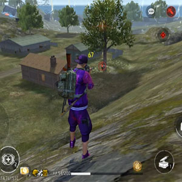
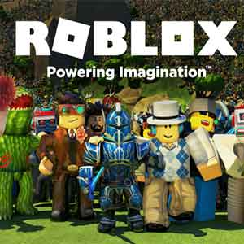
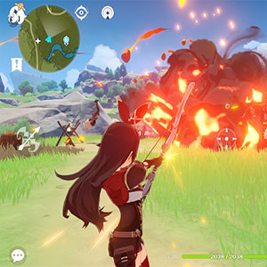
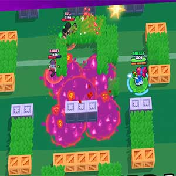

Os **_jogos para Android_** se tornaram uma febre global, oferecendo entretenimento ao alcance das mãos. Com milhões de downloads diários, esses [jogos](https://tecextreme.com.br/categoria/games-jogos/) conquistam desde casual gamers até entusiastas de gráficos avançados.

A **[Google Play Store](https://play.google.com/store/games?hl=pt_BR)** é um verdadeiro tesouro, com milhares de opções gratuitas que vão desde **jogos casuais** até experiências imersivas como **FPS** e **RPGs**. Este artigo apresentará os **5 melhores jogos grátis** e ainda destacará menções honrosas imperdíveis!

## Conteúdo do post...

1. [Por que os Jogos para Android São Populares?](#por-que-os-jogos-para-android-sao-populares)
2. [Critérios para Escolher os Melhores Jogos para Android](#criterios-para-escolher-os-melhores-jogos-para-android)
3. [Conheça os Top 5 Jogos para Android Disponíveis Gratuitamente](#conheca-os-top-5-jogos-para-android-disponiveis-gratuitamente)
    1. [#1 Free Fire](#1-free-fire)
    2. [#2 Roblox](#2-roblox)
    3. [#3 Genshin Impact](#3-genshin-impact)
    4. [#4 Brawl Stars](#4-brawl-stars)
    5. [#5 Blood Strike](#5-blood-strike)
4. [Menções Honrosas: Mais Opções Incríveis de Jogos para Celular](#mencoes-honrosas-mais-opcoes-incriveis-de-jogos-para-celular)
5. [Dicas para Aproveitar ao Máximo os Jogos para Android](#dicas-para-aproveitar-ao-maximo-os-jogos-para-android)
6. [Conclusão](#conclusao)
7. [FAQ (Perguntas Frequentes)](#faq-perguntas-frequentes)

## Por que os Jogos para Android São Populares?

A **_facilidade de acesso_** é um dos grandes motivos para a popularidade dos jogos para Android. Com a _Google Play Store_ disponível em praticamente todos os dispositivos, baixar jogos nunca foi tão simples.

A diversidade de gêneros também impressiona: desde **FPS** e **RPGs** até **simuladores** e **Battle Royale**, há opções para todos os gostos. Essa variedade garante que qualquer jogador encontre algo alinhado ao seu estilo.

Outro ponto crucial é a _gratuidade_. Muitos dos **jogos grátis** oferecem experiências completas sem custos iniciais, tornando o entretenimento acessível para milhões de usuários ao redor do mundo.

Por fim, a _jogabilidade intuitiva_ e a constante evolução dos gráficos fazem com que os jogadores se sintam imersos. Isso explica por que os **melhores jogos para Android** continuam dominando as paradas de downloads.

## Critérios para Escolher os Melhores Jogos para Android

Os **_gráficos e design_** são essenciais para atrair jogadores. Títulos com visuais impressionantes, como _aventuras_ ou simuladores, tendem a se destacar na multidão de **jogos para Android**.

A _jogabilidade envolvente_ é outro fator decisivo. Mecânicas intuitivas e controles responsivos garantem uma experiência fluida, especialmente em jogos de **multiplayer** ou FPS intensos.

As **avaliações de jogos** também desempenham um papel crucial. Com base nas notas e comentários na _Google Play Store_, é possível identificar quais títulos oferecem mais **diversão** e qualidade.

Por fim, a facilidade de _download e instalação_ é fundamental. Um jogo leve e rápido para baixar amplia o acesso, tornando-o ainda mais popular entre os usuários de dispositivos Android.

## Conheça os Top 5 Jogos para Android Disponíveis Gratuitamente

### #1 Free Fire

Free Fire é um dos **jogos Battle Royale** mais populares da atualidade, especialmente entre os jogadores de dispositivos móveis. O jogo coloca 50 jogadores em uma ilha remota, onde o objetivo é ser o último sobrevivente. Com partidas rápidas de cerca de 10 minutos, ele se destaca por sua dinâmica acelerada, perfeita para quem busca sessões de jogo intensas, mas curtas.

A _jogabilidade competitiva_ é um dos grandes diferenciais do Free Fire. Os jogadores podem escolher entre diferentes classes de personagens, cada uma com habilidades únicas, como cura ou aumento de velocidade. Além disso, o jogo oferece uma ampla variedade de armas e itens, permitindo estratégias personalizadas. Essa flexibilidade faz dele um dos **jogos populares Android**, atraindo milhões de downloads na _Google Play Store_.

O _multiplayer emocionante_ é outro ponto alto do Free Fire. Seja jogando sozinho ou em equipes de até quatro jogadores, a interação social é constante. O jogo também inclui modos especiais, como o Clash Squad, que oferece partidas ainda mais rápidas e cheias de ação. A comunidade ativa e os eventos frequentes garantem que sempre haja algo novo para explorar, mantendo os jogadores engajados.

Os _gráficos otimizados_ são um dos motivos pelos quais o Free Fire funciona tão bem em celulares. Apesar de não ser o jogo com os gráficos mais avançados do mercado, sua simplicidade visual garante uma experiência fluida mesmo em dispositivos de entrada. Isso, combinado com controles intuitivos e personalizáveis, faz dele uma escolha acessível para qualquer jogador. Não é à toa que o Free Fire continua sendo um dos **jogos grátis** mais baixados e amados no Android.

### #2 Roblox

Roblox é muito mais do que um jogo; é uma _plataforma de criação e exploração de mundos virtuais_ que permite aos jogadores dar asas à sua criatividade. Nele, os usuários podem desenvolver seus próprios jogos ou explorar experiências criadas por outros jogadores ao redor do mundo. Essa flexibilidade faz do Roblox um dos **simuladores** mais versáteis disponíveis no Android, atraindo tanto jogadores casuais quanto desenvolvedores iniciantes.

A combinação de _aventura e simulação_ é o que torna o Roblox tão envolvente. Os jogadores podem participar de corridas emocionantes, batalhas épicas, simulações de trabalho ou até mesmo construir suas próprias cidades. Com milhares de mini-jogos disponíveis, há sempre algo novo para descobrir. Além disso, o ambiente multiplayer permite que amigos joguem juntos, tornando a experiência ainda mais social e divertida.

Um dos destaques do Roblox é sua capacidade de atrair diferentes perfis de jogadores. Enquanto alguns preferem criar e compartilhar suas próprias experiências, outros se concentram em explorar os mundos já existentes. Isso faz com que ele seja considerado um dos **jogos casuais** mais acessíveis, mas também profundo o suficiente para manter os jogadores engajados por horas a fio. A comunidade ativa e colaborativa é outro ponto forte da plataforma.

Os gráficos simplistas e coloridos do Roblox podem não impressionar à primeira vista, mas são parte essencial de sua identidade. Eles garantem que o jogo funcione perfeitamente em dispositivos Android, mesmo os menos potentes. Além disso, o sistema de personalização de avatares e a possibilidade de ganhar itens exclusivos adicionam camadas extras de diversão. Não é à toa que o **Roblox** continua sendo uma das plataformas mais populares entre jogadores de todas as idades.

### #3 Genshin Impact

Genshin Impact é um _RPG de mundo aberto_ que rapidamente se tornou um fenômeno global. Com uma história envolvente e personagens carismáticos, o jogo leva os jogadores a explorar o vasto mundo de Teyvat. Sua narrativa rica e missões secundárias cativantes garantem horas de imersão para os fãs de RPG.

Os _gráficos deslumbrantes_ são um dos maiores destaques do Genshin Impact. Com visuais comparáveis aos consoles, o jogo apresenta paisagens vibrantes, efeitos de luz impressionantes e designs detalhados. Essa qualidade visual eleva a experiência, consolidando sua posição como um dos **melhores jogos no Android** disponíveis atualmente.

A _jogabilidade rica_ combina exploração, combate dinâmico e coleta de recursos. Os jogadores podem formar equipes com diferentes personagens, cada um com habilidades únicas, criando estratégias variadas. O sistema de gacha para novos personagens também adiciona um elemento de surpresa e progressão constante.

Além disso, o Genshin Impact oferece eventos sazonais e atualizações frequentes, mantendo o conteúdo sempre fresco. A possibilidade de jogar tanto no celular quanto em outros dispositivos amplia sua acessibilidade. Não é à toa que ele é considerado um marco nos **jogos grátis** para Android.

### #4 Brawl Stars

Brawl Stars é um _jogo multiplayer_ que se destaca por sua ação rápida e partidas dinâmicas, perfeitas para quem busca diversão em sessões rápidas. Com controles simples e jogabilidade envolvente, ele se tornou um dos **jogos casuais** mais populares no Android. Cada partida dura apenas alguns minutos, ideal para momentos de pausa no dia a dia.

Os _personagens cativantes_ são um dos grandes atrativos do jogo. Cada "brawler" possui habilidades únicas e designs marcantes, desde caubóis até cientistas malucos. Além disso, os jogadores podem evoluir seus personagens, desbloqueando novas skins e poderes. Essa variedade mantém o jogo sempre interessante e recompensador.

O destaque fica por conta dos _modos variados de jogo_, como o emocionante Gem Grab ou o caótico Showdown. Cada modo oferece uma experiência única, garantindo que os jogadores nunca fiquem presos à mesma dinâmica. Essa diversidade faz do Brawl Stars uma fonte constante de **entretenimento** para todos os tipos de gamers.

Com gráficos coloridos e uma atmosfera leve, o jogo é acessível para qualquer público. A interação com amigos em equipes ou competições adiciona um toque social ao **Brawl Stars**, tornando-o ainda mais envolvente. Não é à toa que ele conquistou milhões de downloads na Google Play Store.

### #5 Blood Strike

Blood Strike é um _FPS_ que traz combates intensos e estratégicos, perfeito para fãs de ação rápida e táticas bem planejadas. O jogo oferece partidas multiplayer repletas de adrenalina, onde cada movimento pode definir o resultado da batalha. Sua jogabilidade direta o torna acessível, mas com profundidade suficiente para desafiar os jogadores.

A _experiência imersiva_ é garantida por gráficos detalhados e mapas bem projetados, criando um ambiente realista para os combates. O foco em estratégia exige que os jogadores trabalhem em equipe, escolham armas cuidadosamente e usem o cenário a seu favor. Esses elementos fazem do Blood Strike uma ótima opção para quem ama **jogos grátis** de tiro no Android.

Os modos variados, como Team Deathmatch e Bomb Mode, mantêm a experiência sempre renovada. Cada modo oferece desafios únicos, exigindo diferentes abordagens e habilidades. Além disso, o sistema de progressão permite desbloquear novas armas e personalizações, aumentando o engajamento dos jogadores ao longo do tempo.

Com controles intuitivos e otimização para dispositivos móveis, o Blood Strike entrega uma experiência fluida sem comprometer a qualidade. Seu equilíbrio entre estratégia e ação o torna um dos melhores representantes do gênero **FPS** na Google Play Store, conquistando fãs de jogos de tiro em primeira pessoa.

## Menções Honrosas: Mais Opções Incríveis de Jogos para Celular

- **Clash of Clans**Clash of Clans é um jogo de estratégia onde os jogadores constroem vilarejos, treinam tropas e competem em batalhas multiplayer. A dinâmica envolve planejar defesas impenetráveis enquanto ataca bases inimigas para coletar recursos. Seu equilíbrio entre estratégia e progressão contínua o torna um dos **jogos mais baixados** no Android.

- **Candy Crush Saga**Candy Crush Saga é um puzzle casual que desafia os jogadores a combinar doces coloridos para completar níveis com objetivos específicos. Com mecânicas simples, mas desafiadoras, o jogo oferece uma experiência viciante e perfeita para sessões rápidas. Sua popularidade o coloca entre os **jogos casuais** favoritos na Play Store.

- **My Talking Tom**My Talking Tom é um simulador de cuidado com um gato virtual, onde os jogadores alimentam, brincam e interagem com o animal para mantê-lo feliz. A dinâmica relaxante e visual cativante atrai jogadores de todas as idades. É uma ótima escolha para quem busca entretenimento leve e divertido.

- **8 Ball Pool**8 Ball Pool traz o clássico jogo de bilhar para celulares, com partidas online contra jogadores reais. O controle intuitivo e as competições emocionantes garantem uma experiência imersiva. É um dos jogos mais populares para quem gosta de esportes e disputas estratégicas.

- **Among Us!**Among Us! é um jogo social de dedução e traição, onde os jogadores trabalham juntos para completar tarefas enquanto identificam impostores infiltrados. A dinâmica cooperativa e cheia de suspense o tornou um fenômeno global, especialmente para grupos de amigos em busca de diversão multiplayer.

- **Squad Busters**Squad Busters é um jogo de ação multiplayer onde personagens icônicos se enfrentam em batalhas dinâmicas e rápidas. A combinação de habilidades únicas e estratégias em equipe cria uma experiência competitiva e envolvente. É ideal para fãs de jogos casuais com toques de RPG.

- **Pizza Ready**Pizza Ready é um simulador de gerenciamento de restaurante onde os jogadores preparam e entregam pizzas sob pressão de tempo. A mecânica simples e desafiadora oferece uma experiência relaxante, mas divertida. É perfeito para quem gosta de jogos de simulação com foco em organização.

- **Stumble Guys**Stumble Guys é uma competição multiplayer estilo "corrida maluca", onde os jogadores enfrentam obstáculos hilários até chegarem à linha de chegada. A jogabilidade caótica e visual colorido garantem momentos de risadas e adrenalina. É um dos **jogos populares Android** para partidas casuais.

- **Call of Duty: Warzone Mobile**Call of Duty: Warzone Mobile é um FPS de alta qualidade com combates intensos e gráficos realistas. O jogo oferece modos multiplayer variados, desde batalhas táticas até confrontos em larga escala. Sua jogabilidade imersiva o torna essencial para fãs de jogos de tiro em primeira pessoa no Android.

## Dicas para Aproveitar ao Máximo os Jogos para Android

O _gerenciamento de espaço_ é essencial para quem deseja baixar novos jogos frequentemente. Apague arquivos desnecessários, como fotos duplicadas ou aplicativos pouco usados, para liberar espaço no celular. Isso garante que sempre haja memória disponível para seus **downloads** favoritos na Google Play Store.

Uma _conexão estável_ é crucial para aproveitar jogos multiplayer sem interrupções. Wi-Fi de qualidade ou uma rede móvel robusta podem fazer toda a diferença em experiências online, especialmente em títulos como Free Fire ou Call of Duty: Warzone Mobile. Sem uma boa internet, até os **jogos mais baixados** podem perder sua graça.

_Explorar novos gêneros_ pode abrir portas para experiências inesperadas. Experimente algo diferente, como o desafiador _Monster Hunter Puzzles_ ou simuladores relaxantes como My Talking Tom. Essa diversidade enriquece sua biblioteca e torna suas sessões de jogo ainda mais interessantes.

Por fim, siga **_dicas de jogos_** em blogs e fóruns para descobrir títulos escondidos na Play Store. Muitos jogos incríveis passam despercebidos, mas com boas recomendações, você pode encontrar verdadeiras pérolas que valem cada segundo de gameplay.

## Conclusão

Os **_jogos para Android_** provam que há opções para todos os gostos, desde aventuras épicas até puzzles casuais. Seja qual for seu estilo, a Google Play Store oferece uma ampla variedade de títulos que garantem horas de diversão e entretenimento.

_Experimente os jogos mencionados_ neste artigo e descubra novos mundos e jogabilidades diferentes. Compartilhe esta publicação com outros jogadores!

_Baixe agora os melhores jogos para Android_ e aproveite ao máximo o que o mundo dos games móveis tem a oferecer. Com tantas opções incríveis disponíveis, nunca foi tão fácil encontrar algo perfeito.

## FAQ (Perguntas Frequentes)

1. **Quais são os melhores jogos gratuitos para Android?**Os **_melhores jogos grátis_** incluem títulos como Free Fire, Genshin Impact e Roblox. Esses jogos oferecem experiências variadas, desde Battle Royale até RPGs de mundo aberto, garantindo diversão para todos os perfis de jogadores.

3. **Qual o jogo top 1 da Play Store?**O título de _top 1_ pode variar ao longo do tempo, mas jogos como **Free Fire** e **Genshin Impact** frequentemente lideram as paradas. Suas combinações de jogabilidade e gráficos impressionantes os mantêm no topo das listas de downloads.

5. **Qual foi o jogo mais jogado da Play Store em 2024?**Em 2024, o _jogo mais jogado_ foi o **Squad Busters**, um multiplayer dinâmico com personagens icônicos. Sua popularidade reflete a crescente demanda por jogos casuais, mas competitivos, no Android.

7. **Qual é o melhor jogo free?**O _melhor jogo free_ depende do gênero preferido, mas títulos como **Among Us!** e **Call of Duty: Warzone Mobile** se destacam pela jogabilidade envolvente e comunidade ativa. Ambos são ótimas escolhas para quem busca qualidade sem custo.

9. **O que jogar no Android?**Experimente opções como **Stumble Guys**, **Pizza Ready** ou simuladores como My Talking Tom. A variedade de gêneros na Play Store garante que sempre haja algo novo e emocionante para explorar no Android.

11. **Quais são os jogos em alta para 2024?**Jogos como **Monster Hunter Puzzles**, **Blood Strike** e **Roblox** estão em alta em 2024. Esses títulos combinam inovação e jogabilidade acessível, conquistando milhões de jogadores ao redor do mundo.

13. **Qual é o jogo com a maior avaliação da Play Store?**O _jogo mais bem avaliado_ é frequentemente o **Genshin Impact**, graças aos seus gráficos deslumbrantes e narrativa envolvente. As avaliações dos usuários destacam sua qualidade como um dos melhores RPGs disponíveis.

15. **Qual é o melhor jogo offline para Android?**Para quem prefere jogar offline, **My Talking Tom** e outros simuladores são ótimas opções. Eles oferecem experiências completas sem a necessidade de conexão constante, perfeitos para momentos desconectados.
