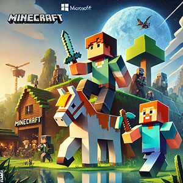
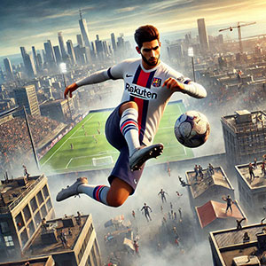
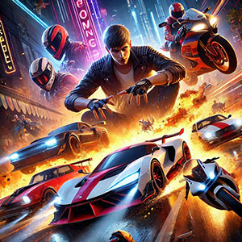
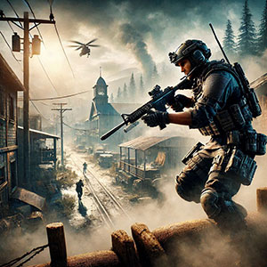
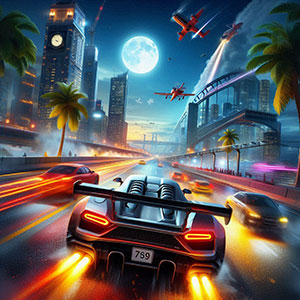
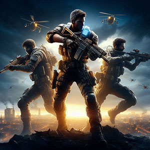

No vasto universo dos games para PC, encontrar **jogos grátis para Windows** e de qualidade sem gastar é uma verdadeira conquista. Felizmente, a **Microsoft Store** oferece uma seleção de jogos gratuitos que proporcionam experiências memoráveis. 

Então, se a ideia é curtir títulos incríveis sem investir um centavo, a lista a seguir traz **7 jogos gratuitos e imperdíveis para Windows**. Prepare o teclado, ajuste o mouse e embarque nessa jornada, porque a diversão está garantida!

1. [Por que optar por jogos da Microsoft Store?](#por-que-optar-por-jogos-da-microsoft-store)
2. [Critérios para a seleção dos melhores jogos gratuitos](#criterios-para-a-selecao-dos-melhores-jogos-gratuitos)
3. [Lista dos 7 jogos grátis para Windows](#lista-dos-7-jogos-gratis-para-windows)
4. [Como baixar os jogos grátis para Windows na Microsoft Store](#como-baixar-jogos-na-microsoft-store)
5. [Dicas para otimizar sua experiência de jogo](#dicas-para-otimizar-sua-experiencia-de-jogo)
6. [Conclusão](#conclusao)
7. [FAQs (Perguntas Frequentes)](#fa-qs-perguntas-frequentes)

## Por que optar por jogos da Microsoft Store?

A **Microsoft Store** é uma das melhores opções para quem procura **jogos grátis para Windows** com segurança e praticidade. Uma das grandes vantagens da plataforma é a **verificação rigorosa** realizada em cada título antes de sua publicação. Isso garante uma experiência totalmente livre de malwares, protegendo o computador contra possíveis ameaças e proporcionando tranquilidade ao jogador. _Diferentemente de outras fontes menos confiáveis, a Microsoft Store é sinônimo de confiabilidade_.

Além disso, a **integração perfeita com o sistema Windows** é outro destaque. Os jogos podem ser instalados rapidamente, sem complicações, e as atualizações são realizadas automaticamente, garantindo que sempre se tenha a versão mais recente de cada título. _Essa conexão direta com o **[sistema operacional](https://tecextreme.com.br/o-que-e-sistema-operacional-e-principais-funcoes/)** melhora a experiência geral do usuário_, tornando o processo mais eficiente e sem preocupações com compatibilidade ou configurações complexas.

Outro atrativo é a **variedade de opções disponíveis**. A loja conta com uma ampla gama de gêneros, que vão desde **jogos de ação e aventura** até **corridas, puzzles e simuladores**. Com essa diversidade, é possível encontrar títulos que atendam a diferentes preferências, sejam elas voltadas para desafios estratégicos, competições online ou aventuras imersivas. Tudo isso faz com que a Microsoft Store seja uma opção indispensável para os amantes de games.

Por fim, vale destacar que muitos desses **jogos gratuitos** oferecem funcionalidades como **multiplayer online**, atualizações constantes e gráficos impressionantes, características que normalmente são esperadas em títulos pagos. Optar pela Microsoft Store é investir em uma experiência rica e acessível, que coloca os jogadores em contato com o que há de melhor no universo dos games sem nenhum custo.

## Critérios para a seleção dos melhores jogos gratuitos

A escolha dos **melhores jogos grátis para Windows** na **Microsoft Store** exige atenção a alguns critérios fundamentais que garantem uma experiência de qualidade. Um dos aspectos mais importantes é a **qualidade gráfica e sonora**. Jogos com visuais detalhados e trilhas sonoras imersivas proporcionam uma conexão mais profunda com o jogador, criando atmosferas envolventes que tornam cada partida inesquecível. _Seja explorando cenários fantásticos ou competindo em corridas de alta velocidade, esses elementos elevam o nível de diversão e realismo._

Outro ponto essencial é a **jogabilidade envolvente e intuitiva**. Jogos que oferecem controles fáceis de aprender e mecânicas que incentivam a exploração ou o desafio contínuo são os mais cativantes. _A fluidez das ações e a possibilidade de experimentar diferentes estilos de jogo, como aventuras, simuladores ou competições multiplayer, são características marcantes dos títulos mais populares._ Quanto mais acessível e atrativo o gameplay, maior a chance de o jogador voltar e recomendar o título.

Por fim, é crucial considerar o **feedback positivo da comunidade gamer** e o **suporte ativo dos desenvolvedores**. Jogos bem avaliados por outros usuários refletem uma experiência satisfatória e indicam qualidade no produto. Além disso, títulos que recebem atualizações frequentes mostram que os desenvolvedores estão comprometidos em corrigir bugs, adicionar conteúdos novos e melhorar a experiência. _Esses fatores reforçam a confiança do público e garantem a relevância contínua do jogo._

Com esses critérios, é possível identificar os jogos gratuitos que realmente valem a pena e aproveitar ao máximo o catálogo diversificado da **Microsoft Store**.

## Lista dos 7 jogos grátis para Windows

### #1 [Roblox](https://www.xbox.com/pt-BR/games/store/roblox/9nblgggzm6wm)

**Roblox** é mais do que um jogo; é uma plataforma que combina **criatividade e interação social**. Permite aos jogadores criarem seus próprios mundos virtuais e explorarem criações de outros usuários, transformando ideias em realidades digitais. 

_Desde sua criação em 2006, Roblox tem sido um espaço para jovens e adultos compartilharem experiências imersivas, com opções que variam de aventuras épicas a simuladores de vida._ Além disso, a comunidade ativa e as atualizações frequentes fazem com que a plataforma esteja sempre em expansão.

### #2 [Minecraft Launcher](https://www.xbox.com/pt-BR/games/store/minecraft-launcher/9pgw18npbzv5)

O **Minecraft Launcher** é a porta de entrada para o fenômeno global que é o **Minecraft**. Ele oferece acesso às versões **Java** e **Bedrock**, permitindo que os jogadores explorem mundos infinitos, criem estruturas incríveis e enfrentem desafios únicos.

_Lançado em 2009, Minecraft rapidamente se tornou um ícone cultural, cativando milhões com sua jogabilidade de mundo aberto e infinita liberdade criativa._ O launcher centraliza tudo, tornando fácil gerenciar versões e explorar servidores personalizados.

### #3 [eFootball™](https://www.xbox.com/pt-br/games/store/efootball/9nt1zbbv6wh6)

O **eFootball™** representa a evolução do clássico **Pro Evolution Soccer (PES)**, trazendo partidas de futebol altamente realistas e emocionantes. _Desde seu relançamento em 2021, o jogo tem se focado em oferecer uma experiência gratuita e acessível, com gráficos avançados e física aprimorada._ Os jogadores podem competir em torneios online, montar suas equipes dos sonhos e desafiar rivais em partidas multiplayer intensas.

### #4 [Asphalt Legends Unite](https://www.xbox.com/pt-br/games/store/asphalt-legends-unite/9nzqpt0mwtd0)

**Asphalt Legends Unite** é sinônimo de **adrenalina e velocidade**. O jogo entrega corridas alucinantes em gráficos impressionantes, com uma seleção vasta de carros licenciados, que incluem marcas como Ferrari e Lamborghini. _Parte da famosa franquia Asphalt, este título continua a tradição de proporcionar experiências intensas em cenários deslumbrantes, que vão de cidades futuristas a paisagens naturais._ Com modos multiplayer e eventos sazonais, há sempre algo novo para explorar.

### #5 [Call of Duty®: Warzone™](https://www.xbox.com/pt-br/games/store/call-of-duty-warzone/9nnfg8bqrcxl)

**Call of Duty®: Warzone™** leva a experiência de battle royale a outro nível, combinando mapas gigantescos, tiroteios intensos e estratégia em um só lugar. _Desde seu lançamento em 2020, Warzone tem atraído milhões de jogadores, oferecendo batalhas épicas em cenários realistas do universo Call of Duty._ O jogo é gratuito, mas com opções de personalização e atualizações constantes, que mantêm a comunidade ativa e engajada.

### #6 [Asphalt 8: Airborne](https://www.microsoft.com/pt-br/p/asphalt-8-airborne/9wzdncrfj26j?activetab=pivot:overviewtab)

Se a velocidade é a paixão, **Asphalt 8: Airborne** oferece **corridas arcade emocionantes** com manobras aéreas que desafiam a gravidade. _Desde sua estreia, o jogo conquistou os fãs com sua jogabilidade frenética e gráficos de alta qualidade._ Com uma ampla variedade de carros e pistas dinâmicas, o título continua sendo uma escolha popular entre quem busca diversão casual, mas cheia de emoção.

### #7 [Code of War: Jogatina de Tiro Gratuito e Online](https://www.microsoft.com/pt-br/p/code-of-war-jogo-de-tiro-online/9pdck6npf4tx)

**Code of War** é um shooter online que coloca os jogadores em **batalhas PvP eletrizantes**, onde habilidade e estratégia são fundamentais. _Com gráficos impressionantes e uma ampla seleção de armas e equipamentos, o jogo oferece combates dinâmicos e personalizáveis._ Desde seu lançamento, Code of War tem atraído fãs de FPS, graças à jogabilidade rápida e ao compromisso com uma experiência balanceada e competitiva.

## Como baixar os jogos grátis para Windows na Microsoft Store

Para baixar **jogos grátis para Windows** na **Microsoft Store** é um processo simples e rápido, ideal para quem quer começar a jogar sem complicação. O primeiro passo é abrir a **Microsoft Store**, que pode ser acessada diretamente através do menu Iniciar ou pela barra de tarefas. Ao clicar no ícone da loja, o ambiente intuitivo da plataforma será exibido, oferecendo fácil acesso a todas as suas funcionalidades.

Uma vez dentro da loja, a **barra de pesquisa** na parte superior da tela é a ferramenta ideal para localizar o título desejado. Se você já sabe o nome do jogo, basta digitar e pressionar **Enter**. Caso contrário, a Microsoft Store oferece categorias e recomendações que facilitam a descoberta de novos **jogos grátis**. Explore as seções, como **"Jogos mais populares"** ou **"Top grátis"**, para encontrar opções que atendam ao seu gosto.

Ao encontrar o jogo de sua escolha, clique na opção **"Obter"**, que está localizada na página do jogo. Isso iniciará o **download** automaticamente e começará a instalação no seu computador. O progresso do download pode ser monitorado na seção de "Biblioteca" da Microsoft Store. Após a instalação, o jogo estará pronto para ser jogado, e você pode começar a explorar novas aventuras e desafios no universo dos **games grátis para PC**.

## Dicas para otimizar sua experiência de jogo

Para garantir a melhor performance possível ao jogar **jogos grátis para Windows** da **Microsoft Store**, é fundamental manter os **drivers da placa de vídeo** sempre atualizados. Atualizações regulares ajudam a melhorar o desempenho gráfico, corrigir falhas e garantir que os jogos rodem com fluidez. _Ter os drivers atualizados não só melhora a qualidade visual, mas também previne lags e travamentos durante as partidas_, oferecendo uma jogabilidade mais suave e agradável.

Antes de baixar qualquer jogo, é crucial verificar os **requisitos mínimos de sistema** para garantir que o seu PC atenda às exigências do jogo. Cada título tem uma configuração específica que pode incluir o tipo de [processador](https://tecextreme.com.br/o-que-e-cpu-unidade-central-de-processamento/), memória RAM, [placa de vídeo](https://tecextreme.com.br/3-formas-de-saber-o-modelo-da-placa-mae/) e [sistema operacional](https://tecextreme.com.br/o-que-e-sistema-operacional-e-principais-funcoes/). _Evitar surpresas desagradáveis, como o jogo não rodar corretamente ou até mesmo não ser instalado, começa com uma simples conferência desses detalhes antes do download._

Além de otimizar o hardware do seu computador, o uso de **acessórios como controles ou headsets** pode transformar sua experiência de jogo. Controles proporcionam maior precisão e conforto em jogos de ação ou corrida, enquanto os headsets garantem uma imersão total ao ouvir os sons do jogo com mais clareza e detalhamento. _Esses acessórios não apenas elevam a experiência, mas também permitem interações mais dinâmicas, especialmente em jogos multiplayer, onde a comunicação e o controle são essenciais para o sucesso._

## Conclusão

A **Microsoft Store** oferece uma vasta seleção de **jogos grátis para Windows** e de alta qualidade, proporcionando opções para todos os tipos de jogadores. Com títulos como **Roblox**, **Minecraft Launcher** e **eFootball™**, é possível desfrutar de horas de diversão sem gastar nada. A facilidade de instalação, segurança e a diversidade de gêneros fazem da plataforma uma excelente escolha para quem busca entretenimento acessível. Ao explorar esses jogos, você encontra novas experiências e desafios, desde corridas emocionantes até aventuras imersivas. Não deixe de testar os jogos mencionados e aproveite ao máximo as oportunidades de diversão que a **Microsoft Store** oferece sem custo algum.

## FAQs (Perguntas Frequentes)

1. **O que jogar no Windows?**Há uma grande variedade de **jogos gratuitos para Windows** disponíveis na **Microsoft Store**. Títulos como **Roblox**, **Minecraft Launcher** e **Call of Duty®: Warzone™** são ótimas escolhas para quem busca diversão em diferentes estilos, desde criação e aventura até ação e competições intensas.

3. **Qual o melhor jogo para PC grátis?**O título "melhor jogo" pode variar de acordo com os gostos pessoais, mas **eFootball™** e **Asphalt 8: Airborne** são amplamente recomendados. Esses jogos oferecem excelente jogabilidade, gráficos de alta qualidade e atualizações constantes, garantindo experiências envolventes e de alta performance.

5. **Qual o jogo gratuito mais jogado?**Jogos como **Roblox** e **Call of Duty®: Warzone™** figuram entre os mais jogados da **Microsoft Store**, devido às suas comunidades ativas e modos multiplayer, que mantêm os jogadores engajados por horas.

7. **O que jogar no PC fraco?**Para PCs com configurações mais modestas, opções como **Code of War** e **Asphalt 8: Airborne** são ideais. Esses títulos são otimizados para rodar bem em máquinas menos potentes, sem sacrificar a diversão ou a qualidade visual.

9. **Os jogos da Microsoft Store são realmente gratuitos?**Sim, muitos jogos estão disponíveis de forma totalmente gratuita. No entanto, alguns oferecem **compras dentro do aplicativo** para desbloquear conteúdos extras ou itens cosméticos, permitindo personalizações opcionais.

11. **É necessário ter uma conta Microsoft para baixar os jogos?**Sim, é necessário usar uma **conta Microsoft** para acessar a loja, fazer downloads e gerenciar suas bibliotecas de jogos. A conta também possibilita o armazenamento de dados na nuvem e acesso a recursos adicionais.

13. **Os jogos da Microsoft Store são seguros?**Sim, todos os jogos da **Microsoft Store** passam por rigorosos processos de verificação para garantir que estão livres de malwares e oferecem uma experiência confiável aos usuários.

15. **Posso jogar com amigos online nesses jogos?**  
     Sim, muitos títulos gratuitos incluem modos multiplayer, como **eFootball™** e **Call of Duty®: Warzone™**, permitindo partidas com amigos ou outros jogadores ao redor do mundo, garantindo ainda mais diversão.
