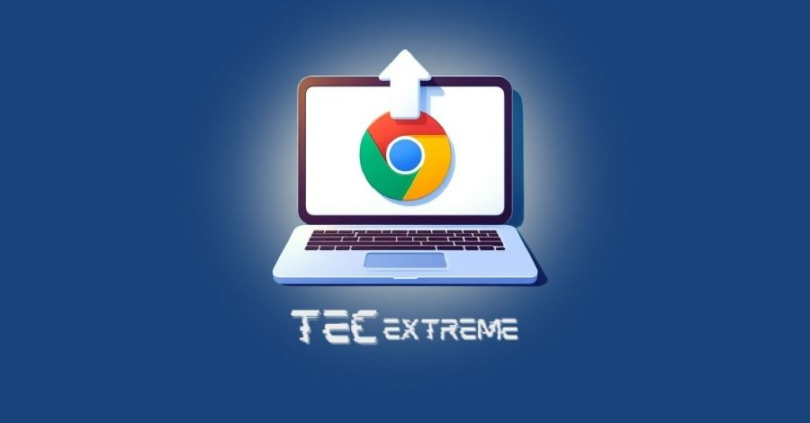

Saiba **como atualizar o Google Chrome** e tenha acesso aos recursos mais recentes e navegue na internet com mais segurança.

Manter o Chrome atualizado é fundamental para garantir uma experiência de navegação segura e eficiente. As atualizações frequentes do Chrome oferecem diversos benefícios, como:

- **Segurança aprimorada:** proteja-se contra malware's, hackers e outras ameaças online com as últimas correções de segurança.

- **Novos recursos e funcionalidades:** desfrute de novas ferramentas e recursos que podem tornar sua navegação mais produtiva e divertida.

- **Melhor desempenho e estabilidade:** O Chrome atualizado oferece uma experiência de navegação mais rápida, suave e confiável.

Este guia **passo a passo é ideal para iniciantes e usuários experientes que desejam manter seu navegador atualizado**. Seja você um novato no mundo da tecnologia ou um usuário experiente que busca otimizar seu Chrome, este guia irá te ajudar a realizar a atualização de forma rápida e fácil.

## Conteúdo

1. [Como verificar se há atualizações:](#como-verificar-se-ha-atualizacoes)
2. [Como atualizar o Google Chrome manualmente:](#como-atualizar-o-google-chrome-manualmente)
    1. [No computador:](#no-computador)
    2. [No Android:](#no-android)
    3. [No iOS:](#no-i-os)
3. [Dicas para manter o Google Chrome atualizado:](#dicas-para-manter-o-google-chrome-atualizado)
    1. [Ative a atualização automática:](#ative-a-atualizacao-automatica)
    2. [Verifique se há atualizações regularmente:](#verifique-se-ha-atualizacoes-regularmente)
    3. [Recomendação: Use a versão mais recente do Google Chrome](#recomendacao-use-a-versao-mais-recente-do-google-chrome)
    4. [Incentive seus amigos e familiares a manterem o Google Chrome atualizado:](#incentive-seus-amigos-e-familiares-a-manterem-o-google-chrome-atualizado)
4. [Conclusão:](#conclusao)

## Como verificar se há atualizações:

Siga estes passos simples para verificar se há atualizações no Google Chrome:

1. Abra o Google Chrome em seu computador.

3. Clique no menu de três pontinhos localizado no canto superior direito da tela no Google Chrome.

5. No menu suspenso, selecione "Ajuda" e depois "Sobre o Google Chrome".

7. O Chrome verificará automaticamente se há atualizações disponíveis.

9. Caso exista uma atualização disponível, o download e a instalação serão realizados de forma automática, sem interromper suas atividades. Você será notificado quando a instalação for concluída e precisará reiniciar o Chrome para aplicar as atualizações.

Dica: Para verificar se há atualizações manualmente, clique em "Verificar se há atualizações" na página "Sobre o Google Chrome".

Observação: Se você estiver usando uma versão gerenciada do Chrome (por exemplo, em um ambiente de trabalho ou escola), as atualizações podem ser instaladas automaticamente pelo administrador da rede.

## Como atualizar o Google Chrome manualmente:

Em alguns casos, você pode querer atualizar o Chrome manualmente, como quando você está enfrentando problemas com a atualização automática ou deseja ter certeza de que está usando a versão mais recente disponível.

**Siga estas etapas para atualizar o Chrome manualmente:**

### No computador:

1. Dê um duplo clique no atalho do navegador **Google Chrome** para abri-lo.

3. **Selecione o ícone de três pontos localizado no canto superior direito** da tela do navegador Google Chrome.

5. Selecione **"Ajuda"** e depois **"Sobre o Google Chrome".**

7. O Chrome verificará **automaticamente** se há atualizações.

9. Caso exista uma atualização disponível, selecione **“Atualizar o Google Chrome”**. Assim, o navegador fará o download e a atualização de forma automática.

11. O Chrome será reiniciado para concluir a instalação.

### No Android:

1. Abra o Aplicativo da **Google Play Store.**

3. Clique na "fotinha" de perfil do usuário, **localizado no canto superior direito da tela do celular.**

5. Selecione o menu de **"Gerenciar apps e dispositivos"** e **clique para verificar se há atualizações.**

7. Procure pelo Aplicativo do **"Google Chrome".**

9. Caso exista uma atualização disponível, pressione **“Atualizar”.**

### No iOS:

1. Abra o aplicativo da **"App Store".**

3. Toque na aba "Atualizações" para verificar se tem alguma atualização disponível.

5. Procure pelo aplicativo do navegador **"Google Chrome".**

7. Se houver alguma atualização disponível no **iPhone/iPad**, toque em **"Atualizar".**

**Dica:** Se você estiver com problemas para baixar ou instalar a atualização, **[consulte a página de suporte do Google Chrome](https://support.google.com/chrome/answer/95414?hl=pt-BR&co=GENIE.Platform%3DDesktop)** para obter ajuda.

## Dicas para manter o Google Chrome atualizado:

### Ative a atualização automática:

A maneira mais fácil de manter o Chrome atualizado é ativar a atualização automática. Dessa forma, o Chrome verificará e instalará automaticamente as atualizações assim que forem disponibilizadas. Para ativar a atualização automática:

1. Abra o Google Chrome em seu computador.

3. **Clique no ícone de três pontinhos localizado no canto superior direito** da tela do navegador Google Chrome.

5. No menu suspenso, selecione "Configurações".

7. Na tela “Configurações”, deslize para baixo e selecione “Avançado”.

9. Na seção "Atualizações", localize a opção "Atualizar automaticamente o Google Chrome".

11. Ative a opção para ativar a atualização automática.

### Verifique se há atualizações regularmente:

Mesmo com a atualização automática ativada, é recomendável verificar se há atualizações manualmente de vez em quando. Isso garantirá que você esteja sempre usando a versão mais recente do Chrome. Para verificar se há atualizações manualmente:

1. Abra o Google Chrome em seu computador.

3. **Clique no ícone de três pontinhos localizado no canto superior direito** da tela do navegador Google Chrome.

5. No menu suspenso, selecione "Ajuda" e depois "Sobre o Google Chrome".

7. Na página "Sobre o Google Chrome", o Chrome verificará automaticamente se há atualizações disponíveis.

9. Caso exista uma atualização disponível, o Chrome fará o download automaticamente.

11. Siga as orientações exibidas na tela para realizar a instalação.

### Recomendação: Use a versão mais recente do Google Chrome

O Google recomenda usar a versão mais recente do Chrome para ter acesso aos recursos mais recentes e à melhor segurança. Você pode verificar qual versão do Chrome você está usando e se há uma versão mais recente disponível na página "Sobre o Google Chrome".

### Incentive seus amigos e familiares a manterem o Google Chrome atualizado:

Compartilhe este artigo com seus amigos e familiares para que eles também possam se beneficiar das vantagens de manter o Chrome atualizado.

## Conclusão:

Manter o Google Chrome atualizado é crucial para garantir uma experiência de navegação segura, eficiente e agradável. As atualizações frequentes do Chrome oferecem diversos benefícios, como:

- **Compatibilidade com sites e serviços mais recentes.**

- **Correções de bugs e problemas conhecidos.**

- **Experiência de Navegação Mais Fluida**.

- **Segurança aprimorada**.

- **Novos recursos e funcionalidades**.

- **Melhor desempenho.**

Compartilhe este artigo com seus amigos e familiares para que eles também possam se beneficiar das vantagens de manter o Chrome atualizado.

Não deixe de conferir nosso artigo de **[Como limpar o chace e os Cookies no Google Chrome.](https://tecextreme.com.br/limpar-o-cache-e-os-cookies-no-google-chrome/)**

Atualize seu Chrome agora e navegue com mais segurança e rapidez!
