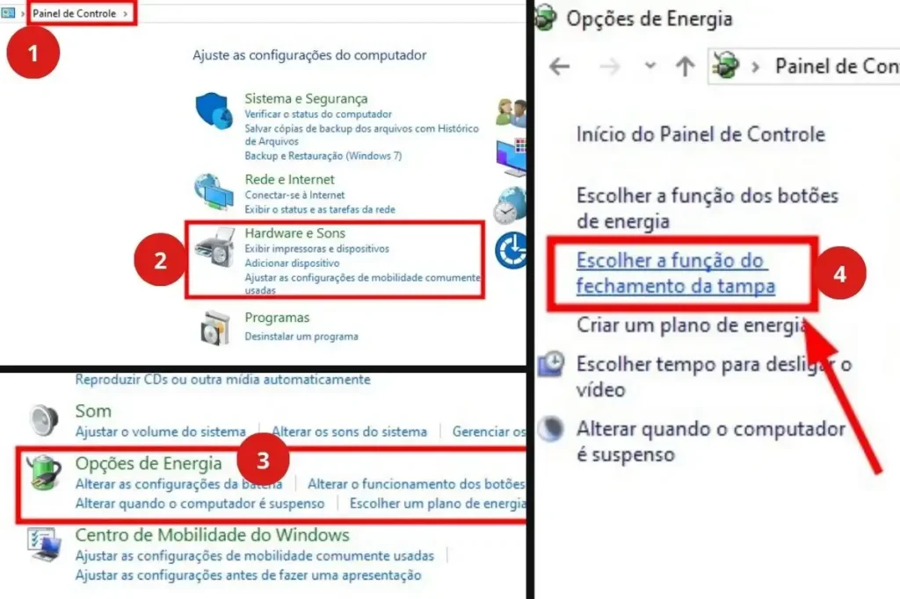
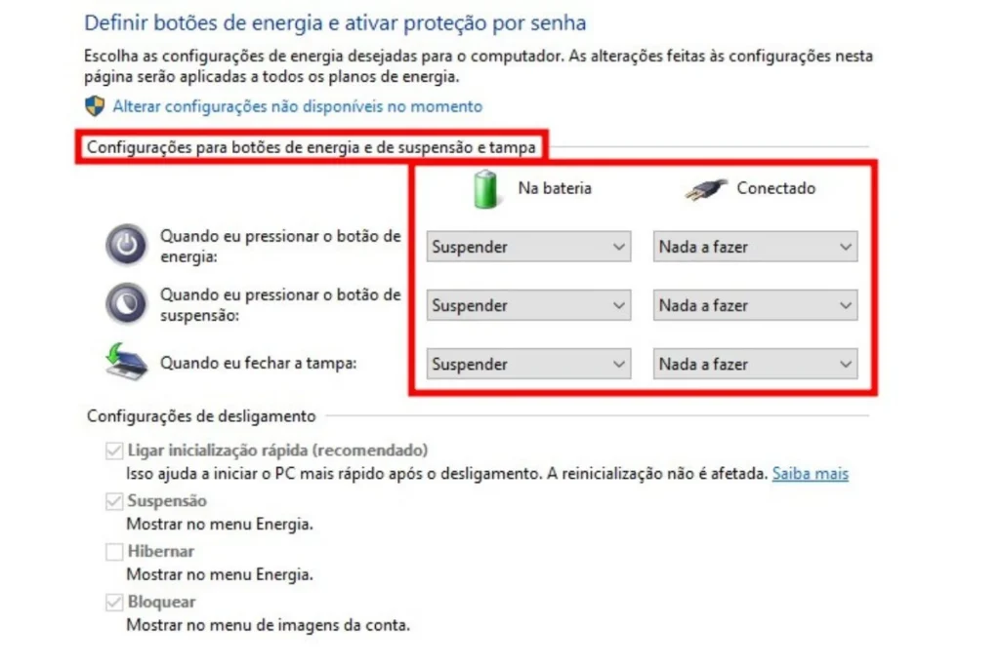

Encontrar usuários de Windows, seja Windows 10 ou Windows 11 com a mesma dúvida é algo comum: **como fechar o notebook sem desligar ou entrar em modo suspensão.** A questão surge especialmente quando a ideia é manter apenas uma segunda tela funcionando, seja ao conectar o notebook à TV, usar um monitor externo ou manter processos importantes ativos em segundo plano, como downloads e uploads.

No comportamento padrão do Windows, ao abaixar a tampa do notebook, o sistema ativa o modo de descanso. Isso pode causar transtornos; afinal, é fácil lembrar de situações em que foi necessário fechar a tela no meio de um download ou durante um filme exibido apenas na TV.

Este guia apresenta orientações práticas e ajustes simples que permitem manter o notebook ligado mesmo com a tampa fechada, evitando que o sistema **suspenda**, **hiberne** ou **desligue** sem necessidade.

## Conteúdo deste post...

1. [Quando vale a pena manter o notebook ligado com a tampa fechada?](#quando-vale-a-pena-manter-o-notebook-ligado-com-a-tampa-fechada)
2. [Como fechar o notebook sem desligar: Tutorial para Windows 10 ou Windows 11](#como-fechar-o-notebook-sem-desligar-tutorial-para-windows-10-ou-windows-11)
    1. [1\. Abrir o Painel de Controle](#1-abrir-o-painel-de-controle)
    2. [2\. Acessar as Opções de Energia](#2-acessar-as-opcoes-de-energia)
    3. [3\. Uma vez dentro de “Opções de Energia”, clicar em: “Escolher a função do fechamento da tampa”](#3-uma-vez-dentro-de-opcoes-de-energia-clicar-em-escolher-a-funcao-do-fechamento-da-tampa)
    4. [4\. Definindo o comportamento da tampa](#4-definindo-o-comportamento-da-tampa)
3. [Configurações diferentes para energia e bateria](#configuracoes-diferentes-para-energia-e-bateria)
4. [Dicas para evitar problemas ao manter o notebook fechado](#dicas-para-evitar-problemas-ao-manter-o-notebook-fechado)
5. [Quando não é recomendado manter o notebook ligado com a tampa fechada](#quando-nao-e-recomendado-manter-o-notebook-ligado-com-a-tampa-fechada)
6. [Conclusão](#conclusao)

## Quando vale a pena manter o notebook ligado com a tampa fechada?

Manter o notebook ativo com a tampa baixa é útil em diversas situações, como:

- Downloads longos

- Renderização de vídeos

- Execução de servidores locais

- Chamadas de áudio contínuas

- Uso com monitor externo

Não por acaso, muitos buscam por soluções como: “**Como manter o notebook ligado com a tampa fechada?”** ou até mesmo o termo em inglês: _How to close the laptop screen without turning it off._

## Como fechar o notebook sem desligar: Tutorial para Windows 10 ou Windows 11

Há um ajuste simples no Painel de Controle que altera completamente o comportamento do equipamento.

**Alterando a configuração no Painel de Controle**

### **1\. Abrir o Painel de Controle**

O Painel de Controle continua disponível em ambos os sistemas e centraliza várias configurações essenciais.

### **2\. Acessar as Opções de Energia**

Dentro do menu, a seção **Hardware e Sons > Opções de Energia** concentra os ajustes relacionados ao comportamento da tampa.

### **3\. Uma vez dentro de “Opções de Energia”, clicar em: “Escolher a função do fechamento da tampa”**

Aqui o Windows permite definir qual ação será tomada ao baixar a tela.

### **4\. Definindo o comportamento da tampa**

Quando identificar a opções de "Ao fechar a tampa", opte pela escolha:

- **Nada a fazer (Do nothing)**

Essa simples mudança impede que o sistema desligue ou suspenda. Muitos aprendem esse passo buscando por frases como _Não desligar notebook ao fechar a tampa Windows 11_ ou _Como fechar a tela do notebook e não desligar w10_.

## Configurações diferentes para energia e bateria

O Windows permite definir comportamentos distintos:

- **Ligado na tomada:** pode permanecer totalmente ativo

- **Usando bateria:** pode suspender para economizar energia

Essa flexibilidade evita consumo excessivo e permite manter tarefas quando necessário.

## Dicas para evitar problemas ao manter o notebook fechado

- Garantir boa ventilação lateral

- Evitar superfícies que bloqueiem a saída de ar

- Monitorar temperatura em jogos e tarefas pesadas

- Utilizar suportes ou bases refrigeradas

Assim, o desempenho fica estável e o hardware protegido.

## Quando não é recomendado manter o notebook ligado com a tampa fechada

Modelos que aquecem muito ou não possuem ventilação eficiente podem sofrer ao operar fechados. Nesses casos, a tampa pode atuar como um “cobertor”, retendo calor e reduzindo a vida útil dos componentes.

## Conclusão

Configurar o sistema para **fechar a tampa do notebook sem desligar** traz mais praticidade no dia a dia, especialmente em tarefas contínuas. Com um simples ajuste no Windows 10 ou 11, o notebook mantém atividades mesmo com a tela abaixada, evitando interrupções e aumentando a produtividade. Um pequeno ajuste que, como uma chave silenciosa, transforma o modo como o equipamento se comporta.
