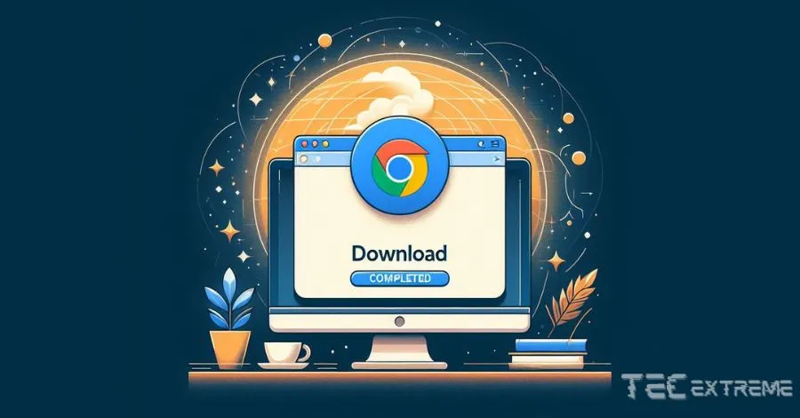
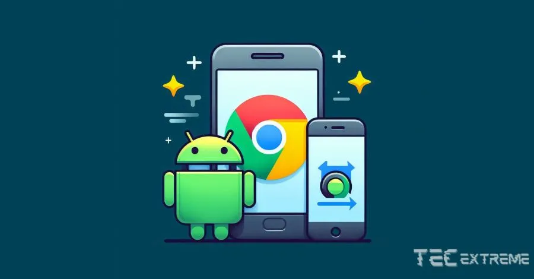

Baixe o Google Chrome no PC e celular. Guia prático de **como instalar o Google Chrome** no notebook, computador, Android, iPhone e iPad.

Se você está procurando um navegador rápido e seguro para sua navegação na internet, o Google Chrome é uma das melhores opções disponíveis. Ele é fácil de usar, tem uma interface intuitiva e muitos recursos úteis que tornam a navegação na web mais eficiente.

Neste artigo, vamos mostrar como instalar o Google Chrome no seu PC, Android e iPhone.

## Conteúdo

1. [Como instalar o Google Chrome no notebook e PC](#como-instalar-o-google-chrome-no-notebook-e-pc)
    1. [Requisitos do Sistema e Download](#requisitos-do-sistema-e-download)
    2. [Processo de Instalação Passo a Passo:](#processo-de-instalacao-passo-a-passo)
2. [Instalando o Google Chrome em Dispositivos Móveis](#instalando-o-google-chrome-em-dispositivos-moveis)
    1. [Instalação no Android](#instalacao-no-android)
    2. [Instalação no iPhone](#instalacao-no-i-phone)
3. [Conclusão](#conclusao)

Para instalar o Google Chrome no seu PC, você pode baixar o instalador do [site oficial do Chrome](https://www.google.com/intl/pt-BR/chrome/) e seguir as instruções na tela. O procedimento é descomplicado e pode ser concluído em poucos minutos. Após instalado, você pode personalizar o navegador com suas preferências e começar a navegar na web.

Se você usa um dispositivo Android ou iPhone, o processo de instalação do Google Chrome é um pouco diferente, mas ainda é fácil de seguir. Basta acessar a loja de aplicativos do seu dispositivo, pesquisar por "Google Chrome" e seguir as instruções na tela para baixar e instalar o navegador. Após instalado, você pode sincronizar seus favoritos, histórico e outras configurações do Chrome em todos os seus dispositivos.

## Como instalar o Google Chrome no notebook e PC

Se você deseja instalar o Google Chrome em seu computador, siga os passos abaixo.

### Requisitos do Sistema e Download

Antes de fazer o download do Google Chrome, verifique se o seu computador atende aos requisitos mínimos do sistema. O Google Chrome pode ser instalado em computadores com Windows 7, 8, 8.1, 10 e versões mais recentes. Além disso, você precisará de uma conexão com a Internet para fazer o download do instalador.

Para baixar o Google Chrome, visite o site oficial do Google Chrome em [https://www.google.com/intl/pt-BR/chrome/](https://www.google.com/intl/pt-BR/chrome/). Antes de fazer o download, role até o rodapé do navegador e verifique o idioma, depois clique no botão "Fazer o download do Chrome" para iniciar o download do instalador. O tamanho do arquivo é de cerca de 60 MB, portanto, pode levar alguns minutos para baixar, dependendo da velocidade da sua conexão com a Internet.

### **Processo de Instalação Passo a Passo:**

Após o **download do instalador**, siga os passos abaixo para **instalar o Google Chrom**e em seu computador:

1. Abra o arquivo de instalação do Google Chrome que baixou, caso não tenha escolhido uma pasta específica, provavelmente ele vai estar em Downloads.

3. Clique em "Sim" para permitir que o aplicativo faça alterações no seu computador.

5. Aguarde enquanto o instalador do Google Chrome é carregado.

7. Clique em "Instalar" para começar a instalação.

9. Aguarde enquanto o Google Chrome é instalado em seu computador.

11. Clique em "Concluir" para fechar o instalador.

13. Abra o Google Chrome e comece a navegar na web!

Agora que o Google Chrome está instalado em seu computador, você pode personalizá-lo de acordo com suas preferências, adicionando extensões e aplicativos da Web Store do Chrome. O Google Chrome é um navegador rápido, seguro e fácil de usar que oferece muitos recursos úteis para melhorar sua experiência de navegação na web.

## Instalando o Google Chrome em Dispositivos Móveis

Se você deseja instalar o Google Chrome em seu smartphone Android ou iPhone, é um processo bastante simples. O Google Chrome é um navegador popular e gratuito, que oferece uma experiência de navegação rápida e segura.

### Instalação no Android

Para instalar o Google Chrome em seu smartphone Android, você pode baixá-lo na **[Play Store](https://play.google.com/store/games?hl=pt_BR&gl=US)**. Siga estes passos:

1. Pegue seu celular/smartphone com Android e abra a **[Play Store](https://play.google.com/store/apps/details?id=com.android.chrome&hl=pt_BR&gl=US)** (Loja de aplicativos do Google).

3. Na barra de pesquisa, digite "Google Chrome", role até encontrar a logo do navegador da Google e identifique se o desenvolvedor é a Google LLC.

5. Clique em "Instalar" dessa forma você irá baixar e instalar o aplicativo em seu smartphone Android.

Após a instalação, você pode abrir o Google Chrome no seu smartphone Android e começar a navegar na Internet.

### Instalação no iPhone

Para instalar o Google Chrome em seu iPhone, você pode baixá-lo na App Store. Siga estes passos:

1. Abra a "App Store" em seu iPhone/iPad.

3. Na barra de pesquisa, digite "Google Chrome", ao encontrar e verifique se o desenvolvedor do App é a Google LLC.

5. Clique em "Obter" para baixar e instalar o aplicativo em seu iPhone.

Após a instalação, você pode abrir o Google Chrome no seu iPhone ou iPad e começar a navegar na Internet.

É importante lembrar que, para manter o Google Chrome atualizado em seu smartphone, você deve atualizá-lo regularmente. Para atualizar o Google Chrome, basta ir à Play Store ou à App Store e verificar se há atualizações disponíveis para o aplicativo.

Se você estiver usando o Safari em seu iPhone, pode ser uma boa ideia experimentar o Google Chrome para ver se prefere a experiência de navegação. Com o Google Chrome, você pode navegar na Internet com rapidez e segurança, e desfrutar de recursos como preenchimento automático de formulários e pesquisa na barra de endereço.

## Conclusão

Instalar o Google Chrome em seu PC, Android ou iPhone é um processo simples e rápido. Agora que você sabe como instalar o navegador em seus dispositivos, não há motivo para continuar usando um navegador que não atenda às suas necessidades.

Lembre-se de que o Google Chrome é um navegador popular e confiável que oferece muitos recursos úteis, como navegação rápida, segurança e privacidade, além de uma ampla variedade de extensões para personalizar sua experiência de navegação.

Se você tiver problemas durante o processo de instalação, verifique se sua conexão com a Internet está funcionando corretamente e se você está seguindo as instruções passo a passo. Se ainda tiver problemas, consulte a página de suporte do Google Chrome ou entre em contato com o suporte técnico para obter ajuda adicional.

Agora que você sabe como instalar o Google Chrome, aproveite ao máximo a sua experiência de navegação na web e desfrute de tudo o que o navegador tem a oferecer e confira nossos outros posts:

- [SSD ou HD: entenda as diferenças e saiba qual o melhor](https://tecextreme.com.br/ssd-ou-hd-entenda-as-diferencas-e-qual-o-melhor/)

- [Diferença entre memória RAM e ROM o que são e como funcionam](https://tecextreme.com.br/diferenca-entre-memoria-ram-e-rom/)
