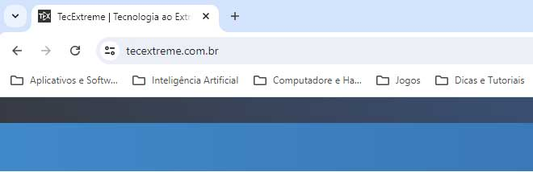

Utilizar pastas na barra de favoritos é a forma mais eficientes de organizar os sites que você acessa frequentemente. Com as pastas na barra de favoritos pode-se manter tudo em ordem e facilitar o acesso. 

Provavelmente já se sentiu perdido na sua própria lista de favoritos do navegador? Com tantos sites interessantes para visitar, manter tudo organizado pode ser um desafio.

Organizar seus favoritos não é apenas uma questão de estética, mas também de praticidade. Ao saber exatamente onde encontrar seus links preferidos, você economiza tempo e reduz a frustração. 

Vamos explorar todas as vantagens e técnicas para maximizar o uso das pastas na barra de favoritos.

## Conteúdo

1. [O Que São Pastas na Barra de Favoritos?](#o-que-sao-pastas-na-barra-de-favoritos)
2. [Por Que Usar Pastas na Barra de Favoritos?](#por-que-usar-pastas-na-barra-de-favoritos)
3. [Como Criar Pastas na Barra de Favoritos](#como-criar-pastas-na-barra-de-favoritos)
    1. [Google Chrome](#google-chrome)
    2. [Mozilla Firefox](#mozilla-firefox)
    3. [Microsoft Edge](#microsoft-edge)
4. [Organizando Seus Favoritos](#organizando-seus-favoritos)
5. [Dicas para Nomear Suas Pastas](#dicas-para-nomear-suas-pastas)
6. [Usando Subpastas para Maior Organização](#usando-subpastas-para-maior-organizacao)
7. [Sincronizando Seus Favoritos Entre Dispositivos](#sincronizando-seus-favoritos-entre-dispositivos)
8. [Dicas de Manutenção das pastas de favoritos](#dicas-de-manutencao-das-pastas-de-favoritos)
9. [Solução de Problemas Comuns](#solucao-de-problemas-comuns)
10. [Principais Aprendizados](#principais-aprendizados)
11. [Conclusão](#conclusao)
12. [Perguntas Frequentes](#perguntas-frequentes)

## **O Que São Pastas na Barra de Favoritos?**

As **pastas na barra de favoritos funcionam como as pastas no seu computador**. Elas permitem **agrupar sites semelhantes** em uma única pasta, **facilitando o acesso rápido** aos seus **links favoritos** sem ter que percorrer uma lista interminável de URLs. Isso é especialmente útil quando você precisa acessar rapidamente sites que visita frequentemente.

Além disso, as pastas podem ser personalizadas de acordo com suas necessidades. Por exemplo, você pode criar pastas específicas para trabalho, lazer, estudos, compras, entre outros. Dessa forma, você mantém sua barra de favoritos organizada e seus links sempre à mão.

## **Por Que Usar Pastas na Barra de Favoritos?**

Usar pastas na barra de favoritos tem várias vantagens. Primeiramente, ajuda a manter seus favoritos organizados. Em vez de ter uma lista longa e desordenada, você pode categorizar seus sites por temas ou usos. Essa prática aprimora a experiência de navegação, tornando-a mais eficiente e agradável.

Outra grande vantagem é a melhoria na eficiência do seu trabalho ou estudo. Ao categorizar seus links, você reduz o tempo gasto procurando por um site específico. Com todos os seus links organizados em pastas, você pode se concentrar no que realmente importa.

## **Como Criar Pastas na Barra de Favoritos**

Criar pastas na barra de favoritos é um processo simples. Veja o passo a passo de como fazer isso nos navegadores mais utilizados:

### **Google Chrome**

1. **Ativar a Barra de Favoritos:**
    - Abra o Google Chrome no seu computador. (Caso não tenha o navegador Google Chrome, veja como instala-lo no post: **["Como instalar o Google Chrome no celular e PC: Guia Prático"](https://tecextreme.com.br/como-instalar-o-google-chrome-celular-e-pc/)**).
    
    - No canto superior direito, clique nos três pontos verticais (Mais opções).
    
    - Clique na opção de "Favoritos e listas" e, em seguida, selecione para acessar o: "Gerenciador de favoritos", nesta tela, podemos gerenciar melhor todos os nossos favoritos.

3. **Adicionar uma Nova Pasta:**
    - No Gerenciador de favoritos, clique nos três pontos verticais novamente.
    
    - Escolha "Adicionar nova pasta".
    
    - Digite um nome para a sua pasta e selecione onde deseja que ela fique (caso já existam outras pastas no navegador).
    
    - Clique em "Salvar".

5. **Adicionar Sites à Pasta:**
    - Quando você encontrar um site que deseja salvar como favorito, clique no ícone de estrela na barra de pesquisa (URL).
    
    - Selecione a pasta que você criou (Selecione pelo nome de quando foi realizada a criação).
    
    - Clique em "Concluído".

No Chrome, você também pode arrastar e soltar links diretamente nas pastas recém-criadas. Isso facilita a organização e permite uma gestão mais intuitiva dos seus favoritos.

### **Mozilla Firefox**

1. **Abrir o Navegador**:
    - Abra o [**Mozilla Firefox**](https://www.mozilla.org/pt-BR/firefox/new/) no seu computador.

3. **Acessar a Barra de Favoritos**:
    - Certifique-se de que a barra de favoritos está visível. Se não estiver, você pode habilitá-la clicando no menu (três linhas horizontais no canto superior direito), selecionando "Biblioteca", depois "Favoritos" e então "Exibir barra de favoritos".

5. **Adicionar uma Nova Pasta**:
    - Posicione o mouse em um espaço vazio na barra de favoritos.
    
    - Clique com o botão direito do mouse nesse espaço vazio para abrir o menu de opções.

7. **Selecionar a Opção para Adicionar Pasta**:
    - No menu de opções que irá aparecer, clique em "Nova Pasta" (Lembre-se de nomear de forma que fique nítido o conteúdo).

9. **Nomear a Nova Pasta**:
    - Uma janela será exibida para que você possa nomear a nova pasta.
    
    - Digite o nome desejado para a pasta (por exemplo, "Trabalho", "Estudos", etc.).
    
    - Clique em "Adicionar" ou "Salvar" para criar a pasta.

11. **Encontrar e Utilizar a Nova Pasta**:
     - A nova pasta agora deve aparecer na barra de favoritos.
     
     - Para encontrá-la, clique na barra de favoritos para expandi-la.
     
     - Se houver muitos itens na barra de favoritos, clique na setinha que aparece à direita da barra para expandir e ver todas as pastas e itens.
     
     - Localize a pasta que você acabou de criar com o nome que você escolheu.
     
     - Você pode arrastar e soltar favoritos dentro desta pasta para mantê-los organizados.

O Firefox oferece a opção de adicionar descrições às pastas, o que pode servir para lembrar por que você salvou um determinado conjunto de links. Aproveite essa funcionalidade para manter tudo ainda mais organizado.

### **Microsoft Edge**

1. **Ativar a Barra de Favoritos:**
    - Abra o **Microsoft Edge** no seu computador.
    
    - Clique nos três pontinhos no canto superior direito do navegador e no menu de opções que será apresentado, selecione "Favoritos" (Geralmente com um ícone de estrela).
    
    - Irá abrir uma caixa que é o "Gerenciar favoritos".

3. **Adicionar uma Nova Pasta:**
    - No Gerenciador de favoritos, clique na opção para adicionar uma nova pasta (representada por um ícone de pasta com o sinal de “+” ou similar).
    
    - Digite um nome para a sua pasta e selecione onde deseja que ela fique (caso já existam outras pastas no navegador).
    
    - Clique em "Salvar".

5. **Adicionar Sites à Pasta:**
    - Quando encontrar um site que deseja salvar como favorito, clique no ícone de estrela na barra de pesquisa (URL).
    
    - Procure pela pasta criada com o nome específico.
    
    - Clique em "Concluído".

No Edge, você pode sincronizar suas pastas e favoritos com outros dispositivos, facilitando o acesso a seus links em qualquer lugar. Basta garantir que a sincronização está ativada nas configurações do navegador.

## **Organizando Seus Favoritos**

Depois de criar suas pastas, é hora de organizar seus favoritos. Arraste e solte seus links nas pastas apropriadas. Por exemplo, você pode ter pastas para "Notícias", "Trabalho", "Hobbies", etc. Isso não só mantém sua barra de favoritos limpa, mas também facilita encontrar o que você precisa rapidamente.

Uma dica útil é não exagerar na quantidade de pastas. Mantenha suas categorias amplas o suficiente para evitar ter que navegar por múltiplas pastas para encontrar um link específico. A ideia é simplificar, não complicar.

## **Dicas para Nomear Suas Pastas**

Opte por nomes claros e específicos para suas pastas. Em vez de usar “Diversos”, escolha algo mais descritivo, como “Tutoriais de Programação” ou “Receitas Favoritas”. Escolher nomes específicos e claros para suas pastas torna a localização de conteúdo mais rápida e a navegação mais intuitiva.

Além disso, é uma boa prática revisar periodicamente os nomes das suas pastas. À medida que suas necessidades mudam, pode ser útil renomear ou reestruturar suas pastas para melhor refletir seu uso atual. Isso garante que sua barra de favoritos continue sendo uma ferramenta útil e eficiente.

## **Usando Subpastas para Maior Organização**

Se você tem muitos favoritos em uma categoria, considere criar subpastas. Por exemplo, dentro da pasta "Trabalho", você pode ter subpastas como "Projetos Atuais" e "Recursos de Pesquisa". Isso adiciona uma camada extra de organização e facilita ainda mais encontrar os links que você precisa.

As subpastas são especialmente úteis para projetos complexos ou hobbies com muitas facetas. Elas permitem uma organização mais granular e ajudam a manter tudo bem estruturado. Só tome cuidado para não exagerar na quantidade de subpastas, o que pode acabar complicando em vez de simplificar.

## **Sincronizando Seus Favoritos Entre Dispositivos**

A maioria dos navegadores modernos permite sincronizar seus favoritos entre dispositivos. Isso significa que você pode acessar suas pastas organizadas em seu computador, tablet ou smartphone. Certifique-se de estar logado na mesma conta em todos os dispositivos e ativar a sincronização.

Sincronizar seus favoritos é especialmente útil para quem trabalha ou estuda em diferentes dispositivos. Dessa forma, você garante que seus links estão sempre disponíveis, independentemente de onde você esteja. É uma forma prática de manter a continuidade e a produtividade.

## **Dicas de Manutenção das pastas de favoritos**

Para manter seus favoritos organizados, faça uma revisão regular. Exclua links que você não usa mais e reorganize conforme necessário. Isso ajuda a manter sua barra de favoritos funcional e eficiente. Um bom momento para fazer isso é mensalmente ou sempre que perceber que está difícil encontrar um link específico.

Além disso, considere atualizar os links para garantir que ainda estão ativos e relevantes. Links quebrados ou desatualizados podem prejudicar a eficiência da sua barra de favoritos. Manter tudo em ordem requer um pouco de esforço, mas os benefícios valem a pena.

## **Solução de Problemas Comuns**

Se suas pastas de favoritos desaparecerem ou não sincronizarem corretamente, tente as seguintes soluções:

1. Verifique se está logado na conta correta, isso porque para que a sincronização aconteça, é necessário utilizar a mesma conta.

3. Certifique-se de que a sincronização está ativada nas configurações do navegador.

5. Reinicie o navegador ou o dispositivo.

Se o problema persistir, pode ser útil consultar a ajuda do navegador ou buscar suporte técnico. Manter suas pastas de favoritos funcionando corretamente é essencial para uma navegação eficiente e organizada.

## **Principais Aprendizados**

Antes de finalizar, é importante destacar os pontos-chave discutidos neste artigo:

1. **Pastas na Barra de Favoritos:** São essenciais para organizar seus links e facilitar o acesso.

3. **Criação e Organização:** A criação de pastas e subpastas é simples e altamente recomendada para uma navegação eficiente.

5. **Nomeação e Manutenção:** Usar nomes descritivos e revisar regularmente suas pastas ajudam a manter tudo em ordem.

7. **Sincronização entre Dispositivos:** Garantir que seus favoritos estejam sincronizados entre todos os dispositivos é crucial para acessibilidade constante.

9. **Soluções de Problemas:** Saber como solucionar problemas comuns pode evitar frustrações e garantir que suas pastas de favoritos funcionem corretamente.

## **Conclusão**

Manter seus favoritos organizados com **pastas na barra de favoritos** pode transformar sua experiência de navegação. Com um pouco de esforço inicial e manutenção regular, você terá acesso rápido e fácil aos sites que mais usa.

Usar pastas na barra de favoritos não só melhora sua eficiência, mas também torna a navegação mais agradável. Experimente as sugestões deste artigo e descubra como a organização pode tornar sua experiência online mais simples e eficiente.

## **Perguntas Frequentes**

**1\. Como criar pasta na barra de favoritos do Browser Google Chrome?**

De formar rápida e resumida, para criar uma pasta no Chrome, clique com o botão direito na barra de favoritos, selecione "Adicionar pasta", nomeie a pasta e clique em "Salvar".

**2\. Posso usar subpastas na barra de favoritos?**

Sim, você pode criar subpastas dentro de suas pastas principais para uma organização ainda melhor. As subpastas permitem uma organização mais detalhada e ajudam a manter tudo bem estruturado.

**3\. Como sincronizo meus favoritos entre diferentes dispositivos?**

Certifique-se de estar logado na mesma conta do navegador em todos os seus dispositivos e ative a

sincronização nas configurações do navegador. Isso garante que seus links favoritos estejam sempre acessíveis, independentemente de onde você esteja.

**4\. O que fazer se meus favoritos não estiverem sincronizando?**

Verifique se você está logado na conta correta, certifique-se de que a sincronização está ativada e tente reiniciar o navegador ou o dispositivo. Caso o problema persista, pode ser necessário buscar suporte técnico do respectivo navegador.

**5\. Como mantenho minha barra de favoritos organizada?**

Faça revisões regulares, exclua links desnecessários e reorganize suas pastas conforme necessário para manter tudo funcional e acessível. Manter sua barra de favoritos organizada requer um pouco de esforço, mas os benefícios em termos de eficiência e praticidade valem a pena.
