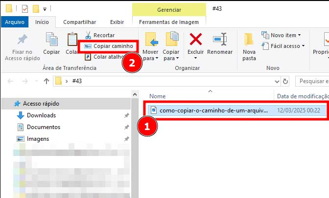
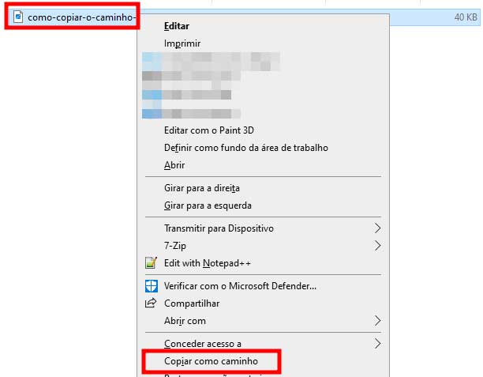
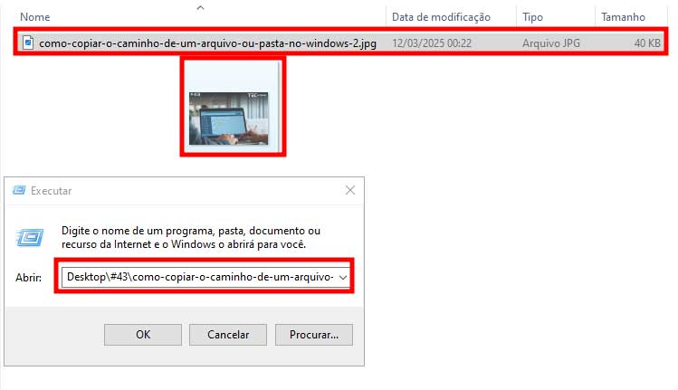

**Copiar o caminho de um arquivo ou pasta no Windows** pode parecer uma tarefa simples, mas é extremamente útil em várias situações do dia a dia. Seja para compartilhar um diretório com colegas de trabalho, facilitar a automação de tarefas ou integrar arquivos em diferentes [**softwares**](https://tecextreme.com.br/o-que-e-software-para-que-serve-principais-tipos/), entender como acessar essa funcionalidade é essencial para qualquer usuário.

Neste post, serão apresentadas **3 formas práticas** de **copiar o caminho de um arquivo (Caminho completo)** ou **pasta no Windows**, destacando métodos rápidos e eficientes para otimizar a experiência do usuário.

## Conteúdo do post...

1. [Por Que Copiar o Caminho de um Arquivo ou Pasta?](#por-que-copiar-o-caminho-de-um-arquivo-ou-pasta)
2. [As 3 Maneiras Simples de Copiar o Caminho de um arquivo no Windows](#as-3-maneiras-simples-de-copiar-o-caminho-de-um-arquivo-no-windows)
    1. [Método 1: Usar a Opção "Copiar Caminho" no Menu de acima da URL (Guia Início)](#metodo-1-usar-a-opcao-copiar-caminho-no-menu-de-acima-da-url-guia-inicio)
    2. [Método 2: Usar Shift + Botão Direito do Mouse](#metodo-2-usar-shift-botao-direito-do-mouse)
    3. [Método 3: Arrastar o Arquivo para a Ferramenta Executar (Windows + R)](#metodo-3-arrastar-o-arquivo-para-a-ferramenta-executar-windows-r)
3. [Qual Método é o Melhor Para Copiar Caminho?](#qual-metodo-e-o-melhor-para-copiar-caminho)
4. [Conclusão](#conclusao)
5. [Perguntas Frequentes (FAQ)](#perguntas-frequentes-faq)

## Por Que Copiar o Caminho de um Arquivo ou Pasta?

Saber como **encontrar o caminho de um arquivo** ou pasta no Windows pode ser uma habilidade indispensável para otimizar tarefas diárias. O **"caminho de um arquivo"** nada mais é do que a localização exata dele **dentro do sistema**, algo semelhante a um endereço que indica onde ele está guardado. Com essa informação, é possível **compartilhar diretórios de forma precisa**, integrar arquivos a outros programas ou até criar scripts automatizados.

Imagine, por exemplo, que há um projeto colaborativo em andamento. Para que todos na equipe tenham acesso ao mesmo arquivo ou pasta, é fundamental fornecer o **caminho correto**. Sem essa precisão, há o risco de arquivos duplicados ou dificuldades para localizá-los. Copiar o caminho permite que os documentos certos sejam acessados rapidamente, seja em um servidor compartilhado ou em um diretório local.

Além disso, ao usar programas que exigem a importação de arquivos, como editores de vídeo, IDEs de programação ou ferramentas de análise de dados, **ter o caminho do arquivo à mão facilita o processo**. Em vez de procurar manualmente dentro do software, basta colar o caminho para abrir o arquivo instantaneamente. Essa prática também é útil para **automatizar processos**, como configurar backups ou criar rotinas com scripts no [Windows PowerShell](https://learn.microsoft.com/pt-br/powershell/scripting/overview?view=powershell-7.5).

Se o conceito de "copiar o caminho de um arquivo" parecer complicado, ele é mais simples do que parece. Pense no caminho como uma trilha que começa na "raiz" do sistema (geralmente o disco C:) e segue até o local específico onde o arquivo está armazenado. Essa trilha é composta por pastas e subpastas, formando um endereço único. Aprender a **localizar o arquivo** e copiar seu caminho é um passo importante para **gerenciar arquivos no Windows 10** de forma eficiente.

## As 3 Maneiras Simples de Copiar o Caminho de um arquivo no Windows

Copiar o caminho de um arquivo ou pasta no Windows pode ser feito de várias maneiras, dependendo do nível de experiência e da situação específica. Abaixo, são explorados três métodos rápidos e eficazes para realizar essa tarefa.

### Método 1: Usar a Opção "Copiar Caminho" no Menu de acima da URL (Guia Início)

Este é o método mais simples e acessível, ideal para iniciantes ou usuários que preferem soluções rápidas e diretas.

**Passo a passo:**

1. Encontre o arquivo (PDF, Word, Excel, etc.) ou pasta que deseja copiar o caminho.

3. Após encontrar, selecione o arquivo/pasta e no menu de cima (Guia Inicio), selecione a opção de “Copiar caminho”.

O caminho será automaticamente copiado para a área de transferência, pronto para ser colado onde você precisar, como, por exemplo, um bloco de notas.

**Vantagens:**

- Intuitivo e fácil de usar.

- Não exige o uso de atalhos de teclado.

- Funciona em versões recentes do Windows, como o Windows 10 e 11.

* * *

### Método 2: Usar Shift + Botão Direito do Mouse

Este método é perfeito para quem prefere atalhos no teclado ou precisa de mais controle sobre as opções disponíveis.

**Passo a passo:**

1. Identifique a tecla **Shift** no teclado, pressione ela e mantenha a mesma pressionada.

3. Clique com o botão direito do mouse no/sobre o **arquivo no Windows**, ou pasta desejada (Lembrando que o Shift precisa estar pressionado). No menu de contexto expandido que irá parecer, clique na opção **"Copiar como caminho"**.

Essa abordagem é muito útil porque adiciona mais funcionalidades ao menu de contexto, permitindo copiar o caminho de forma precisa, mesmo em versões anteriores do Windows.

**Destaque:**

- Ideal para usuários intermediários que trabalham frequentemente com atalhos ou scripts.

- Oferece maior flexibilidade no uso do menu de contexto.

* * *

### Método 3: Arrastar o Arquivo para a Ferramenta Executar (Windows + R)

Se já utiliza a ferramenta **Executar** no Windows, este método pode ser incrivelmente prático.

**Passo a passo:**

1. Para abrir a janela do Executar, pressione as teclas Windows e R ao mesmo tempo (a tecla com o ícone do Windows e a tecla "R")

3. Segure e arraste o arquivo ou pasta que deseja copiar para a caixa de texto dentro da janela Executar.

5. O caminho completo irá aparecer automaticamente na janelinha do executar.

Depois disso, o texto pode ser copiado e utilizado onde for necessário.

**Indicação:**

- Excelente para usuários avançados ou para quem precisa integrar caminhos em scripts e rotinas automatizadas.

- Permite personalização e integração em fluxos de trabalho complexos.

## Qual Método é o Melhor Para Copiar Caminho?

Agora que foram apresentadas as três formas de **copiar o caminho completo de um arquivo** ou pasta no Windows, é importante entender qual delas é a mais adequada para diferentes perfis de usuário e necessidades. Cada método tem suas vantagens e peculiaridades, e a escolha entre eles pode depender da familiaridade com o sistema e da preferência por atalhos rápidos ou soluções mais visuais.

- **Usuários básicos:** O **Método 1** é ideal para quem busca rapidez e simplicidade. Ele é direto, fácil de usar e não exige conhecimento avançado.

- **Usuários intermediários:** O **Método 2** oferece mais controle e é perfeito para quem prefere atalhos de teclado e deseja otimizar o fluxo de trabalho.

- **Usuários avançados:** O **Método 3** é recomendado para quem busca automação e precisa de precisão em tarefas complexas, como scripts ou configurações de rede.

Cada método tem seu lugar, e a escolha mais adequada depende do perfil de usuário e da complexidade das tarefas executadas no Windows. Seja qual for a escolha, todas as opções são simples, rápidas e eficientes para garantir que o **caminho do arquivo no Windows** seja copiado com precisão.

## Conclusão

Foram apresentadas três formas de **copiar o caminho completo de um arquivo** ou pasta no Windows. O **Método 1** é ideal para quem busca rapidez e simplicidade, enquanto o **Método 2** oferece mais controle para quem prefere atalhos. Já o **Método 3** é recomendado para usuários avançados ou para quem quer automatizar tarefas. Cada opção tem suas vantagens e pode otimizar o fluxo de trabalho.

## Perguntas Frequentes (FAQ)

1. **Como pegar o caminho de um arquivo no Google Drive?**Para obter o caminho de um arquivo ou pasta no **Google Drive**, basta clicar com o botão direito sobre o arquivo e selecionar **“Obter link”**. Embora o caminho no Google Drive seja um link, ele funciona de maneira similar ao caminho de arquivos locais, permitindo o acesso rápido ao item desejado.

3. **O que é um caminho de arquivo?**O **caminho de um arquivo** é a sequência de diretórios e subpastas que leva até a localização do arquivo ou pasta no sistema. Ele inclui o nome do arquivo, a extensão e a hierarquia de pastas em que está armazenado. Com o caminho correto, é possível acessar ou compartilhar o arquivo de maneira precisa.

5. **Como copiar arquivos no Windows?**Copiar arquivos no Windows pode ser feito de várias formas. A maneira mais simples é usar **Ctrl + C** para copiar e **Ctrl + V** para colar em outro local. Caso precise copiar o caminho de um arquivo ou pasta, siga as instruções nos métodos apresentados neste post.

7. **O que é copiar o path?**Copiar o **path** (caminho) de um arquivo ou pasta no Windows significa obter a localização exata dele no sistema. Isso pode ser feito usando métodos como o menu de contexto ou atalhos de teclado, como descrito anteriormente.

9. **O que quer dizer copiar como caminho?**Copiar como caminho é uma funcionalidade do Windows que permite copiar o endereço completo de um arquivo ou pasta. Esse recurso é útil para compartilhar diretórios, integrar arquivos em softwares ou automatizar tarefas.

11. **Como enviar o caminho de uma pasta por e-mail?**Para enviar o caminho de uma pasta por e-mail, basta copiar o caminho usando um dos métodos apresentados neste post e colá-lo no corpo do e-mail ou em um documento anexado.

13. **Como copiar o URL de um arquivo?**Para copiar o URL de um arquivo, especialmente em serviços de nuvem como o Google Drive, clique com o botão direito no arquivo e selecione **“Obter link”**. O URL gerado pode ser compartilhado ou colado onde for necessário.

15. **Abrir local do arquivo no Windows 10**  
     Para acessar o local de um arquivo no Windows 10 ou até mesmo no Windows 11, clique com o botão direito do mouse sobre o arquivo e escolha a opção **“Abrir local do arquivo”** no menu que aparece. Essa ação abrirá a pasta onde o arquivo está armazenado.
