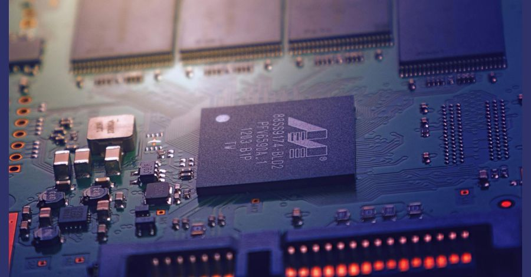

A memória RAM e ROM são dois tipos importantes de armazenamento de dados em dispositivos eletrônicos. Embora tenham nomes semelhantes, essas memórias possuem características distintas e desempenham papéis diferentes no funcionamento do dispositivo. Neste artigo, vamos explorar a diferença entre a memória RAM e a memória ROM, entender como cada uma funciona e como elas otimizam o desempenho do seu dispositivo.

## Conteúdo

1. [O que é memória Ram](#o-que-e-memoria-ram)
2. [O que é memória Rom](#o-que-e-memoria-rom)
3. [Principais diferenças entre memória Ram e Rom](#principais-diferencas-entre-memoria-ram-e-rom)
    1. [Função](#funcao)
    2. [Volatilidade](#volatilidade)
    3. [Velocidade de acesso](#velocidade-de-acesso)
4. [Para que serve a memória Ram](#para-que-serve-a-memoria-ram)
5. [Comparativo entre memória RAM e memória ROM](#comparativo-entre-memoria-ram-e-memoria-rom)
6. [Para que serve a memória Rom](#para-que-serve-a-memoria-rom)
7. [A memória Rom é utilizada para:](#a-memoria-rom-e-utilizada-para)
8. [Comparativo entre memória Ram e Rom](#comparativo-entre-memoria-ram-e-rom)
    1. [Velocidade de leitura e gravação](#velocidade-de-leitura-e-gravacao)
    2. [Capacidade de armazenamento](#capacidade-de-armazenamento)
    3. [Volatilidade](#volatilidade-1)
    4. [Custo](#custo)
    5. [Confiabilidade](#confiabilidade)
    6. [Flexibilidade](#flexibilidade)
9. [Memória Ram e Rom: Compatibilidade e utilização conjunta](#memoria-ram-e-rom-compatibilidade-e-utilizacao-conjunta)
10. [Vantagens e desvantagens da memória Ram e Rom](#vantagens-e-desvantagens-da-memoria-ram-e-rom)
11. [Melhorando o desempenho do seu dispositivo](#melhorando-o-desempenho-do-seu-dispositivo)
12. [Conclusão](#conclusao)

**Principais pontos a serem destacados:**

- A memória RAM é volátil e armazena temporariamente os dados ativamente utilizados pelo dispositivo.

- A memória ROM é não volátil e armazena permanentemente dados importantes e instruções básicas.

- A memória RAM permite a execução rápida de aplicativos e tarefas.

- A memória ROM é responsável pela inicialização do sistema operacional.

- A memória RAM e a memória ROM têm capacidades de armazenamento e velocidades de acesso diferentes.

## O que é memória Ram

A [memória RAM](https://pt.wikipedia.org/wiki/Mem%C3%B3ria_de_acesso_aleat%C3%B3rio) é um tipo de memória que só mantém os dados quando o dispositivo está em funcionamento. Ela guarda os dados que o dispositivo usa ativamente.

A memória Ram é um tipo de memória volátil que armazena temporariamente enquanto o computador está ligado, ou seja, os dados que estão sendo utilizados ativamente pelo dispositivo. É responsável por permitir a execução rápida de aplicativos e tarefas pelo processador. Ao contrário da memória Rom, a memória Ram não armazena as informações permanentemente, pois seus dados são apagados quando o dispositivo é desligado ou reiniciado.

Quando você está usando seu computador, por exemplo, a memória Ram armazena os dados dos aplicativos abertos, permitindo que o processador acesse rapidamente essas informações quando necessário. Isso garante uma experiência fluida e sem atrasos ao alternar entre diferentes tarefas e aplicativos.

A memória Ram funciona como uma espécie de "mão direta" entre o processador e o armazenamento de dados do dispositivo. Ela permite que os dados sejam rapidamente transferidos da memória Rom ou de um disco rígido, por exemplo, para a memória Ram, onde podem ser acessados e processados pelo processador de forma muito mais veloz.

Em resumo, a memória Ram desempenha um papel fundamental no desempenho geral do dispositivo, garantindo que os dados necessários para a execução de aplicativos e tarefas estejam prontamente disponíveis para o processamento.

## O que é memória Rom

A memória Rom, ou Read-Only Memory (Memória Somente Leitura), é um tipo de memória não volátil que desempenha um papel fundamental no funcionamento do dispositivo. Ao contrário da memória Ram, a memória Rom armazena permanentemente dados importantes e instruções básicas para inicializar o sistema operacional e outros programas essenciais.

Enquanto a memória Ram é volátil e temporária, a memória Rom preserva as informações mesmo quando o dispositivo é desligado. Ela é responsável por manter os comandos básicos necessários para o funcionamento do dispositivo, garantindo que o sistema possa ser inicializado adequadamente.

Essa memória é chamada de "Read-Only" porque seu conteúdo não pode ser alterado ou apagado pelo usuário. Apenas o fabricante do dispositivo tem a capacidade de gravar informações na memória Rom durante o processo de fabricação.

Ao fornecer as instruções básicas para iniciar o sistema operacional e outros programas essenciais, a memória Rom assegura que o dispositivo esteja sempre pronto para uso. Ela é essencial para garantir a estabilidade e a segurança do sistema.

## Principais diferenças entre memória Ram e Rom

Nesta seção, vamos explorar as principais diferenças entre a memória Ram (Random Access Memory) e a memória Rom (Read-Only Memory). Iremos comparar sua função, volatilidade, capacidade de armazenamento e velocidade de acesso para compreender melhor suas distinções fundamentais.

### Função

A memória Ram é responsável por armazenar temporariamente os dados que estão sendo utilizados ativamente pelo dispositivo. Ela permite uma execução rápida de aplicativos e tarefas pelo processador, atuando como uma memória de curto prazo.

Já a memória Rom é responsável por armazenar permanentemente dados importantes e instruções básicas para a inicialização do sistema operacional e outros programas essenciais. Ela é uma memória de longo prazo e não pode ser modificada após a fabricação do dispositivo.

### Volatilidade

A memória Ram é uma memória volátil, o que significa que ela perde os dados armazenados assim que o dispositivo é desligado. Isso permite que os dados sejam alterados rapidamente, mas requer que sejam salvos em uma memória permanente para evitar perda de informações.

A memória Rom, por sua vez, é uma memória não volátil, ou seja, os dados armazenados permanecem mesmo quando o dispositivo é desligado. Essa característica é essencial para manter informações importantes e garantir a inicialização adequada do sistema.

Capacidade de armazenamento  
A memória Ram geralmente tem uma capacidade de armazenamento muito maior do que a memória Rom. Ela permite o armazenamento temporário de grandes quantidades de dados para um rápido acesso, o que é fundamental para a execução eficiente de aplicativos e tarefas.

Por outro lado, a memória Rom tem uma capacidade de armazenamento limitada. Ela armazena apenas os dados e instruções essenciais para o funcionamento básico do sistema, como o firmware e o sistema operacional.

### Velocidade de acesso

A memória Ram oferece acesso rápido aos dados armazenados. Ela permite que o processador acesse instantaneamente as informações necessárias para a execução de aplicativos, o que resulta em um desempenho ágil e responsivo do dispositivo.

Já a memória Rom tem uma velocidade de acesso mais lenta em comparação com a memória Ram. Embora seu papel principal seja fornecer instruções básicas para a inicialização do sistema, ela não é tão rápida quanto a memória Ram para acessar e fornecer dados.

<figure>

|  | **Memória Ram** | **Memória Rom** |
| --- | --- | --- |
| **Função** | Armazenamento temporário de dados ativos | Armazenamento permanente de dados e instruções básicas |
| **Volatilidade** | Memória volátil, perde dados ao desligar o dispositivo | Memória não volátil, dados permanecem após desligamento |
| **Capacidade de armazenamento** | Maior capacidade de armazenamento | Capacidade de armazenamento limitada |
| **Velocidade de acesso** | Acesso rápido aos dados | Acesso mais lento em comparação com a memória Ram |

<figcaption>

_Principais diferenças entre memória Ram e Rom_

</figcaption>

</figure>

## Para que serve a memória Ram

A memória RAM (Random Access Memory) desempenha um papel fundamental no funcionamento do seu dispositivo, oferecendo diversos propósitos e benefícios. Vamos explorar suas principais utilizações, destacando como ela melhora a performance e a experiência de uso.

- Execução eficiente de aplicativos: A memória RAM permite que seu dispositivo execute os aplicativos de forma rápida e eficiente. Quando você abre um aplicativo, ele é carregado na memória RAM para que o processador possa acessar facilmente os dados e instruções necessários, evitando, atrasos e travamentos.

- Multitarefas e alternância rápida: A RAM permite alternar rapidamente entre diferentes aplicativos e tarefas. Ela armazena temporariamente os dados de cada aplicativo aberto, de modo que você pode alternar entre eles sem perder tempo de carregamento ou desempenho.

- Processamento de dados: A memória RAM desempenha um papel fundamental no processamento de dados em tempo real. Ela armazena rapidamente os dados que estão sendo manipulados pelo processador, permitindo que as operações sejam executadas de forma mais rápida e eficiente.

A memória RAM é como a mesa de trabalho do seu dispositivo, onde dados e instruções são temporariamente armazenados para facilitar seu acesso e processamento pelo processador.

Além disso, a memória RAM também é responsável por melhorar a performance em jogos, edição de vídeos e outras tarefas que exigem uso intensivo de recursos. Aumentar a capacidade de memória RAM do seu dispositivo possibilita a execução de uma maior quantidade de aplicativos e tarefas ao mesmo tempo, sem afetar sua performance.

## Comparativo entre memória RAM e memória ROM

Para uma visão mais clara das diferenças entre a memória RAM e a memória ROM, consulte o comparativo abaixo:

<figure>

| **Métrica** | **Memória Ram** | **Memória Rom** |
| --- | --- | --- |
| **Tipo de memória** | Volátil | Não Volátil |
| **Armazenamento temporário de dados** | Sim | Não |
| **Armazenamento permanente de dados** | Não | Sim |
| **Velocidade de acesso** | Rápida | Varia |
| **Capacidade de armazenamento** | Varia | Fixa |

<figcaption>

_Comparativo entre memória RAM e memória ROM_

</figcaption>

</figure>

## Para que serve a memória Rom

A memória Rom (Read-Only Memory) desempenha um papel fundamental no funcionamento do dispositivo, fornecendo informações essenciais para a inicialização e operação básica do sistema. Ela é uma forma de memória não volátil, o que significa que seus dados são permanentemente armazenados e não são apagados quando o dispositivo é desligado.

Diferentemente da memória Ram, a memória Rom não pode ser modificada pelo usuário ou pelos aplicativos em execução. Ela contém dados importantes, como o firmware do dispositivo, que é responsável por iniciar o sistema operacional e permitir o funcionamento de outros programas essenciais.

A principal função da memória Rom é garantir a estabilidade e segurança do dispositivo, armazenando informações críticas que não devem ser alteradas. É por isso que é chamada de memória "somente leitura", pois seus dados são apenas lidos e não podem ser gravados.

## A memória Rom é utilizada para:

1. Armazenar o sistema operacional do dispositivo;

3. Guardar informações e instruções básicas indispensáveis para o funcionamento do sistema;

5. Preservar configurações de fábrica e pré-programações de aplicativos;

7. Proteger dados importantes de modificação ou remoção acidental;

9. Permitir o boot inicial do dispositivo.

Em resumo, a memória Rom serve para armazenar permanentemente informações cruciais para o funcionamento e segurança do sistema, garantindo que o dispositivo possa inicializar corretamente e executar suas funções básicas de maneira confiável.

<figure>

| **Memória ROM** | **Memória RAM** |
| --- | --- |
| Armazena dados permanentemente | Armazena dados temporariamente |
| Contém informações essenciais para a inicialização e operação básica do sistema | Armazena dados ativamente utilizados pelo dispositivo |
| Não pode ser modificada pelo usuário ou pelos aplicativos em execução | Pode ser gravada e atualizada pelos aplicativos |
| Contribui para a estabilidade e segurança do sistema | Possibilita a execução rápida de aplicativos e tarefas |

<figcaption>

_Para que serve a memória Rom_

</figcaption>

</figure>

## Comparativo entre memória Ram e Rom

Nesta seção, faremos um comparativo detalhado entre a memória Ram (Random Access Memory) e a memória Rom (Read-Only Memory). Vamos analisar critérios importantes para entender qual tipo de memória atende melhor às necessidades do seu dispositivo.

### Velocidade de leitura e gravação

A memória Ram é conhecida pela sua alta velocidade de leitura e gravação. Ela permite um acesso rápido aos dados armazenados, o que contribui para o desempenho ágil dos aplicativos e tarefas em seu dispositivo. Por outro lado, a memória Rom oferece uma velocidade de leitura mais lenta, pois seu objetivo principal é armazenar informações permanentes e fundamentais.

### Capacidade de armazenamento

A capacidade de armazenamento da memória Ram é geralmente maior do que a da memória Rom. A Ram pode variar de alguns gigabytes a vários terabytes, proporcionando espaço suficiente para armazenar temporariamente dados em uso. Já a memória Rom geralmente tem uma capacidade menor, pois armazena informações estáticas e essenciais para o sistema operacional e outros componentes críticos.

### Volatilidade

A memória Ram é uma memória volátil, o que significa que os dados armazenados são temporários e são perdidos quando o dispositivo é desligado. Por outro lado, a memória Rom é uma memória não volátil e preserva os dados permanentemente, mesmo após o desligamento do dispositivo.

### Custo

A memória Ram tende a ser mais cara do que a memória Rom, devido à sua tecnologia avançada e maior capacidade. É necessário considerar cuidadosamente suas necessidades de armazenamento e orçamento antes de optar por uma configuração de memória Ram maior.

### Confiabilidade

A memória Rom é conhecida por sua alta confiabilidade, pois os dados armazenados são permanentes e não estão sujeitos a perda ou corrupção. Por outro lado, embora a memória Ram seja altamente eficiente, ela pode ser suscetível a falhas e perda de dados em caso de desligamento abrupto do dispositivo.

### Flexibilidade

A memória Ram oferece maior flexibilidade em termos de armazenamento e gerenciamento de dados em tempo real. Ela permite a execução rápida de múltiplos aplicativos e tarefas simultaneamente. Já a memória Rom é menos flexível, pois é usada principalmente para armazenar dados estáticos e instruções permanentes.

<figure>

| **Critério** | **Memória RAM** | **Memória ROM** |
| --- | --- | --- |
| Velocidade de leitura e gravação | Alta | Baixa |
| Capacidade de armazenamento | Geralmente maior | Geralmente menor |
| Volatilidade | Volátil | Não volátil |
| Custo | Mais caro | Mais barato |
| Confiabilidade | Menos confiável | Mais confiável |
| Flexibilidade | Maior | Menor |

<figcaption>

_Comparativo entre memória Ram e Rom_

</figcaption>

</figure>

## Memória Ram e Rom: Compatibilidade e utilização conjunta

Para otimizar o desempenho do dispositivo e atender às demandas de diferentes aplicativos e sistemas operacionais, é importante entender a compatibilidade e a possibilidade de utilização conjunta da memória Ram e Rom. Vamos analisar como essas duas formas de memória podem trabalhar em conjunto para garantir um melhor funcionamento do seu dispositivo.

A memória Ram e a memória Rom desempenham papéis complementares em um dispositivo, oferecendo armazenamento e acesso rápido a dados cruciais. Enquanto a memória Ram é responsável por armazenar temporariamente os dados utilizados ativamente pelo dispositivo durante a execução de aplicativos e tarefas, a memória Rom contém dados permanentes, como instruções de inicialização do sistema operacional e outros programas essenciais.

Ao utilizar a memória Ram e Rom juntas, é possível otimizar o desempenho do dispositivo, aproveitando as vantagens de cada uma. A memória Ram proporciona velocidade de acesso rápido aos dados, permitindo a execução rápida de aplicativos e tarefas pelo processador. Já a memória Rom fornece a estabilidade e confiabilidade necessárias para a inicialização e o funcionamento básico do sistema operacional.

Além disso, a utilização conjunta da memória Ram e Rom permite uma maior flexibilidade na capacidade de armazenamento. Enquanto a memória Ram oferece uma capacidade de armazenamento maior, mas volátil, a memória Rom fornece uma capacidade menor, mas permanente. Essa combinação é importante para atender às demandas variadas de diferentes aplicativos e sistemas operacionais.

Em resumo, a compatibilidade e a utilização conjunta da memória Ram e Rom são fundamentais para otimizar o desempenho do seu dispositivo. Aproveite as vantagens de cada uma dessas formas de memória e garanta um funcionamento eficiente e estável do seu dispositivo.

## Vantagens e desvantagens da memória Ram e Rom

Ao analisarmos as memórias Ram e Rom, é importante compreender suas vantagens e desvantagens. Cada tipo de memória oferece benefícios específicos, mas também apresenta algumas limitações a serem consideradas ao escolher a melhor opção para o seu dispositivo.

**Vantagens da memória Ram**

- Velocidade de acesso rápida, permitindo a execução ágil de aplicativos e tarefas.

- Possibilita multitarefa eficiente, com a capacidade de armazenar temporariamente diversos dados em uso.

- Facilidade de atualização, permitindo a expansão da capacidade de memória do dispositivo.

**Desvantagens da memória Ram**

- Volatilidade, pois os dados armazenados são perdidos quando o dispositivo é desligado ou reiniciado.

- Capacidade limitada, devido às restrições físicas do tamanho e capacidade dos módulos de memória.

- Dependência de energia constante para manter os dados armazenados.

**Vantagens da memória Rom**

- Armazenamento permanente de dados importantes e instruções básicas para o sistema operacional.

- Resistência a perda de dados, mesmo sem energia.

- Integridade e estabilidade dos dados, sendo imune a gravações acidentais ou alterações não autorizadas.

**Desvantagens da memória Rom**

- Impossibilidade de modificação dos dados armazenados, sendo apenas leitura.

- Capacidade limitada e não expansível.

- Menor velocidade de acesso em comparação com a memória Ram.

Ao considerar a escolha entre memória Ram e Rom, é fundamental levar em conta essas vantagens e desvantagens, bem como as necessidades específicas do seu dispositivo e aplicativos utilizados. Agora que você conhece suas características, pode tomar uma decisão informada para otimizar o desempenho do seu dispositivo.

<figure>

|  | **Memória Ram** | **Memória Rom** |
| --- | --- | --- |
| **Vantagens** | Velocidade de acesso rápido   Permite multitarefa eficiente   Fácil de atualizar | Armazenamento permanente de dados   Resistência à perda de dados   Integridade e estabilidade dos dados |
| **Desvantagens** | Volatilidade dos dados   Capacidade limitada   Dependência de energia | Apenas leitura dos dados   Capacidade limitada e não expansível   Menor velocidade de acesso |

<figcaption>

_Vantagens e desvantagens da memória Ram e Rom_

</figcaption>

</figure>

## Melhorando o desempenho do seu dispositivo

Nesta seção, vamos discutir algumas dicas e estratégias para otimizar o desempenho do seu dispositivo, levando em consideração as características da memória Ram e da memória Rom. Você aprenderá como maximizar o uso dessas memórias para obter o melhor desempenho possível.

1. **Gerenciamento de aplicativos:** Feche os aplicativos que não estão sendo usados. Quanto mais aplicativos abertos, mais memória Ram será utilizada, o que pode afetar o desempenho do dispositivo.

3. **Limpeza de cache:** Regularmente, limpe o cache dos aplicativos instalados no dispositivo. O cache acumulado pode ocupar espaço na memória Ram, impactando sua capacidade de resposta.

5. **Armazenamento externo:** Se o seu dispositivo permite, utilize um cartão de memória para armazenar arquivos e aplicativos. Isso ajuda a diminuir a carga na memória interna e na memória Rom, melhorando o desempenho geral do dispositivo.

7. **Atualizações de software:** Mantenha seu dispositivo e aplicativos atualizados. As atualizações de software costumam trazer melhorias de desempenho e correções de bugs, ajudando a otimizar o uso da memória Ram e Rom.

9. **Gestão de arquivos:** Faça regularmente uma limpeza nos arquivos do seu dispositivo. Remova arquivos desnecessários, como fotos e vídeos duplicados ou antigos, para liberar espaço de armazenamento na memória Rom.

11. **Reinicialização periódica:** Reinicie o seu dispositivo regularmente. Isso ajuda a liberar a memória Ram e a reiniciar processos que possam estar consumindo recursos desnecessários.

13. **Utilize aplicativos de otimização:** Considere a utilização de aplicativos de otimização disponíveis na loja de aplicativos do seu dispositivo. Esses aplicativos podem oferecer recursos adicionais para melhorar o desempenho e gerenciamento da memória Ram e Rom.

Ao seguir essas dicas e estratégias, você poderá aproveitar ao máximo a memória Ram e Rom do seu dispositivo, garantindo um desempenho rápido e eficiente.

## Conclusão

Após explorarmos as diferenças entre a memória Ram e a memória Rom, podemos concluir que ambas desempenham papéis fundamentais no armazenamento de dados e no desempenho do seu dispositivo.

A memória Ram, sendo volátil, permite a execução rápida de aplicativos e tarefas, melhorando a performance e a experiência de uso. Por outro lado, a memória Rom, sendo não volátil, armazena permanentemente dados importantes e instruções básicas para inicializar o sistema operacional e outros programas essenciais.

Compreender essas diferenças é essencial para tomar decisões informadas sobre o uso dessas memórias. A memória Ram é ideal para a execução eficiente de aplicativos e tarefas ativas, enquanto a memória Rom garante a estabilidade e segurança do dispositivo.

Esperamos ter contribuído para o seu entendimento sobre as diferenças entre a memória Ram e a memória Rom e como elas impactam no desempenho do seu dispositivo. Agora você está preparado para tomar decisões conscientes sobre o uso de memória em seu dispositivo e aproveitar ao máximo seu potencial. Não deixe de ver o artigo: **[SSD ou HD: entenda as diferenças e saiba qual o melhor](https://tecextreme.com.br/ssd-ou-hd-entenda-as-diferencas-e-qual-o-melhor/)**. Até mais!
