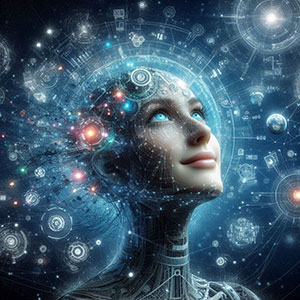
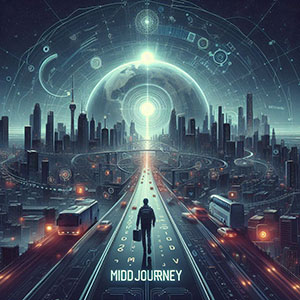
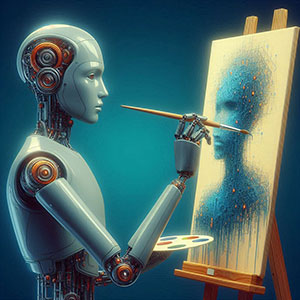
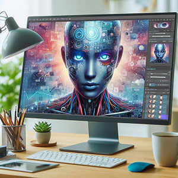
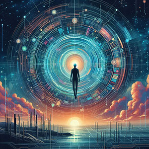

Com gerador de imagens por IA é possível criar imagens incríveis. Os geradores de imagens por IA estão transformando a forma como criamos conteúdo visual. Com apenas alguns cliques, é possível produzir ilustrações, fotos realistas e obras de arte impressionantes. Neste artigo, vamos explorar as 5 melhores ferramentas de geração de imagens por IA disponíveis atualmente, destacando suas funcionalidades, vantagens e como elas podem revolucionar seu fluxo de trabalho criativo.

1. [O que é um gerador de imagens por IA (Inteligência Artificial)?](#o-que-e-um-gerador-de-imagens-por-ia-inteligencia-artificial)
2. [Como funciona o Gerador de Imagens por IA?](#como-funciona-o-gerador-de-imagens-por-ia)
3. [Quais são as 5 melhores ferramentas de geração de imagens por IA?](#quais-sao-as-5-melhores-ferramentas-de-geracao-de-imagens-por-ia)
4. [Como escolher o melhor gerador de imagens para diferentes necessidades?](#como-escolher-o-melhor-gerador-de-imagens-para-diferentes-necessidades)
5. [Benefícios dos geradores de imagens por IA no dia a dia](#beneficios-dos-geradores-de-imagens-por-ia-no-dia-a-dia)
6. [Conclusão](#conclusao)
7. [FAQ: Perguntas Frequentes](#faq-perguntas-frequentes)

## O que é um gerador de imagens por IA (Inteligência Artificial)?

Os geradores de imagens por IA são ferramentas avançadas que utilizam [**inteligência artificial**](https://tecextreme.com.br/categoria/inteligencia-artificial/) para criar imagens a partir de descrições textuais ou parâmetros definidos. Essas soluções combinam aprendizado de máquina e redes neurais para produzir visuais únicos, variando de obras de arte abstratas a imagens foto-realistas.

Essa tecnologia está transformando diversas áreas, como design gráfico, marketing e criação de conteúdo, ao permitir que qualquer pessoa, independentemente de habilidades técnicas, crie imagens de alta qualidade com rapidez e eficiência.

## Como funciona o Gerador de Imagens por IA?

A base dos geradores de imagens por IA está no aprendizado profundo, um subsetor do aprendizado de máquina que utiliza redes neurais artificiais para imitar o funcionamento do cérebro humano. Essas redes são treinadas com milhões de imagens e descrições para aprender padrões, estilos e estruturas que possam ser replicados.

**Exemplos de algoritmos usados**

Um dos algoritmos mais populares usados nesse processo é o **GAN (Generative Adversarial Network)**. Ele funciona com duas redes neurais que competem entre si:

1. **Gerador:** Cria novas imagens com base nos dados fornecidos.

3. **Discriminador:** Avalia a qualidade das imagens geradas, comparando-as com imagens reais, e fornece feedback para melhorar o processo.

Esse ciclo contínuo permite que os geradores produzam resultados cada vez mais realistas. Além dos GANs, tecnologias como **Transformers** também são empregadas para interpretar descrições textuais e transformá-las em visuais detalhados, como visto no caso do **DALL·E 2**.

**Exemplo prático**

Imagine que você descreva "um cachorro brincando em um parque ao pôr do sol". O gerador de imagens por IA analisa a descrição, consulta seu banco de dados para identificar padrões e combina elementos visuais correspondentes. Em poucos segundos, ele cria uma imagem que reflete exatamente a cena descrita.

Essa combinação de algoritmos inovadores e bancos de dados extensos é o que torna os geradores de imagens por IA tão poderosos e versáteis.

## Quais são as 5 melhores ferramentas de geração de imagens por IA?

Com tantas opções disponíveis, encontrar o melhor gerador de imagens por IA pode ser desafiador. Abaixo, listamos as 5 ferramentas mais populares e eficazes, destacando suas funcionalidades, vantagens e casos de uso.

### **1\. DALL·E 2**

O **DALL·E 2**, criado pela OpenAI, é um dos geradores de imagens mais avançados. Ele utiliza inteligência artificial para transformar descrições textuais em imagens altamente detalhadas e criativas.

#### **Principais funcionalidades do DALL·E 2:**

- Capacidade de interpretar descrições complexas e criar imagens realistas.

- Suporte para ajustes, como redimensionar ou editar elementos específicos das imagens geradas.

- Produz resultados em alta resolução.

Casos de uso:

Ideal para ilustradores, profissionais de marketing e criadores de conteúdo que buscam imagens únicas para campanhas ou projetos artísticos.

**Exemplo prático:**Digite "um robô pintando uma paisagem futurista durante o pôr do sol" no DALL·E 2, e ele criará uma imagem com todos esses elementos visualmente integrados.

### **2\. MidJourney**

O **[MidJourney](https://www.midjourney.com/home)** é amplamente reconhecido por sua ênfase em qualidade artística, tornando-o uma escolha popular entre designers e artistas digitais.

#### **Principais funcionalidades do** **MidJourney****:**

- Foco em criar visuais com estética artística e detalhamento impressionante.

- Suporte via Discord, onde os usuários podem interagir e compartilhar suas criações.

- Grande variedade de estilos visuais disponíveis.

Casos de uso:

Perfeito para criar ilustrações conceituais, arte abstrata e visuais de alta qualidade para exposições ou projetos criativos.

### **3\. Stable Diffusion**

O **[Stable Diffusion](https://stablediffusionweb.com/)** é uma ferramenta de código aberto que se destaca por sua flexibilidade e customização.

#### **Principais funcionalidades Stable Diffusion:**

- Totalmente gratuito e de código aberto.

- Pode ser executado localmente, eliminando a necessidade de conexão com a nuvem.

- Compatível com plug-ins para maior personalização.

Casos de uso:

Ideal para desenvolvedores, entusiastas de IA e empresas que desejam adaptar o software para necessidades específicas.

### **4\. Canva com IA**

O **[Canva](https://www.canva.com/)**, amplamente utilizado para design gráfico, agora inclui recursos de IA para geração de imagens, oferecendo simplicidade e acessibilidade para iniciantes.

#### **Principais funcionalidades do Canva com IA:**

- Interface intuitiva e fácil de usar.

- Geração de imagens integrada diretamente ao fluxo de design.

- Extensa biblioteca de templates e elementos gráficos.

Casos de uso:

Ótimo para pequenas empresas, profissionais de marketing e criadores de conteúdo que precisam de designs rápidos e eficientes.

### **5\. Runway ML**

O **[Runway ML](https://runwayml.com/)** é voltado para usuários avançados, oferecendo ferramentas para edição de vídeo, modelagem 3D e geração de imagens.

#### **Runway ML: Principais funcionalidades**

- Suporte para múltiplos formatos criativos, incluindo vídeos e modelos 3D.

- Geração de imagens personalizável com opções avançadas de edição.

- Ferramentas colaborativas para equipes criativas.

**Casos de uso:**

Ideal para criadores de conteúdo profissional, estúdios de produção e equipes de design que trabalham em projetos de grande escala.

## Como escolher o melhor gerador de imagens para diferentes necessidades?

Com diversas opções de geradores de imagens por IA no mercado, selecionar a ferramenta mais adequada requer análise cuidadosa. A seguir, encontram-se algumas orientações práticas para auxiliar na escolha.

### **1\. Definir o objetivo da criação de imagens**

O propósito principal é o ponto de partida para escolher o gerador de imagens ideal:

- **Arte:** Para criar ilustrações conceituais ou visuais artísticos, ferramentas como MidJourney e DALL·E 2 são altamente recomendadas devido à sua qualidade estética.

- **Marketing:** No caso de campanhas publicitárias que exigem agilidade, o Canva com IA oferece praticidade e resultados rápidos.

- **Design Gráfico:** Para projetos técnicos ou criativos mais elaborados, Stable Diffusion é uma excelente opção por sua flexibilidade.

Com um objetivo claro, é mais fácil alinhar as funcionalidades da ferramenta às expectativas.

### **2\. Avaliar custo-benefício**

Comparar o custo das ferramentas em relação às suas funcionalidades ajuda a determinar a melhor relação custo-benefício. Muitas plataformas oferecem versões gratuitas com limitações e planos pagos para recursos mais avançados, como direitos comerciais e maior qualidade de imagem.

**Dicas:**

- Ferramentas como Stable Diffusion oferecem alternativas gratuitas e de código aberto.

- Planos pagos, como os do DALL·E 2 e MidJourney, atendem bem a demandas frequentes ou profissionais.

### **3\. Examinar a facilidade de uso**

Analisar a interface e os recursos oferecidos é fundamental para determinar a curva de aprendizado e o tempo necessário para criar imagens. Ferramentas como o Canva são ideais para iniciantes, enquanto plataformas como Runway ML atendem melhor a usuários avançados.

**Critérios de avaliação:**

- Disponibilidade de tutoriais e suporte técnico.

- Integração com outros softwares ou fluxos de trabalho.

### **4\. Considerar opções de personalização**

A flexibilidade para ajustar detalhes como estilo, cores e formatos é um diferencial em alguns geradores. Stable Diffusion e Runway ML permitem maior controle sobre os resultados, atendendo projetos que exigem especificidade.

**Exemplo:**

Para criar imagens com um estilo artístico específico, o MidJourney oferece ajustes detalhados e variações até alcançar o resultado desejado.

### **5\. Consultar avaliações e utilizar versões gratuitas**

Analisar feedback de outros usuários e experimentar versões gratuitas ajuda a entender como cada ferramenta funciona na prática. Plataformas como DALL·E 2 e Canva oferecem períodos de teste que facilitam essa análise.

## Benefícios dos geradores de imagens por IA no dia a dia

Os geradores de imagens por IA estão transformando a forma como conteúdos visuais são criados, oferecendo vantagens significativas em diversas áreas. Abaixo, estão destacados os principais benefícios que essas ferramentas proporcionam.

### **1\. Redução de custos e tempo**

Gerar imagens manualmente ou contratar profissionais pode demandar recursos consideráveis. Com ferramentas de IA, é possível:

- Produzir imagens em questão de minutos, eliminando a necessidade de longos processos de design.

- Reduzir custos associados à contratação de ilustradores ou à aquisição de softwares complexos.

- Otimizar fluxos de trabalho em setores como marketing, educação e entretenimento.

**Exemplo:** Para criar imagens promocionais rapidamente, plataformas como Canva com IA ou DALL·E 2 oferecem soluções instantâneas e acessíveis.

### **2\. Acessibilidade para não designers**

Ferramentas de geração de imagens por IA democratizam o design, permitindo que qualquer pessoa crie visuais atrativos, independentemente de experiência técnica.

- Interfaces intuitivas tornam o processo de criação simples e direto.

- Modelos pré-definidos e sugestões automáticas ajudam a construir imagens alinhadas às necessidades específicas.

Softwares como o Canva, com seus recursos de IA integrados, exemplificam essa acessibilidade ao permitir que pequenas empresas e empreendedores criem campanhas visuais sem a necessidade de habilidades avançadas em design gráfico.

### **3\. Potencial para experimentação criativa**

Geradores de imagens por IA oferecem uma oportunidade única para explorar ideias e conceitos inovadores.

- Ferramentas como MidJourney e Stable Diffusion permitem testar diferentes estilos artísticos e visuais.

- A flexibilidade dos algoritmos de IA possibilita combinações únicas de elementos, criando resultados inesperados e criativos.

**Exemplo prático:** Experimentar estilos futuristas para projetos de ilustração conceitual ou testar diferentes layouts para branding em um negócio local.

Esses benefícios destacam a relevância dos geradores de imagens por IA no cotidiano, contribuindo para maior produtividade e criatividade em diversos contextos.

## Conclusão

Os geradores de imagens por IA são aliados poderosos para criar conteúdos visuais únicos e de alta qualidade, sejam eles artísticos ou comerciais. Explore as ferramentas que listamos e descubra qual delas se adapta melhor às suas demandas.  
Experimente agora uma dessas ferramentas e compartilhe sua experiência nos comentários!

## FAQ: Perguntas Frequentes

1. **O que é essa IA que cria imagens?**Um software que utiliza inteligência artificial para criar imagens com base em descrições ou modelos predefinidos.

3. **Qual é o melhor gerador de imagens por IA gratuito?**Stable Diffusion é uma excelente opção gratuita e de código aberto.

5. **É necessário saber programação para usar geradores de imagens por IA?**Não. A maioria das ferramentas é intuitiva e acessível para todos os usuários.

7. **Os geradores de imagens por IA podem criar imagens realistas?**Sim, ferramentas como DALL·E 2 produzem resultados incrivelmente realistas.

9. **Os geradores de imagens por IA são éticos de usar?**  
    Sim, desde que usados respeitando direitos autorais e propósitos legais.
