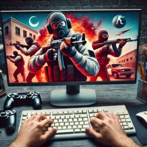
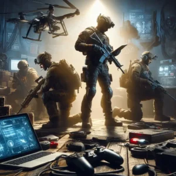
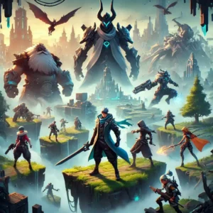

Os jogos de tiro para PC continuam dominando o cenário dos [**games**](https://tecextreme.com.br/categoria/games-jogos/), oferecendo experiências intensas, cheias de adrenalina e diversão. Mas com tantas opções disponíveis, como decidir quais são os melhores? Este artigo vai explorar os **5 melhores jogos de tiro para PC**, destacando seus diferenciais e o que os tornam indispensáveis para qualquer jogador.

## Conteúdo

1. [O que torna um jogo de tiro incrível?](#o-que-torna-um-jogo-de-tiro-incrivel)
2. [#1 - Counter-Strike: Global Offensive (CS:GO)](#1-counter-strike-global-offensive-cs-go)
3. [#2 - Call of Duty: Warzone](#2-call-of-duty-warzone)
4. [#3 - Apex Legends](#3-apex-legends)
5. [#4 - Valorant](#4-valorant)
6. [#5 - Doom Eternal](#5-doom-eternal)
7. [Jogos, menções honrosas](#jogos-mencoes-honrosas)
8. [Dicas para escolher o jogo certo](#dicas-para-escolher-o-jogo-certo)
9. [Conclusão](#conclusao)
10. [Perguntas Frequentes](#perguntas-frequentes)

## O que torna um jogo de tiro incrível?

Nem todos os jogos de tiro são iguais, e certos elementos os diferenciam:

- **Jogabilidade fluida e responsiva:** Movimentos precisos e mecânicas que respondem rapidamente ao jogador.

- **Variedade de modos de jogo:** Multiplayer, campanha, ou até Battle Royale, para atender diferentes preferências.

- **Gráficos e som imersivos:** Ambientes realistas e efeitos sonoros que melhoram a experiência.

- **Força da comunidade:** Quanto maior a participação da comunidade, maior o potencial para interações valiosas e duradouras.

Esses aspectos são fundamentais para determinar a qualidade e a longevidade de um jogo.

## #1 - [Counter-Strike: Global Offensive (CS:GO)](https://store.steampowered.com/app/730/CounterStrike_2/)

### **História do CS:GO**

Desde o lançamento em 2012, **Counter-Strike: Global Offensive** solidificou sua posição como um dos melhores jogos de tiro. Derivado do clássico Counter-Strike, CS:GO combina simplicidade com desafios estratégicos.

### **Por que é tão popular?**

- **Partidas altamente competitivas:** Cada rodada é uma batalha tática entre terroristas e contra-terroristas.

- **Ecosistema de eSports:** CS:GO é um dos pilares dos torneios globais de eSports.

- **Acessibilidade:** Mesmo computadores mais antigos conseguem rodá-lo.

- **Mercado de skins:** Um mercado ativo que mantém o interesse dos jogadores.

## #2 - [Call of Duty: Warzone](https://www.xbox.com/pt-br/games/store/call-of-duty-warzone/9nnfg8bqrcxl)

### **Modo Battle Royale e sua mecânica única**

**Call of Duty: Warzone** revolucionou o gênero Battle Royale ao adicionar mecânicas como o **Gulag**, onde jogadores derrotados têm uma chance de voltar ao campo de batalha.

### **Principais características do Warzone**

- **Mapas gigantescos:** Cenários detalhados que favorecem diferentes estilos de jogo.

- **Integração com outras franquias COD:** Atualizações constantes com novos conteúdos.

- **Crossplay:** Permite jogar entre plataformas, aumentando o alcance dos jogadores.

Warzone oferece uma mistura de ação frenética e estratégia que atrai tanto jogadores casuais quanto profissionais.

## #3 - [Apex Legends](https://www.ea.com/pt-br/games/apex-legends)

### **O diferencial dos heróis e habilidades únicas**

**Apex Legends** introduziu uma abordagem única ao gênero de Battle Royale, focando em **personagens com habilidades especiais**. Cada herói tem sua própria personalidade, habilidades e estilo de jogo.

### **Sucesso no cenário competitivo**

- **Trabalho em equipe:** O jogo transforma a equipe em uma unidade coesa, onde a comunicação é a base de todas as ações.

- **Gráficos e narrativa ricos:** Desenvolvido pela Respawn Entertainment, o jogo é ambientado no universo de Titanfall.

- **Atualizações frequentes:** Temporadas regulares mantêm a experiência sempre renovada.

## #4 - [Valorant](https://playvalorant.com/pt-br/)

### **Mistura de estratégia e ação**

Combinando elementos de CS:GO e Overwatch, **Valorant** tornou-se um sucesso instantâneo. Ele apresenta personagens com habilidades únicas e armas balanceadas, criando um jogo que exige precisão e trabalho em equipe.

### **O impacto no eSports**

- **Torneios globais:** Valorant rapidamente se tornou um dos maiores títulos competitivos do mundo.

- **Design acessível:** Roda em PCs menos potentes, atraindo uma grande base de jogadores.

- **Foco na tática:** Cada partida exige planejamento e execução impecáveis.

## #5 - [Doom Eternal](https://store.steampowered.com/app/782330/DOOM_Eternal/)

### **A evolução de Doom ao longo dos anos**

**Doom Eternal** é um retorno triunfante às raízes do FPS, combinando ação frenética com gráficos modernos e uma trilha sonora incrível.

### **Por que Doom Eternal é um clássico moderno?**

- **Jogabilidade acelerada:** Enfrentar hordas de demônios em ambientes dinâmicos é pura adrenalina.

- **História envolvente:** Explora a luta do Doom Slayer contra forças demoníacas.

- **Gráficos de última geração:** Um dos jogos mais visualmente impressionantes de sua categoria.

## Jogos, menções honrosas

- **Rainbow Six Siege:** A escolha perfeita para amantes de estratégias e combates intensos.

- **PUBG:** O jogo que popularizou os Battle Royales.

- **Overwatch 2:** Para os fãs de jogos em equipe com personagens carismáticos.

## Dicas para escolher o jogo certo

- **Prefere ação frenética ou estratégia?** Escolha jogos como Doom Eternal para adrenalina ou CS:GO para desafios estratégicos.

- **Joga sozinho ou com amigos?** Warzone e Apex Legends são ideais para multiplayer.

- **Configuração do PC:** Verifique os requisitos do sistema antes de baixar.

## Conclusão

Os jogos de tiro para PC continuam a evoluir, proporcionando experiências inesquecíveis para jogadores de todos os níveis. Desde clássicos como CS:GO até títulos inovadores como Valorant, há algo para todos. Experimente os jogos mencionados e encontre o que mais combina com você.

## Perguntas Frequentes

1. **Qual é o melhor jogo de tiro para quem está começando?**Apex Legends é uma ótima escolha, pois combina diversão com aprendizado rápido.

3. **Todos esses jogos são gratuitos?**Valorant, Apex Legends e Warzone são free-to-play, enquanto Doom Eternal e CS:GO podem exigir compra.

5. **Preciso de um PC potente para rodar esses jogos?**Não necessariamente. Jogos como Valorant e CS:GO rodam bem em máquinas mais modestas.

7. **Esses jogos têm suporte para controle?**Sim, a maioria oferece suporte para controle, mas mouse e teclado são recomendados.

9. **Qual desses é melhor para eSports?**  
    CS:GO e Valorant dominam o cenário competitivo atualmente.
