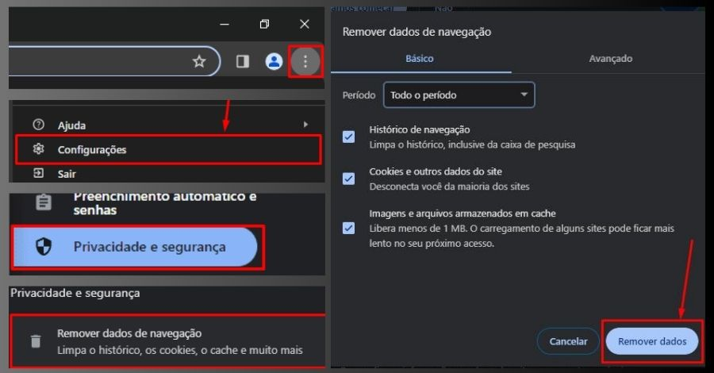

Se você utiliza frequentemente o navegador **Chrome** da **[Google](https://about.google/intl/ALL_br/products/)** no computador, notebook ou celular, em algum momento precisou **limpar o cache e os cookies no Google Chrome**, isso porque, provavelmente já percebeu que o navegador armazena informações temporárias como: imagens, cookies e outros dados dos sites que você visita.

Embora isso possa **acelerar a navegação**, também pode **acumular arquivos desnecessários** e **prejudicar** o desempenho do navegador.

Provavelmente, em algum momento você já se deparou com páginas da web que demoram uma eternidade para carregar ou talvez tenha tido problemas de autenticação em sites que você visita com frequência.

Essas frustrações podem ser resultado do **acúmulo** de **cache e cookies** em seu navegador Google Chrome.

## Conteúdo

1. [O que são Cache e Cookies?](#o-que-sao-cache-e-cookies)
    1. [Cache?](#cache)
    2. [Cookies](#cookies)
2. [Quando é preciso limpar o Cache e os Cookies do navegador?](#quando-e-preciso-limpar-o-cache-e-os-cookies-do-navegador)
3. [Diagnóstico em Modo Anônimo: Descubra se o Cache ou Cookies são Culpados!](#diagnostico-em-modo-anonimo-descubra-se-o-cache-ou-cookies-sao-culpados)
4. [Pontos de atenção antes de fazer a limpeza do cache e dos cookies do navegador Google Chrome](#pontos-de-atencao-antes-de-fazer-a-limpeza-do-cache-e-dos-cookies-do-navegador-google-chrome)
5. [Como Limpar o Cache e os Cookies no Google Chrome passo a passo:](#como-limpar-o-cache-e-os-cookies-no-google-chrome-passo-a-passo)
    1. [No Computador:](#no-computador)
    2. [No Android:](#no-android)
    3. [No iPhone e iPad:](#no-i-phone-e-i-pad)
6. [Dica Extra: Limpeza Avançada](#dica-extra-limpeza-avancada)
7. [Conclusão:](#conclusao)

## O que são Cache e Cookies?

Cache e cookies são duas partes importantes do seu navegador que, embora invisíveis, desempenham um papel fundamental na sua experiência de navegação.

### Cache?

O [**cache**](https://pt.wikipedia.org/wiki/Cache_web) do navegador é um espaço de armazenamento temporário onde são guardadas cópias de arquivos, como imagens, folhas de estilo e scripts, dos sites frequentemente visitados.

Esses arquivos ficam armazenados localmente no seu computador ou dispositivo móvel, permitindo que, quando você retorna a um site, o navegador carregue as páginas mais rapidamente, pois muitos elementos necessários já estão pré-armazenados no cache.

### Cookies

Cookies são pequenos arquivos de texto que os sites colocam no seu dispositivo quando você os visita.

Esses arquivos contêm informações como preferências de idioma, dados de login, itens no carrinho de compras e outras configurações do site.

Os **[cookies](https://pt.wikipedia.org/wiki/Cookie_\(inform%C3%A1tica\))** têm um papel crucial na personalização da sua experiência de navegação, permitindo que os sites se lembrem de você e ofereçam conteúdo relevante.

Ao realizar a limpeza do cache e/ou dos cookies, você pode se deparar com a opção de limpeza do **"Histórico de Navegação"**. O histórico de navegação é uma lista que contém os endereços (URLs) e os títulos das páginas dos sites que você visitou. O propósito disso é simplificar o processo de retornar a esses sites, permitindo que você os acesse novamente sem ter que lembrar ou digitar o URL completo. A alternativa para apagar o histórico também está disponível.

## Quando é preciso limpar o Cache e os Cookies do navegador?

Às vezes, o navegador fica sobrecarregado e precisa de um "reset". Aqui estão **seis** sinais de que é hora de limpar o cache e os cookies no Google Chrome:

- **Desempenho Lento:** Se o seu navegador está demorando muito para carregar páginas da web, é um sinal de que o cache pode estar sobrecarregado de dados temporários, o que afeta a velocidade de carregamento.

- **Problemas de Carregamento de Páginas:** Se você notar que certas páginas não estão carregando corretamente, com elementos em falta ou travamentos frequentes, é hora de limpar o cache.

- Problemas de Autenticação: Se está tendo dificuldades para fazer login em suas contas online, como e-mails ou redes sociais, cookies corrompidos podem ser a causa. Limpar os cookies pode resolver esses problemas.

- **Uso Intensivo da Web:** Se você usa a web com frequência e visita muitos sites, o cache e os cookies podem se acumular rapidamente, tornando a limpeza mais frequente uma necessidade para manter o desempenho do navegador.

- **Compartilhamento de Computador ou Dispositivo:** Se mais de uma pessoa usa o mesmo computador ou dispositivo, limpar os cookies é uma medida importante para evitar que informações de login e preferências sejam compartilhadas inadvertidamente.

- **Espaço em Disco Insuficiente:** Em dispositivos com pouco espaço de armazenamento, o cache pode ocupar uma quantidade considerável de espaço em disco, impactando o desempenho geral do dispositivo. Limpar o cache e o cookies ajuda a liberar espaço.

Lembrando que, **a frequênci**a com que você deve **limpar o cache e os cookies** depende do **seu uso da web e de suas necessidades**. Algumas pessoas o fazem mensalmente, enquanto outras podem fazer isso apenas quando notam problemas específicos. A decisão é sua, mas é uma boa prática incorporar essa manutenção regular à sua rotina de uso da web para garantir um desempenho suave e proteção da privacidade.

## Diagnóstico em Modo Anônimo: Descubra se o Cache ou Cookies são Culpados!

Se suspeita que problemas de desempenho estão relacionados ao cache ou cookies, realizar um teste em uma guia anônima pode fornecer respostas valiosas.

Aqui está o caminho para esse diagnóstico rápido:

1. **Abra uma Guia Anônima:**  
    • Clique nos três pontinhos no canto superior direito do navegador e depois clique na opção: "Nova guia anônima" dentro do menu suspenso.

3. **Reproduza o Problema:**  
    • Navegue nas páginas ou realize as ações que normalmente causam problemas.

5. **Avalie o Desempenho:**  
    • Observe se o desempenho melhora na guia anônima. Se sim, é um indicativo de que o cache ou os cookies podem estar impactando a navegação.

7. **Considere uma Limpeza:**  
    • Caso o desempenho seja notavelmente melhor na guia anônima, pode ser hora de considerar uma limpeza no cache e cookies.

Essa estratégia simples permite isolar possíveis causas de problemas, indicando se o cache ou cookies estão interferindo na sua experiência de navegação.

## Pontos de atenção antes de fazer a limpeza do cache e dos cookies do navegador Google Chrome

Quando você opta por limpar o cache e os cookies do navegador Google Chrome, alguns resultados esperados podem surgir. Abaixo estão alguns pontos importante que você deve estar ciente antes de fazer a limpeza:

- **Exclusão de Dados Temporários:** Todos os arquivos armazenados em cache, incluindo imagens e outros recursos de sites, são apagados. Isso significa que, ao revisitar esses sites, o navegador precisará baixar esses elementos novamente, o que pode levar um pouco mais de tempo.

- **Desconexão Automática:** Se você estiver conectado a sites ou serviços, como contas de e-mail ou redes sociais, a limpeza dos cookies pode resultar na desconexão automática dessas contas. Você precisará fazer login novamente e reconfigurar algumas preferências. **Portanto, antes de fazer a limpeza do cache e cookies do navegador é importante que você tenha suas senhas salvas (Certifique-se de ter credenciais de login salvas).**

- **Perda de Preferências:** Alguns sites usam cookies para lembrar suas preferências e configurações. Ao limpar os cookies, **você pode perder essas preferências, e o site pode voltar às configurações padrão.**

## Como Limpar o Cache e os Cookies no Google Chrome passo a passo:

Hora de colocar as mãos na massa e melhorar o desempenho do navegador! Siga nosso guia prático dividido em três partes: no computador, Android e iPad/iPhone.

### No Computador:

Google Chrome: **Versão 118.0.5993.118 (Versão oficial) 64 bits**

1. Abra o Chrome.

3. Clique nos três pontos no canto superior direito e depois em "Configurações".

5. Em configurações, selecione a opção: "Privacidade e segurança".

7. Clique em "Remover dados de navegação".

9. Em "Período", selecione a opção de "Todo o período".

11. Marque as opções: "Histórico de navegação" (Histórico de navegação é opcional), "Cookies e outros dados do site" e "Imagens e arquivos em cache".

13. Clique no botão de: "Remover dados" e reinicie o navegador.

<figure>

<figcaption>

Limpar Cache e Cookies do Google Chrome no computador

</figcaption>

</figure>

### No Android:

1. Abra o aplicativo do Google Chrome e toque nos três pontinhos no canto superior direito.

3. Selecione "Configurações".

5. Dentro do menu suspenso, role para baixo e toque em "Privacidade e Segurança".

7. Toque em "Remover dados de navegação".

9. Selecione as caixinhas de: "Imagens e arquivos em cache" e "Cookies, dados do site" (Histótico de navegação é opcional).

11. Toque no botão de: "Remover dados".

### No iPhone e iPad:

1. No iPad/iPhone, navegue entre os aplicativos e abra o aplicativo do Google Chrome.

3. Toque nos três pontinhos no canto superior direito do navegador.

5. Vá para "Configurações" e depois em "Privacidade".

7. Toque em "Remover dados de navegação".

9. Selecione as caixinhas de: "Imagens e arquivos em cache" e "Cookies, dados do site" (Histótico de navegação é opcional).

11. Toque em "Remover dados".

**Lembre-se de que, após a limpeza, você precisará fazer login novamente em sites que exigem autenticação.**

## Dica Extra: Limpeza Avançada

Agora, para os aventureiros que buscam uma limpeza personalizada, mergulharemos em: "Remover dados de navegação", "Avançado". Aqui, a ideia é apagar somente o que é verdadeiramente desnecessário, permitindo que você mantenha suas senhas e preferências salvas intactas. Vamos ao passo a passo:

No computador:

1. Clique nos três pontinho no canto superior direito do navegador e no menu suspenso, vá para "Configurações"

3. Em configurações, clique na opção de: "Privacidade e segurança".

5. Depois clique em "Remover dados de navegação" porém selecione a guia "Avançado".

7. Escolha as Opções Desejadas: Nessa tela, você terá controle total sobre o que deseja limpar. Marque as opções de acordo com suas preferências, lembre-se de manter suas senhas e preferências salvas intactas.

9. Após escolher suas opções, clique em "Remover dados" para efetivar a limpeza avançada.

## Conclusão:

Ao limpar o cache e os cookies, você não apenas otimiza o desempenho do Google Chrome, mas também garante uma experiência de navegação mais eficiente e segura. Cada clique se torna mais ágil, cada página carrega mais rápido.

Se este guia foi útil para você, compartilhe com seus amigos nas redes sociais! Queremos saber sua opinião nos comentários abaixo. Ah, e não perca nosso próximo capítulo: "[Criar conta Google: passo a passo para criar uma conta grátis](https://tecextreme.com.br/criar-conta-google-passo-a-passo/)". A jornada continua!

**Fonte de Referência:** As informações fornecidas neste artigo foram baseadas em nossa experiência e na Ajuda do Google, uma fonte confiável para informações relacionadas ao Google Chrome. Para obter mais detalhes e assistência direta, você pode visitar a [**Ajuda do Google**](https://support.google.com/accounts/answer/32050?hl=pt-BR&co=GENIE.Platform%3DDesktop) relacionada à limpeza de cache e cookies.
