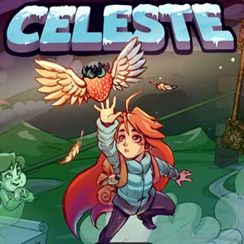
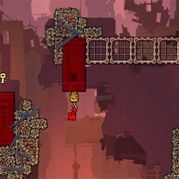
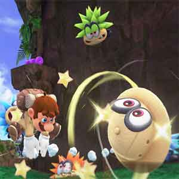

Os **melhores jogos de plataforma** sempre se destacaram por oferecer experiências desafiadoras e envolventes. Com mecânicas que testam habilidades como _timing_ e precisão, eles conquistaram uma legião de fãs ao redor do mundo.

Seja em versões 2D ou 3D, esses jogos continuam a atrair diferentes públicos, desde veteranos até novatos. Disponíveis para **PC e consoles**, eles proporcionam aventuras inesquecíveis. Prepare-se para conhecer _7 opções incríveis_ que valem a pena!

## Conteúdo deste post...

1. [O Que São Jogos de Plataforma?](#o-que-sao-jogos-de-plataforma)
2. [Por Que os Jogos de Plataforma Continuam Conquistando Jogadores?](#por-que-os-jogos-de-plataforma-continuam-conquistando-jogadores)
3. [Os 7 Melhores Jogos de Plataforma para PC e Consoles](#os-7-melhores-jogos-de-plataforma-para-pc-e-consoles)
4. [Jogos de Plataforma para PC: Por Que Vale a Pena?](#jogos-de-plataforma-para-pc-por-que-vale-a-pena)
5. [Jogos de Plataforma nos Consoles: A Experiência Completa](#jogos-de-plataforma-nos-consoles-a-experiencia-completa)
6. [Jogos de Plataforma Indie: Pequenos Estúdios, Grandes Ideias](#jogos-de-plataforma-indie-pequenos-estudios-grandes-ideias)
7. [Dicas Essenciais para Encontrar o Jogo de Plataforma Ideal](#dicas-essenciais-para-encontrar-o-jogo-de-plataforma-ideal)
8. [Menções Honrosas de Jogos de Plataforma que Não Podem Ficar de Fora](#mencoes-honrosas-de-jogos-de-plataforma-que-nao-podem-ficar-de-fora)
9. [Conclusão](#conclusao)
10. [FAQs (Perguntas Frequentes)](#fa-qs-perguntas-frequentes)

## O Que São Jogos de Plataforma?

Um **[jogo eletrônico de plataforma](https://pt.wikipedia.org/wiki/Jogo_eletr%C3%B4nico_de_plataforma)** é definido por sua ênfase em _saltos_ e deslocamentos entre plataformas. Esses jogos desafiam os jogadores a superar obstáculos, inimigos e quebra-cabeças em ambientes dinâmicos. A principal mecânica envolve _correr_, pular e explorar cenários criativos.

Nos **jogos de plataforma 2D**, a ação ocorre em um plano lateral, com movimentos limitados ao eixo horizontal e vertical. Já nos _jogos de plataforma 3D_, o jogador tem liberdade para explorar mundos mais amplos e tridimensionais. Ambos oferecem experiências únicas, mas igualmente desafiadoras.

Ao longo dos anos, os **jogos de plataforma** evoluíram significativamente. Títulos clássicos como _Super Mario Bros_ popularizaram o gênero, enquanto inovações modernas expandiram suas possibilidades. Hoje, gráficos avançados e mecânicas refinadas definem novos padrões.

A transição do 2D para o 3D marcou um momento crucial na história desses jogos. Enquanto alguns títulos preservam o charme retrô, outros apostam em realismo e imersão. Essa diversidade faz do gênero uma escolha sempre relevante para os fãs de jogos eletrônicos.

## Por Que os Jogos de Plataforma Continuam Conquistando Jogadores?

Os **jogos de plataforma** são conhecidos por oferecer experiências desafiadoras e divertidas, mas os _melhores do gênero_ vão além. Eles combinam mecânicas precisas, designs criativos e uma sensação constante de progressão, cativando jogadores de todas as idades.

Entre os _melhores jogos de plataforma_, encontram-se títulos que definiram padrões no passado e continuam relevantes hoje. Seja em 2D ou 3D, esses jogos proporcionam momentos inesquecíveis, como superar fases difíceis ou explorar mundos imersivos. Essa nostalgia misturada à inovação é o que os torna especiais.

Além disso, a diversidade de opções é impressionante. Os **games de plataforma para PC e consoles** oferecem uma ampla gama de estilos, desde clássicos até novidades modernas. Cada título traz algo único, seja um design de nível criativo ou uma abordagem inovadora das mecânicas tradicionais.

Por fim, os _melhores jogos de plataforma_ destacam-se pela capacidade de unir desafio e diversão. Com gráficos impressionantes e controles refinados, eles garantem horas de entretenimento. Não é à toa que continuam sendo uma escolha popular entre os amantes de games.

## Os 7 Melhores Jogos de Plataforma para PC e Consoles

### #1 Celeste (2018)

**Gênero:** Jogo de plataforma 2D | **Plataformas:** PC, Nintendo Switch, PS4, Xbox One  
_Celeste figura entre os jogos de plataforma mais celebrados da última década._ Sua mecânica baseada em saltos precisos desafia os jogadores enquanto conta uma história emocionante sobre superação pessoal.

O design de fases é meticuloso, com obstáculos que exigem paciência e habilidade. Cada nível é único, oferecendo novos desafios sem comprometer a diversão. Além disso, a trilha sonora melhora ainda mais a experiência imersiva.

A narrativa de _Celeste_ é outro destaque, explorando temas como ansiedade e autoaceitação. Combinado com gráficos pixel art encantadores, o jogo se torna uma obra-prima moderna deste gênero.

### #2 Hollow Knight (2017)

**Gênero:** Jogo de plataforma/metroidvania | **Plataformas:** PC, Nintendo Switch, PS4, Xbox One  
_Hollow Knight_ é um dos _melhores jogos de plataforma_ que combina exploração e combate estratégico. Ambientado em um mundo sombrio e misterioso, ele cativa os jogadores com sua atmosfera única e desafios intensos.

Os controles são fluidos, permitindo movimentos precisos durante batalhas e exploração. O mapa vasto e interconectado incentiva a curiosidade, recompensando os jogadores com segredos escondidos.

Além disso, o jogo oferece profundidade em seu sistema de progressão. Com chefes desafiadores e upgrades significativos, _Hollow Knight_ é uma experiência inesquecível para fãs de **jogos eletrônicos de plataforma**.

### #3 Ori and the Blind Forest (2015)

**Gênero:** Jogo de plataforma 2D | **Plataformas:** PC, Xbox One, Nintendo Switch  
_Ori and the Blind Forest_ é um exemplo brilhante de _jogos de plataforma_ que combinam beleza visual e narrativa emocional. A história segue Ori, uma pequena criatura em uma jornada para salvar sua floresta.

Os controles são suaves, com mecânicas de salto e corrida que permitem exploração fluida. Os puzzles e desafios são bem integrados ao ambiente, criando uma experiência envolvente.

A arte visual e a trilha sonora elevam o jogo a outro nível. Com seus gráficos deslumbrantes e uma história tocante, _Ori and the Blind Forest_ é um dos **jogos de plataforma** mais bonitos já criados.

### #4 Super Meat Boy (2010)

**Gênero:** Jogo de plataforma 2D | **Plataformas:** PC, Nintendo Switch, PS4, Xbox One  
_Super Meat Boy_ é conhecido por ser um dos _jogos de plataforma_ mais desafiadores. Com controles responsivos e fases curtas, ele testa a habilidade dos jogadores de forma implacável.

Cada tentativa falha ensina algo novo, incentivando a prática e a melhoria. Apesar da dificuldade, o jogo nunca se torna frustrante, graças ao seu design inteligente e feedback instantâneo.

Com mais de 300 níveis e uma variedade de modos extras, _Super Meat Boy_ é uma experiência essencial para quem busca jogos desafiadores deste maravilhoso gênero de plataforma.

### #5 Sonic the Hedgehog (1991)

**Gênero:** Jogo de plataforma 2D | **Plataformas:** Sega Genesis, PC, consoles modernos  
_Sonic the Hedgehog_ é um clássico dos _jogos de plataforma_ que definiu uma era. Com foco em velocidade e fluidez, ele introduziu mecânicas únicas que inspiraram muitos títulos posteriores.

As fases são projetadas para maximizar a sensação de velocidade, com loops e rampas que desafiam os reflexos do jogador. A jogabilidade rápida e divertida continua relevante até hoje.

Embora seja um jogo antigo, _Sonic_ permanece como um marco nos **jogos de plataforma**, sendo uma referência obrigatória para fãs do gênero.

### #6 Donkey Kong Country: Tropical Freeze (2014)

**Gênero:** Jogo de plataforma 2D | **Plataformas:** Nintendo Switch, Wii U  
_Donkey Kong Country: Tropical Freeze_ é um dos _melhores jogos de plataforma_ da série. Com gráficos impressionantes e níveis criativos, ele oferece uma experiência desafiadora e divertida.

Os controles são precisos, permitindo que os jogadores explorem cenários detalhados cheios de segredos. A cooperação entre Donkey Kong e seus amigos adiciona camadas estratégicas ao gameplay.

A música orquestrada e os designs de fases únicos fazem de _Tropical Freeze_ um destaque nos **jogos de plataforma** modernos.

### #7 Super Mario Odyssey (2017)

**Gênero:** Jogo de plataforma 3D | **Plataformas:** Nintendo Switch  
_Super Mario Odyssey_ é um dos _jogos de plataforma_ mais inovadores da franquia. Com mecânicas de captura, ele permite que Mario controle outros personagens, expandindo as possibilidades de exploração.

Os mundos abertos são repletos de segredos e Power Moons, incentivando a exploração constante. Cada reino tem um tema único, desde desertos até cidades urbanas futurísticas.

Com gráficos vibrantes e uma jogabilidade criativa, _Super Mario Odyssey_ é um exemplo perfeito de como os **jogos de plataforma 3D** podem evoluir e surpreender.

## Jogos de Plataforma para PC: Por Que Vale a Pena?

Os **jogos de plataforma para PC** oferecem uma experiência única que vai além do básico. Com recursos exclusivos, como _mods_ e configurações gráficas avançadas, o PC se torna uma plataforma ideal para explorar os melhores títulos do gênero. Essa flexibilidade atrai jogadores que buscam personalização.

Uma das maiores vantagens dos **jogos pc plataforma** é a capacidade de ajustar os controles. Mouses, **[teclados](https://tecextreme.com.br/tipos-de-teclado-para-pc-diferencas-e-escolha/)** e até joysticks personalizados permitem uma jogabilidade mais precisa. Além disso, as configurações gráficas podem ser ajustadas para oferecer visuais impressionantes ou garantir desempenho estável.

Entre os _melhores jogos de plataforma_ disponíveis para PC, destacam-se títulos como _Celeste_, _Hollow Knight_ e _Ori and the Blind Forest_. Esses jogos aproveitam ao máximo os recursos do PC, entregando experiências fluidas e visualmente deslumbrantes. Mods também expandem ainda mais a longevidade desses títulos.

Por fim, a comunidade de PC é um diferencial importante. Fóruns e plataformas online permitem que jogadores compartilhem dicas, mods e desafios relacionados aos **jogos de plataforma**. Essa interação enriquece ainda mais a experiência, tornando o PC uma escolha essencial para fãs do gênero.

## Jogos de Plataforma nos Consoles: A Experiência Completa

Os **jogos de plataforma** nos consoles oferecem uma experiência imersiva e acessível. Com controles intuitivos e otimizados, os consoles proporcionam uma jogabilidade fluida que atrai tanto iniciantes quanto veteranos do gênero. Essa combinação faz dos consoles uma escolha popular para explorar os melhores títulos.

Títulos exclusivos como _Super Mario Odyssey_ e _Donkey Kong Country: Tropical Freeze_ destacam o potencial dos consoles. Esses jogos são desenvolvidos especificamente para aproveitar o **[hardware](https://tecextreme.com.br/categoria/computadores-e-hardware/)** dos consoles, entregando gráficos impressionantes e mecânicas refinadas. Além disso, muitos _jogos de plataforma_ recebem atualizações exclusivas para essas plataformas.

Os controles de console melhoram significativamente a experiência em **jogos de plataforma**. Com joysticks precisos e botões responsivos, os jogadores têm maior controle sobre saltos e movimentos. Isso é especialmente importante em títulos desafiadores, onde a precisão faz toda a diferença.

Por fim, os consoles oferecem uma experiência social única. Muitos _jogos de plataforma_ incluem modos cooperativos ou multiplayer local, perfeitos para jogar com amigos ou familiares. Essa característica torna os consoles uma escolha ideal para quem busca diversão compartilhada nos **melhores jogos de plataforma**.

## Jogos de Plataforma Indie: Pequenos Estúdios, Grandes Ideias

Os **jogos de plataforma indie** desempenham um papel crucial no ressurgimento do gênero. Com orçamentos menores, esses jogos apostam em criatividade e inovação, trazendo novas ideias para os _jogos de plataforma 2D_ e 3D. Eles provam que grandes experiências não precisam de grandes estúdios.

Títulos como _Celeste_, _Hollow Knight_ e _Ori and the Blind Forest_ são exemplos perfeitos dessa tendência. Esses jogos combinam mecânicas clássicas com narrativas emocionantes e designs de fases únicos. Além disso, muitos _jogos de plataforma indie_ exploram temas profundos, ampliando o apelo do gênero.

A acessibilidade é outro diferencial dos **jogos indie**. Com preços mais baixos e disponibilidade em plataformas como Steam e consoles, eles alcançam um público amplo. Esses jogos também oferecem experiências curtas, mas impactantes, ideais para jogadores casuais ou ocupados.

Por fim, os jogos indie destacam-se pela originalidade. Seja em _jogos de plataforma 2D_ minimalistas ou títulos 3D experimentais, os pequenos estúdios continuam a reinventar o gênero. Essa criatividade garante que os **melhores jogos de plataforma** sigam surpreendendo jogadores ao redor do mundo.

## Dicas Essenciais para Encontrar o Jogo de Plataforma Ideal

Decidir entre **jogos de plataforma 2D** e 3D é o primeiro passo para encontrar o título ideal. Os jogos 2D geralmente focam em desafios rápidos e mecânicas precisas, enquanto os 3D oferecem exploração mais ampla e imersiva. Considere qual estilo se alinha melhor aos seus interesses.

A dificuldade também deve ser avaliada ao escolher um _jogo de plataforma_. Títulos como _Super Meat Boy_ são voltados para jogadores experientes, enquanto _Ori and the Blind Forest_ oferece uma experiência mais acessível. Iniciantes podem optar por títulos com curvas de aprendizado mais suaves e controles intuitivos.

As **preferências pessoais** desempenham um papel essencial na escolha para saber se um **jogo de plataforma é bom o suficiente para estar entre os melhores.** Se a narrativa for importante, explore títulos como _Celeste_ ou _Hollow Knight_. Para quem busca diversão casual, jogos coloridos e com fases curtas podem ser mais adequados. Por fim, experimente diferentes opções antes de decidir. Jogadores casuais podem começar com _jogos de plataforma indie_, enquanto veteranos podem explorar títulos mais complexos. A variedade do gênero garante que há algo para todos os gostos e níveis de habilidade.

## Menções Honrosas de Jogos de Plataforma que Não Podem Ficar de Fora

Confira uma lista dos **jogos** que são verdadeiros clássicos e não podem faltar na coleção dos fãs deste gênero:

- **DuckTales (NES):** Um clássico da Disney que mistura ação e exploração em uma experiência de _plataforma 2D_ divertida e desafiadora.

- **Super Mario World (SNES):** O icônico título de **jogo 2D **de plataforma**** que revolucionou o gênero com mecânicas inovadoras e fases criativas.

- **Shovel Knight (Multiplataforma):** Um indie que resgata o espírito dos clássicos, com controles precisos e desafios envolventes.

- **Little Nightmares I (Multiplataforma):** Combina elementos de horror e plataforma, oferecendo uma experiência atmosférica e intrigante.

- **Little Nightmares II (Multiplataforma):** Continuação que expande a exploração e o suspense, mantendo a essência do primeiro jogo.

- **Limbo (Multiplataforma):** Um _jogo de plataforma_ sombrio com puzzles desafiadores e uma estética única que cativa os jogadores.

- **QuackShot (Mega Drive):** Uma aventura criativa estrelada pelo pato mais famoso da Disney, cheia de desafios e exploração.

- **Rayman Legends (Multiplataforma):** Um dos _melhores jogos de plataforma_ modernos, com gráficos vibrantes e uma jogabilidade fluida e divertida.

## Conclusão

Os **jogos de plataforma** destacam-se pela combinação de desafio, criatividade e nostalgia. Ao longo do artigo, exploramos desde clássicos como _Super Mario World_ até títulos modernos como _Celeste_, mostrando a evolução e diversidade do gênero. Esses jogos continuam conquistando jogadores de todas as idades.

Experimentar os _melhores jogos de plataforma_ mencionados é uma oportunidade imperdível. Seja no PC ou consoles, cada título oferece experiências únicas que valem a pena ser exploradas. Eles são prova de como o gênero permanece relevante e envolvente.

Gostou das sugestões? Compartilhe sua opinião ou indique outros **jogos favoritos deste mesmo gênero**. Sua contribuição pode inspirar outros jogadores a embarcar em novas aventuras. Aproveite para explorar e se divertir!

## FAQs (Perguntas Frequentes)

1. **Quais são os melhores jogos de plataforma para iniciantes?**Para iniciantes, _jogos de plataforma_ como _Ori and the Blind Forest_ e _Celeste_ são ideais. Eles oferecem controles acessíveis e curvas de aprendizado suaves, além de experiências envolventes.

3. **Qual a diferença entre jogos de plataforma 2D e jogos de plataforma 3D?**Os **jogos de plataforma 2D** seguem um plano lateral, com movimentos limitados ao eixo horizontal e vertical. Já os _jogos de plataforma 3D_ permitem exploração em ambientes tridimensionais mais amplos e imersivos.

5. **Existem jogos de plataforma gratuitos para PC?**Sim, existem vários **jogos de plataforma** gratuitos para PC, disponíveis em plataformas como Steam ou Itch.io. Títulos indie costumam ser uma boa opção para quem busca qualidade sem custo.

7. **Vale a pena investir em jogos de plataforma indie?**Com certeza! Muitos _jogos de plataforma indie_ oferecem experiências criativas e inovadoras. Títulos como _Hollow Knight_ e _Celeste_ provam que jogos indie podem ser tão impactantes quanto grandes produções.
