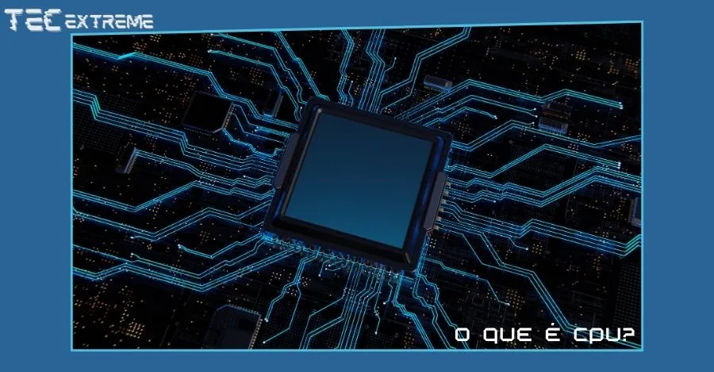
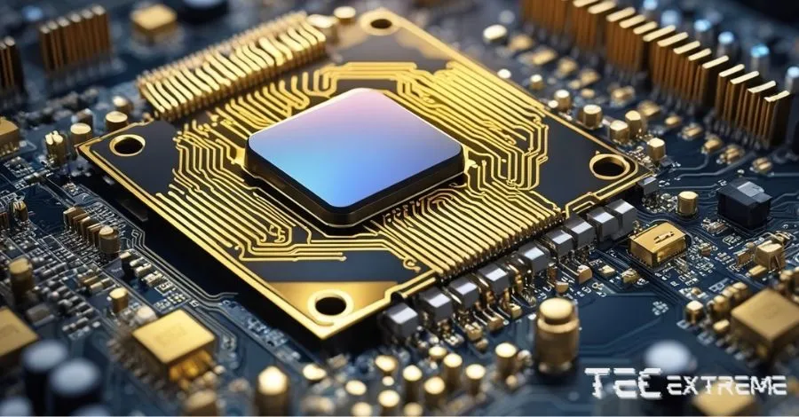
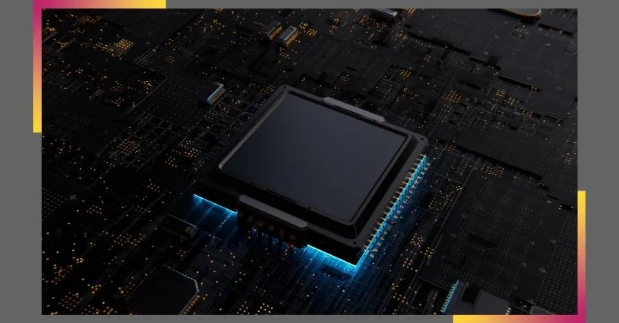

**“O que é CPU?”** Talvez você já tenha se perguntado isso. Afinal, usamos computadores e celulares todos os dias, mas nem sempre estamos por dentro do que acontece por trás das telas desses dispositivos, não é mesmo?

- [Diferença entre memória RAM e ROM o que são e como funcionam](https://tecextreme.com.br/diferenca-entre-memoria-ram-e-rom/)

- [SSD ou HD: entenda as diferenças e saiba qual o melhor](https://tecextreme.com.br/ssd-ou-hd-entenda-as-diferencas-e-qual-o-melhor/)

A CPU, ou Unidade Central de Processamento, é o coração do seu dispositivo, responsável por executar as instruções de cada programa que você usa, desde o sistema operacional até o aplicativo mais simples.

Neste artigo, vamos explorar a CPU em detalhes, entender por que ela é tão importante e como ela afeta o desempenho do seu dispositivo. Vamos começar!

## Conteúdo

1. [O que é CPU?](#o-que-e-cpu)
2. [Componentes da CPU](#componentes-da-cpu)
    1. [Núcleo do Processador](#nucleo-do-processador)
    2. [Memória Cache](#memoria-cache)
    3. [Unidade de Controle](#unidade-de-controle)
    4. [Unidade Lógica e Aritmética (ULA)](#unidade-logica-e-aritmetica-ula)
3. [Tipos de CPU](#tipos-de-cpu)
    1. [CPUs para Computadores](#cp-us-para-computadores)
    2. [CPUs para Celulares](#cp-us-para-celulares)
4. [Como a CPU afeta o desempenho do dispositivo](#como-a-cpu-afeta-o-desempenho-do-dispositivo)
    1. [Influência da CPU no desempenho](#influencia-da-cpu-no-desempenho)
    2. [Escolhendo a CPU certa](#escolhendo-a-cpu-certa)
5. [Diferença entre: CPU, Processador e Gabinete](#diferenca-entre-cpu-processador-e-gabinete)
    1. [CPU vs Processador](#cpu-vs-processador)
    2. [Gabinete](#gabinete)
6. [Por que a CPU fica em 100%](#por-que-a-cpu-fica-em-100)
    1. [Razões para o Uso de 100% da CPU](#razoes-para-o-uso-de-100-da-cpu)
    2. [Gerenciando o Uso da CPU](#gerenciando-o-uso-da-cpu)
7. [Conclusão](#conclusao)
8. [Perguntas Frequentes](#perguntas-frequentes)
9. [Key Takeaways](#key-takeaways)

## O que é CPU?

A CPU, ou Unidade Central de Processamento, é um componente vital de qualquer dispositivo digital, seja um computador, um celular ou um tablet. A CPU é frequentemente referida como o "cérebro" do computador, pois é responsável por executar as instruções de um programa de computador, realizando operações básicas aritméticas, lógicas, de controle e de entrada/saída.

A CPU interpreta e executa a maioria das instruções do hardware do computador, além de determinar a ordem em que as operações acontecem. Isso significa que a CPU é essencial para o funcionamento do seu dispositivo, pois sem ela, não seria possível executar programas ou processar dados.

A CPU é composta por vários componentes principais, incluindo o núcleo do processador, que executa as instruções do programa, e a memória cache, que armazena informações temporárias para acesso rápido. A velocidade e eficiência da CPU podem ter um grande impacto no desempenho geral do seu dispositivo.

Em resumo, a CPU é uma peça de hardware incrivelmente complexa e poderosa que permite que o seu dispositivo funcione de maneira eficiente e eficaz. Entender o que é a CPU e como ela funciona pode ajudá-lo a fazer escolhas mais informadas ao comprar um novo dispositivo ou ao atualizar o seu dispositivo atual.

## Componentes da CPU

Agora que já entendemos o que é a CPU e sua importância, vamos nos aprofundar um pouco mais e conhecer os principais componentes que compõem uma CPU e suas funções.

### Núcleo do Processador

O núcleo do processador, ou simplesmente núcleo, é a parte da CPU que realmente executa as instruções do programa. Uma CPU pode ter um único núcleo (single-core), dois núcleos (dual-core), quatro núcleos (quad-core), ou até mais. Cada núcleo pode executar suas próprias instruções de forma independente das outras, o que permite que a CPU execute várias instruções ao mesmo tempo, melhorando o desempenho geral do dispositivo.

### Memória Cache

A memória cache é um tipo de memória que armazena informações temporárias para acesso rápido. Ela é dividida em níveis, sendo a L1 a mais rápida e a L3 a mais lenta.  
Ela também é muito mais rápida do que a memória RAM, mas também é muito menor.  
A memória cache é usada para armazenar informações que a CPU precisa acessar frequentemente, o que ajuda a acelerar o processo de execução das instruções.

### Unidade de Controle

A Unidade de Controle é o componente da CPU que gerencia as operações da CPU. Ela interpreta as instruções do programa e transmite comandos para os demais componentes da CPU para que sejam realizadas.

### Unidade Lógica e Aritmética (ULA)

A ULA é a parte da CPU que realiza operações aritméticas (como adição e subtração) e operações lógicas (como comparações e testes). A ULA é fundamental para o funcionamento da CPU, pois é ela que realiza a maior parte do "trabalho pesado" de processamento.  
Na próxima seção, vamos explorar os diferentes tipos de CPUs disponíveis no mercado e como eles podem afetar o desempenho do seu dispositivo.

## Tipos de CPU

Após entender o que é uma CPU e quais são seus componentes principais, é importante conhecer os diferentes tipos de CPUs disponíveis no mercado. Afinal, nem todas as CPUs são criadas da mesma forma e o tipo de CPU pode ter um grande impacto no desempenho do seu dispositivo.

### CPUs para Computadores

As CPUs para computadores são geralmente mais poderosas do que as CPUs para celulares. Elas são projetadas para lidar com uma ampla gama de tarefas, desde navegação na web e edição de documentos até jogos e renderização de vídeo. As CPUs para computadores também tendem a ter mais núcleos, o que permite que elas executem várias tarefas ao mesmo tempo.

  
Existem várias marcas e modelos de CPUs para computadores disponíveis no mercado, mas as duas marcas mais conhecidas são a Intel e a AMD. Cada uma delas oferece uma variedade de CPUs que variam em termos de velocidade, número de núcleos e outros recursos.

### CPUs para Celulares

As CPUs para celulares, também conhecidas como SoCs (System on a Chip), são projetadas para serem eficientes em termos de energia, pois a duração da bateria é uma consideração importante para dispositivos móveis. Elas são otimizadas para tarefas que são comuns em celulares, como navegação na web, reprodução de mídia e execução de aplicativos.

As CPUs para celulares geralmente têm menos núcleos do que as CPUs para computadores, mas isso não significa que elas sejam menos poderosas. Na verdade, muitas CPUs para celulares são capazes de executar tarefas bastante complexas, graças à otimização de software e hardware.

Assim como acontece com as CPUs para computadores, existem várias marcas e modelos de CPUs para celulares disponíveis no mercado. Algumas das marcas mais conhecidas incluem a Qualcomm (com sua série Snapdragon), a Apple (com sua série A) e a Samsung (com sua série Exynos).

Na próxima seção, vamos explorar como a CPU afeta o desempenho do seu dispositivo e por que é importante escolher a CPU certa para suas necessidades.

## Como a CPU afeta o desempenho do dispositivo

A CPU tem um papel fundamental no desempenho geral do seu aparelho. Mas de que maneira exatamente a CPU afeta esse desempenho? Vamos investigar isso neste momento.

### Influência da CPU no desempenho

A execução das instruções de um programa de computador é realizada pela CPU. Isso significa que cada ação que você realiza no seu dispositivo - seja abrir um aplicativo, navegar na web, jogar um jogo ou editar um documento - envolve a CPU de alguma forma.  
A velocidade da CPU, medida em gigahertz (GHz), determina quantas instruções por segundo a CPU pode processar. Portanto, uma CPU mais rápida pode processar mais instruções em um determinado período de tempo, resultando em um desempenho mais rápido e suave.  
Além disso, a quantidade de núcleos em uma CPU também afeta o desempenho. Uma CPU com vários núcleos pode executar várias instruções ao mesmo tempo, melhorando o desempenho em tarefas que podem ser divididas em partes menores, como renderização de vídeo ou execução de vários aplicativos ao mesmo tempo.

### Escolhendo a CPU certa

Escolher a CPU certa para suas necessidades é crucial para garantir que você obtenha o desempenho desejado do seu dispositivo. Se você usa seu dispositivo principalmente para tarefas básicas, como navegação na web e edição de documentos, uma CPU básica deve ser suficiente.  
No entanto, se você usa seu dispositivo para tarefas mais exigentes, como jogos, edição de vídeo ou modelagem 3D, você provavelmente vai querer uma CPU mais poderosa para garantir que seu dispositivo possa lidar com essas tarefas de maneira eficiente.  
Na próxima seção, vamos explorar algumas diferenças comuns entre CPU, processador e gabinete, e entender por que a CPU às vezes atinge 100% de uso.

## Diferença entre: CPU, Processador e Gabinete

Ao discutir o hardware do computador, é comum ouvir os termos CPU, processador e gabinete. Embora esses termos estejam relacionados, eles se referem a coisas diferentes. Vamos entender melhor cada um deles.

### CPU vs Processador

Como mencionado anteriormente, a CPU é a Unidade Central de Processamento. Ela atua como o cérebro do computador, executando as instruções dos programas.  
O termo "processador" é frequentemente usado como sinônimo de CPU, e na maioria dos contextos, eles significam a mesma coisa. No entanto, tecnicamente falando, um processador é qualquer componente que processa dados, e uma CPU é um tipo de processador. Portanto, enquanto toda CPU é um processador, nem todo processador é uma CPU. Por exemplo, a GPU (Unidade de Processamento Gráfico) é outro tipo de processador que é especializado em renderização gráfica.

### Gabinete

O gabinete, por outro lado, é a estrutura física que abriga todos os componentes do computador, incluindo a CPU (ou processador), a memória RAM, o disco rígido, a placa-mãe, a fonte de alimentação, entre outros. O gabinete protege os componentes internos do computador contra danos físicos e ajuda a manter os componentes resfriados, fornecendo ventilação e, em alguns casos, refrigeração adicional.  
Portanto, enquanto a CPU é o cérebro do computador e o processador é o componente que processa dados, o gabinete é a casa que mantém todos esses componentes seguros e funcionando corretamente.  

Na próxima seção, vamos explorar por que a CPU às vezes atinge 100% de uso e o que isso significa para o desempenho do seu dispositivo.

## Por que a CPU fica em 100%

Se você já usou o Gerenciador de Tarefas no seu computador ou um aplicativo semelhante no seu celular, pode ter notado que às vezes a CPU atinge 100% de uso. Mas o que isso significa e por que isso acontece?

### Razões para o Uso de 100% da CPU

O uso de 100% da CPU indica que a CPU está trabalhando em sua capacidade máxima. Isso pode acontecer por várias razões. Por exemplo, se você estiver executando um programa ou jogo que requer muitos recursos, a CPU pode precisar trabalhar mais para manter tudo funcionando sem problemas. Da mesma forma, se você tiver muitos programas abertos ao mesmo tempo, a CPU pode ficar sobrecarregada tentando gerenciar tudo.  
No entanto, o uso de 100% da CPU também pode ser um sinal de que algo está errado. Por exemplo, um programa pode ter um bug que faz com que ele use mais recursos da CPU do que deveria. Ou você pode ter malware no seu dispositivo que está usando a CPU para atividades maliciosas.

### Gerenciando o Uso da CPU

Se a CPU do seu dispositivo estiver frequentemente atingindo 100% de uso, existem algumas coisas que você pode fazer para gerenciar isso. Primeiro, tente fechar programas que você não está usando para liberar recursos. Se isso não ajudar, você pode tentar atualizar seus programas e drivers para as versões mais recentes, pois isso pode resolver problemas de desempenho.  
Além disso, é uma boa ideia executar uma verificação de malware regularmente para garantir que seu dispositivo esteja seguro. Se tudo mais falhar, você pode considerar a atualização da sua CPU para um modelo mais poderoso.

Lembre-se, a CPU é uma peça-chave do desempenho do seu dispositivo, então entender como ela funciona e como gerenciar seu uso pode ajudá-lo a manter seu dispositivo funcionando de maneira eficiente.

Na próxima seção, vamos concluir nosso artigo, recapitulando os pontos-chave discutidos e reafirmando a importância da CPU no desempenho do dispositivo.

## Conclusão

Ao longo deste artigo, exploramos a pergunta: **"O que é CPU?"**. Descobrimos que a CPU, ou Unidade Central de Processamento, é o coração do seu dispositivo, seja ele um computador ou um celular. Ela é responsável por executar as instruções dos programas, o que a torna essencial para o funcionamento do seu dispositivo.

Discutimos os componentes principais de uma CPU, incluindo o núcleo do processador, a memória cache, a Unidade de Controle e a Unidade Lógica e Aritmética. Cada um desses componentes desempenha um papel crucial no processamento de dados.

Também exploramos os diferentes tipos de CPUs disponíveis no mercado, incluindo CPUs para computadores e CPUs para celulares. Cada tipo de CPU tem suas próprias características e pode afetar o desempenho do seu dispositivo de maneiras diferentes.

Além disso, discutimos como a CPU afeta o desempenho do dispositivo e por que é importante escolher a CPU certa para suas necessidades. Também abordamos algumas diferenças comuns entre CPU, processador e gabinete, e exploramos por que a CPU às vezes atinge 100% de uso.

Em resumo, a CPU é uma peça-chave do desempenho do seu dispositivo. Entender o que é a CPU e como ela funciona pode ajudá-lo a fazer escolhas mais informadas ao comprar um novo dispositivo ou ao atualizar o seu dispositivo atual. Portanto, a próxima vez que você se perguntar "O que é CPU?", você terá todas as respostas na ponta da língua.

## Perguntas Frequentes

**1\. Qual é a função da CPU?**

A CPU (Unidade Central de Processamento) atua como o núcleo do seu aparelho, seja um computador ou um telefone móvel. Ela é responsável por executar as instruções dos programas, o que a torna essencial para o funcionamento do seu dispositivo. A CPU processa os dados digitais de entrada e os associa às instruções armazenadas em sua memória. Depois, ela entrega como resultado os dados que foram processados.

**2\. Como é dividido o CPU?**

A CPU pode ser dividida em três partes principais: Unidade de Controle (UC), Unidade Lógica e Aritmética (ULA) e Registradores. A Unidade de Controle é o componente da CPU que tem a função de supervisionar a CPU e administrar o processamento. A Unidade Lógica e Aritmética é responsável pelos cálculos (operações lógicas e aritméticas). Os Registradores são pequenas porções de memória rápida e volátil, destinadas ao armazenamento de dados e resultados temporários processados pela CPU.

**3\. O que é memória cache L1, L2 e L3?**

A memória cache é uma memória de alta velocidade situada perto ou dentro do núcleo do chip. Ela atua como armazenamento temporário de dados. A memória cache é estruturada em uma hierarquia de níveis, cada um com sua própria velocidade e capacidade. O cache L1 é o mais veloz e o mais próximo do núcleo do processador, porém é o de menor capacidade. O cache L2 é um pouco mais lento e tem maior capacidade que o L1. Já o cache L3, embora seja o maior, é o mais lento dentre todos.

**4\. Como testar a CPU do PC?**

Existem várias maneiras de testar a CPU do seu PC. Uma delas é usar um programa de benchmark, como o GeekBench. Outra opção é usar uma ferramenta online, como o CPU Stress Test Online. Essas ferramentas permitem que você coloque a CPU sob carga pesada e monitore seu desempenho e estabilidade. É importante monitorar a temperatura da CPU durante esses testes, pois uma CPU superaquecida pode causar danos ao seu dispositivo.

## Key Takeaways

1. **O que é CPU**: A CPU, ou Unidade Central de Processamento, é o coração do seu dispositivo, seja ele um computador ou um celular. Ela é responsável por executar as instruções dos programas, o que a torna essencial para o funcionamento do seu dispositivo.

3. **Componentes da CPU**: A CPU é composta por vários componentes principais, incluindo o núcleo do processador, a memória cache, a Unidade de Controle e a Unidade Lógica e Aritmética.

5. **Tipos de CPU**: Existem diferentes tipos de CPUs disponíveis no mercado, incluindo CPUs para computadores e CPUs para celulares. Cada tipo de CPU tem suas próprias características e pode afetar o desempenho do seu dispositivo de maneiras diferentes.

7. **Influência da CPU no desempenho do dispositivo**: A CPU desempenha um papel crucial no desempenho geral do seu dispositivo. A velocidade e eficiência da CPU podem ter um grande impacto no desempenho geral do seu dispositivo.

9. **Diferença entre CPU, processador e gabinete**: Embora esses termos estejam relacionados, eles se referem a coisas diferentes. A CPU é o cérebro do computador, o processador é o componente que processa dados, e o gabinete é a casa que mantém todos esses componentes seguros e funcionando corretamente.

11. **Por que a CPU fica em 100%**: O uso de 100% da CPU indica que a CPU está trabalhando em sua capacidade máxima. Isso pode acontecer por várias razões, desde a execução de um programa que requer muitos recursos até a presença de um bug ou malware. É importante gerenciar o uso da CPU para evitar sobrecarga e manter o desempenho do dispositivo.

**Referências:** [Tecnoblog](https://tecnoblog.net/responde/o-que-e-cpu-unidade-central-de-processamento/), [AWS](https://aws.amazon.com/pt/what-is/cpu/), [TechTudo](https://www.techtudo.com.br/dicas-e-tutoriais/2023/03/o-que-e-cpu-para-que-serve-e-qual-a-importancia-no-seu-pc-ou-notebook-edinfoeletro.ghtml)
