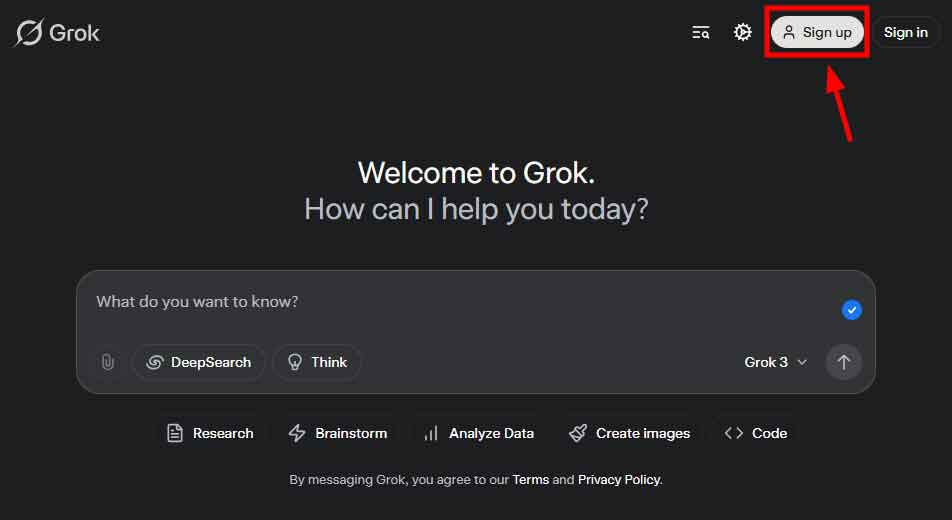
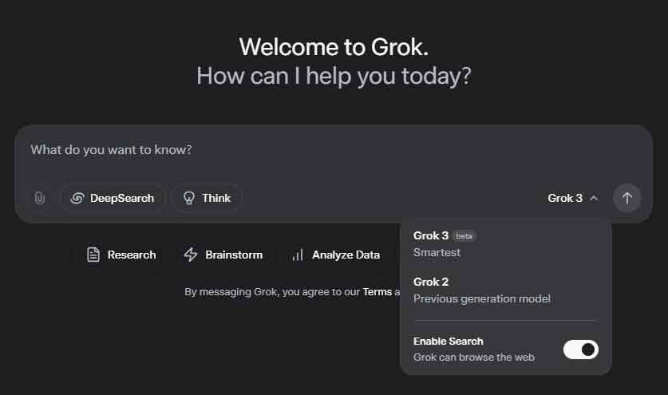

O **Grok 3** está no centro das discussões sobre o futuro da [_inteligência artificial_](https://tecextreme.com.br/categoria/inteligencia-artificial/) e suas aplicações transformadoras. Este modelo de IA tem chamado atenção por sua capacidade avançada de processamento.

**Desenvolvido pela _[xAI](https://x.ai/)_,** liderada por Elon Musk, o Grok 3 se destaca como uma ferramenta poderosa para resolver problemas complexos. _Quer entender o que é o Grok 3 e como ele pode impactar o futuro da tecnologia? Continue lendo!_

## Conteúdo do post...

1. [O Que é Grok 3?](#o-que-e-grok-3)
2. [A Origem do Grok 3: A xAI e Elon Musk](#a-origem-do-grok-3-a-x-ai-e-elon-musk)
3. [Para Que Serve o Grok 3?](#para-que-serve-o-grok-3)
4. [Como Acessar o Grok 3?](#como-acessar-o-grok-3)
5. [Funcionalidades do Grok 3](#funcionalidades-do-grok-3)
6. [Por Que o Grok 3 é Diferente?](#por-que-o-grok-3-e-diferente)
7. [Grok 3 vs ChatGPT: Qual Usar?](#grok-3-vs-chat-gpt-qual-usar)
8. [Conclusão](#conclusao)
9. [FAQs (Perguntas Frequentes)](#fa-qs-perguntas-frequentes)

## O Que é Grok 3?

O **Grok 3** é um modelo de _inteligência artificial_ desenvolvido pela **xAI**, com foco em processamento avançado de linguagem e resolução de problemas complexos. Ele foi projetado para ser mais do que uma simples ferramenta de conversação.

Diferente de outros sistemas, o **Grok da xIA** não se limita a responder perguntas básicas. Ele é capaz de realizar análises detalhadas, gerar conteúdo criativo e até mesmo auxiliar em tarefas científicas.

Além disso, o _Grok 3_ utiliza algoritmos de última geração para oferecer precisão e adaptabilidade. Essa versatilidade faz dele uma solução poderosa para empresas e indivíduos.

O **Grok 3** também se destaca por sua capacidade de aprender continuamente. Isso permite que ele evolua e se adapte a novos contextos, garantindo resultados sempre atualizados.

## A Origem do Grok 3: A xAI e Elon Musk

A xAI foi fundada por Elon Musk com o objetivo de criar modelos de inteligência artificial mais transparentes e éticos. Essa equipe busca inovar no campo da IA, oferecendo alternativas diferenciadas.

O Grok 3 é um dos principais projetos da xAI, projetado para ser mais do que uma simples ferramenta de conversação. Ele reflete o compromisso de Elon Musk em desenvolver tecnologias que priorizam a precisão e a adaptabilidade.

Diferente de outras IAs, como o **ChatGPT** ou o **Gemini**, Essa IA se destaca por sua capacidade de processamento avançado. Enquanto outros modelos focam em interações básicas, a IA Grok oferece soluções robustas para problemas complexos.

Além disso, ela foi criada para ser altamente personalizável. Isso o diferencia de plataformas como o **Gemini**, que possuem limitações em termos de flexibilidade e aplicabilidade prática.

## Para Que Serve o Grok 3?

O **Grok 3** é uma ferramenta versátil, capaz de responder perguntas complexas com precisão. Ele utiliza _inteligência artificial_ avançada para fornecer insights detalhados em diversas áreas.

Além disso, a Inteligência Artificial da xAI pode gerar conteúdo criativo, como textos, ideias e scripts. Essa funcionalidade é ideal para empresas que buscam inovar na produção de materiais digitais ou campanhas publicitárias.

Outro uso important está na resolução de problemas técnicos e científicos. Sua capacidade analítica permite auxiliar pesquisadores e profissionais em projetos altamente especializados.

No contexto do X (antigo Twitter), o _Grok 3_ pode ser usado para melhorar recomendações de conteúdo ou até moderar conversas. Essa aplicação demonstra seu potencial para impactar plataformas digitais de forma significativa.

## Como Acessar o Grok 3?

Para utilizar o **Grok 3**, a mais recente inovação em _inteligência artificial_ da xAI, siga este guia prático:

**01-Acesse o site oficial**: Visite a página dedicada ao [Grok 3](https://x.ai/grok), que pode ser encontrada no domínio da xAI ou em uma plataforma associada, como o X (antigo Twitter). Para facilitar clique aqui **[(Grok X)](https://x.ai/grok)**

**02-Faça login na plataforma**: Utilize suas credenciais de acesso vinculadas ao X para autenticação. Essa etapa garante um processo seguro e personalizado.

**03-Selecione o modelo correto**: Caso outros modelos estejam disponíveis, ajuste as configurações para ativar o **Grok 3**, garantindo que você esteja utilizando a versão mais avançada.

Vale destacar que, se o acesso ainda estiver restrito, a _xAI_ deve expandir gradualmente sua disponibilidade. Fique atento às atualizações oficiais para aproveitar todas as funcionalidades do **Grok 3** assim que possível.

## Funcionalidades do Grok 3

O **Grok 3** oferece uma série de funcionalidades avançadas que o destacam no campo da _inteligência artificial_. Confira abaixo as principais:

- **Processamento de linguagem natural avançado**: Interpreta e responde a comandos complexos com precisão e clareza.

- **Capacidade de aprendizado contínuo**: Adapta-se a novos contextos, garantindo resultados sempre atualizados e relevantes.

- **Integração com outras tecnologias**: Pode ser usado em plataformas como o X (antigo Twitter) para melhorar recomendações e moderação de conteúdo.

- **Flexibilidade e personalização**: Oferece soluções adaptáveis para diferentes necessidades, desde geração de conteúdo até resolução de problemas técnicos.

Comparado a outros modelos, como o _ChatGPT_ ou o Gemini, a IA da _xIA_ se destaca por sua eficiência e versatilidade, tornando-o ideal para aplicações inovadoras.

## Por Que o Grok 3 é Diferente?

O **Grok 3** se destaca pela _transparência e ética_ em sua criação, princípios defendidos pela xAI. Essa abordagem garante que o modelo seja desenvolvido com responsabilidade e confiabilidade.

Outro diferencial está no foco em _personalização e precisão_. Essa IA oferece soluções adaptadas às necessidades específicas dos usuários, tornando-o mais eficiente do que outras IAs disponíveis no mercado.

Além disso, o _Grok_ tem potencial para revolucionar áreas como educação, negócios e ciência. Sua capacidade de resolver problemas complexos pode transformar a forma como esses setores operam.

O **Grok** apresenta uma combinação única de inovação e praticidade. Esses diferenciais o posicionam como uma ferramenta poderosa para o futuro da _inteligência artificial_.

## Grok 3 vs ChatGPT: Qual Usar?

O **Grok 3** e o _ChatGPT_ são modelos avançados de _inteligência artificial_, mas possuem abordagens distintas. Enquanto o Grok 3 foca em transparência e adaptabilidade, o ChatGPT se destaca por sua ampla base de dados e versatilidade geral.

Se a necessidade for resolver problemas técnicos ou científicos, a ferramenta de IA da _xIA_ pode ser mais eficiente. Sua capacidade de processamento avançado oferece soluções mais personalizadas e precisas para tarefas complexas.

Por outro lado, o **ChatGPT** da OpenIA é ideal para interações gerais, como criar diálogos, responder perguntas simples ou gerar conteúdo básico. Ele é mais acessível e amplamente utilizado, o que facilita sua integração em diversas aplicações. A decisão entre um e outro está ligada ao objetivo. Para inovação e precisão, o _Grok 3_ é uma excelente opção. Já para uso cotidiano e generalista, o **ChatGPT** continua sendo uma escolha confiável e prática.

Para facilitar a comparação entre entras as duas IA, preparamos uma tabela que destaca as principais funcionalidades de cada modelo

| **Funcionalidade** | **Grok 3** | **ChatGPT** |
| --- | --- | --- |
| **Foco Principal** | Transparência, precisão e adaptabilidade | Versatilidade e uso geral |
| **Processamento Avançado** | Sim, ideal para problemas técnicos | Básico a intermediário |
| **Geração de Conteúdo** | Criativo e personalizado | Geral e acessível |
| **Integração com Plataformas** | Compatível com X (antigo Twitter) | Amplamente integrável |
| **Aprendizado Contínuo** | Sim, adapta-se rapidamente | Limitado ao treinamento prévio |
| **Melhor Para** | Inovação e tarefas complexas | Uso cotidiano e interações gerais |

## Conclusão

O **Grok 3** é um modelo de _inteligência artificial_ desenvolvido pela xAI, destacando-se por sua precisão, adaptabilidade e transparência. Ele serve para resolver problemas complexos, gerar conteúdo criativo e integrar soluções inovadoras em diversas áreas.

No futuro, o _Grok 3_ pode desempenhar um papel crucial na evolução da IA, impactando setores como educação, negócios e ciência. Sua tecnologia promete moldar novas formas de interação e eficiência no mundo digital.

_Ficou curioso sobre a IA de Elon Musk?_ Compartilhe o post com os amigos ou explore mais sobre o mundo da _inteligência artificial_ aqui no blog. Sua opinião é essencial para continuarmos trazendo insights relevantes!

## FAQs (Perguntas Frequentes)

1. **O que é Grok IA?**A _Grok IA_ é uma série de modelos de _inteligência artificial_ desenvolvidos pela xAI, liderada por Elon Musk. Esses modelos são projetados para resolver problemas complexos e oferecer soluções inovadoras.

3. **O que é Grok 3?**O **Grok 3** é a versão mais recente da linha Grok, destacando-se por seu processamento avançado de linguagem e capacidade de adaptação contínua a novos contextos.

5. **Qual a diferença entre Grok 2 e Grok 3?**Enquanto o _Grok 2_ já era poderoso, o **Grok 3** traz melhorias significativas em precisão, aprendizado contínuo e integração com outras tecnologias, como o X.

7. **Qual a IA do Elon Musk?**A IA mais notável de Elon Musk é o **Grok 3**, desenvolvido pela xAI. Ele reflete os princípios de transparência e ética defendidos por sua equipe.

9. **O que o Grok 3 pode fazer?**O _Grok 3_ pode realizar diversas tarefas, como pesquisar online, criar códigos, gerar imagens, processar uploads de documentos e até resolver problemas científicos complexos.

11. **A IA Grok é confiável?**Sim, a **Grok IA** foi desenvolvida com foco em transparência e ética, garantindo maior confiabilidade em suas interações e resultados.

13. **Grok X, como acessar?**  
     Para acessar o **Grok X**, verifique se ele está disponível no site oficial da xAI ou no X (antigo Twitter). Faça login e siga as instruções para começar a usar.
