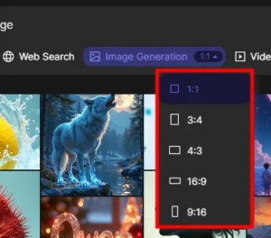
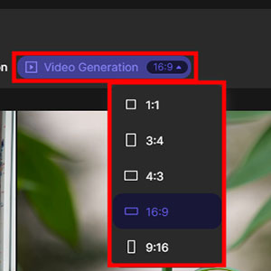
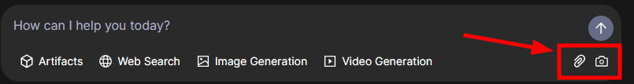
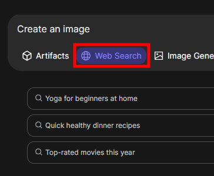

**Qwen 2.5-MAX** é a mais nova aposta da _Alibaba_ no mercado de _[**inteligência artificial**](https://tecextreme.com.br/categoria/inteligencia-artificial/)_, destacando-se como uma solução **revolucionária**, oferecendo _múltiplas funcionalidades_ em um único lugar e, o melhor, de forma **gratuita**.

Neste post, exploramos as **capacidades**, _vantagens_ e _aplicações práticas_ do **Qwen 2.5-MAX**, mostrando por que ele pode ser a escolha ideal para _criadores de conteúdo_, _empresas_ e _pesquisadores_.

## Conteúdo do post...

1. [O que é o Qwen 2.5-MAX?](#o-que-e-o-qwen-2-5-max)
2. [Funcionalidades do Qwen 2.5-MAX](#funcionalidades-do-qwen-2-5-max)
    1. [Criação de Imagens](#criacao-de-imagens)
    2. [Criação de Vídeos](#criacao-de-videos)
    3. [Upload de Documentos e Imagens](#upload-de-documentos-e-imagens)
    4. [Pesquisas na Web](#pesquisas-na-web)
    5. [Tradução de Textos](#traducao-de-textos)
    6. [Geração de Códigos](#geracao-de-codigos)
    7. [Análise de Sentimentos](#analise-de-sentimentos)
    8. [Geração de Conteúdo Textual](#geracao-de-conteudo-textual)
    9. [Personalização de Modelos](#personalizacao-de-modelos)
3. [Vantagens da IA Qwen 2.5-MAX](#vantagens-da-ia-qwen-2-5-max)
4. [Limitações e Desafios da Inteligência Artificial Qwen](#limitacoes-e-desafios-da-inteligencia-artificial-qwen)
5. [Casos de Uso do Qwen 2.5-MAX](#casos-de-uso-do-qwen-2-5-max)
6. [Comparativo com Outras Ferramentas de IA](#comparativo-com-outras-ferramentas-de-ia)
7. [Como Começar a Usar o Qwen 2.5-MAX](#como-comecar-a-usar-o-qwen-2-5-max)
    1. [Passo 1: Acesse o Site Oficial](#passo-1-acesse-o-site-oficial)
    2. [Passo 2: Crie uma Conta](#passo-2-crie-uma-conta)
    3. [Passo 3: Explore a Interface](#passo-3-explore-a-interface)
    4. [Passo 4: Escolha a Funcionalidade Desejada](#passo-4-escolha-a-funcionalidade-desejada)
    5. [Passo 5: Insira o Prompt e Personalize](#passo-5-insira-o-prompt-e-personalize)
    6. [Passo 6: Revise e Ajuste os Resultados](#passo-6-revise-e-ajuste-os-resultados)
    7. [Passo 7: Exporte ou Compartilhe](#passo-7-exporte-ou-compartilhe)
8. [Conclusão](#conclusao)
9. [FAQ (Perguntas Frequentes)](#faq-perguntas-frequentes)

## O que é o Qwen 2.5-MAX?

O **Qwen 2.5-MAX** é um _modelo de linguagem avançado_ (LLM) desenvolvido pela _Alibaba_, com **72 bilhões de parâmetros**, projetado para realizar tarefas complexas de forma integrada. Diferente de outras IAs, ele combina _geração de imagens_, _vídeos_, _análise de documentos_ e _pesquisas na web_ em uma única plataforma.

Comparado a concorrentes como _ChatGPT_ e _Gemini_, o **Qwen 2.5-MAX** se destaca por ser **gratuito** e altamente versátil. Enquanto outras ferramentas cobram por funcionalidades premium, essa IA oferece acesso completo sem custos, democratizando o uso de tecnologias avançadas.

Outro ponto relevante é o foco no **mercado global**. Apesar de ser uma _IA chinesa_, o **Qwen 2.5-MAX** foi desenvolvido para atender usuários de todo o mundo, com uma interface familiar e funcionalidades adaptadas às necessidades internacionais.

Combinando _alta capacidade de processamento_ e _usabilidade intuitiva_, o **Qwen 2.5-MAX** se posiciona como uma das ferramentas mais completas e acessíveis do mercado de _inteligência artificial_.

## Funcionalidades do Qwen 2.5-MAX

### Criação de Imagens

O **Qwen 2.5-MAX** permite a _geração de imagens_ de alta qualidade com base em prompts detalhados. Comparado a ferramentas como _DALL-E_, ele oferece resultados **gratuitos** e com boa consistência visual, ideal para _criadores de conteúdo_ e _designers_. Para utilizar esta opção, basta escolher entre os tamanhos disponíveis e depois inserir um prompt.

### Criação de Vídeos

A ferramenta também gera _vídeos curtos_ de até **60 segundos**, com qualidade visual impressionante. Embora haja limitações em animações complexas, os resultados são perfeitos para _conteúdos rápidos_ em redes sociais ou apresentações.

### Upload de Documentos e Imagens

Com o **Qwen 2.5-MAX**, é possível enviar _documentos_ e _imagens_ para análise. A ferramenta extrai informações, faz resumos e até interpreta gráficos. Por exemplo, ela pode resumir um livro como _The 48 Laws of Power_ em tópicos claros e objetivos.

### Pesquisas na Web

A IA realiza _pesquisas detalhadas_ na web, acessando múltiplas fontes e trazendo respostas organizadas. Ideal para _jornalistas_ e _pesquisadores_, ela oferece insights rápidos sobre temas como _estratégias de marketing_ ou _notícias recentes_.

### Tradução de Textos

O **Qwen 2.5-MAX** oferece _tradução de textos_ em múltiplos idiomas com alta precisão. Essa funcionalidade é ideal para _empresas globais_ que precisam traduzir documentos ou para _estudantes_ que buscam entender conteúdos em outras línguas.  
**Exemplo de caso de uso:** Uma empresa pode traduzir um contrato comercial do inglês para o mandarim em segundos, garantindo precisão e agilidade nas negociações internacionais.

### Geração de Códigos

A ferramenta auxilia **_desenvolvedores_** na criação de trechos de código em diversas linguagens de programação, como **Python, JavaScript e HTML**. Isso acelera o processo de desenvolvimento e reduz erros comuns.  
**Exemplo:** Um desenvolvedor pode pedir ao **Qwen 2.5-MAX** para gerar um script em Python que automatiza a extração de dados de um site, economizando horas de trabalho manual. Muitas vezes com a função **"Artifacts"**, A função de **Artifacts** é usada para gerar, modificar ou atualizar artefatos completos e executáveis, como código HTML, CSS ou JavaScript.

### Análise de Sentimentos

O **Qwen 2.5-MAX** analisa textos para identificar _emoções_ e _tons_, sendo útil para _marketing_ e _análise de feedbacks_. Essa funcionalidade ajuda empresas a entenderem melhor a percepção dos clientes sobre seus produtos ou serviços.  
**Exemplo de uso:** Uma marca pode analisar comentários nas redes sociais para identificar se o tom geral é positivo, negativo ou neutro, ajustando suas estratégias de comunicação conforme necessário.

### Geração de Conteúdo Textual

A ferramenta produz textos criativos, como _artigos_, _roteiros_ ou _descrições de produtos_, com base em prompts específicos. Isso é ideal para _redatores_ e _profissionais de marketing_ que precisam de conteúdo rápido e de qualidade.  
**Exemplo de caso de uso:** Um blogueiro pode usar o **Qwen 2.5-MAX** para criar um artigo sobre "Tendências de Tecnologia para 2024" em minutos, com informações atualizadas e bem estruturadas.

### Personalização de Modelos

O **Qwen 2.5-MAX** permite ajustar o comportamento da IA para atender a necessidades específicas, como _tom de voz_ ou _estilo de escrita_. Isso é útil para empresas que desejam manter uma identidade única em suas comunicações.  
**Exemplo:** Uma empresa de moda pode personalizar o modelo para gerar textos com um tom descontraído e jovial, alinhado à sua marca, ao criar posts para redes sociais.

## Vantagens da IA Qwen 2.5-MAX

A **gratuidade** é um dos maiores atrativos do **Qwen 2.5-MAX**, oferecendo acesso completo a todas as funcionalidades **sem custos**. Isso democratiza o uso de _tecnologias avançadas_, permitindo que _criadores de conteúdo_, _empresas_ e _pesquisadores_ explorem suas capacidades sem investimentos iniciais.

A _interface familiar_, semelhante ao **_ChatGPT_**, facilita a **usabilidade**, especialmente para quem já está acostumado com outras ferramentas de IA. Essa familiaridade reduz a curva de aprendizado e torna a experiência mais intuitiva.

A **versatilidade** do **Qwen 2.5-MAX** é outro ponto forte. Com ele, é possível criar _imagens_, _vídeos_, analisar _documentos_ e realizar _pesquisas na web_ em um só lugar. Essa integração elimina a necessidade de múltiplas plataformas, economizando tempo e recursos.

Por fim, o modelo de **72 bilhões de parâmetros** garante uma _alta capacidade de contexto_, permitindo respostas precisas e detalhadas. Essa capacidade coloca o **Qwen 2.5-MAX** no mesmo patamar de ferramentas pagas, mas com a vantagem de ser **gratuito**.

## **Limitações e Desafios da Inteligência Artificial Qwen**

Apesar de suas **vantagens**, o **Qwen 2.5-MAX** enfrenta desafios na geração de _animações_ e _vídeos complexos_. Enquanto ferramentas pagas oferecem maior flexibilidade, essa IA ainda está limitada a vídeos curtos e simples, com **60 segundos** de duração máxima.

Outro ponto é o **tempo de espera** para gerar vídeos, que pode ser alto devido à alta demanda. Essa limitação pode impactar a produtividade, especialmente para usuários que precisam de resultados rápidos.

Quando comparado a ferramentas pagas como _DALL-E_ ou _ChatGPT Plus_, o **Qwen 2.5-MAX** pode apresentar variações na **qualidade** e **consistência** dos resultados. No entanto, para uma ferramenta **gratuita**, seu desempenho é considerado impressionante.Essas limitações não diminuem o valor do **Qwen 2.5-MAX**, mas mostram que ainda há espaço para melhorias, especialmente em tarefas mais especializadas.

## Casos de Uso do Qwen 2.5-MAX

Para **criadores de conteúdo**, o **Qwen 2.5-MAX** é uma ferramenta essencial, permitindo a geração de _imagens_ e _vídeos_ de alta qualidade para redes sociais. Com prompts detalhados, é possível criar posts visuais impactantes de forma rápida e **gratuita**.

Já para **empresas**, a IA automatiza tarefas como _análise de documentos_ e _criação de artefatos_. Isso agiliza processos internos, reduz custos e aumenta a eficiência, especialmente em áreas como _marketing_ e _gestão de dados_.

**Pesquisadores** também se beneficiam com a capacidade de realizar _pesquisas rápidas_ e _detalhadas_. O **Qwen 2.5-MAX** acessa múltiplas fontes e organiza informações de forma clara, ideal para estudos acadêmicos ou análises de mercado.

Por fim, **desenvolvedores** podem usar a ferramenta para criar _interfaces_ e _protótipos_ de forma ágil. A geração de _artefatos_ e a análise de _códigos_ simplificam o processo de desenvolvimento, economizando tempo e recursos.

## Comparativo com Outras Ferramentas de IA

Em comparação ao _ChatGPT_, o **Qwen 2.5-MAX** se destaca por oferecer **funcionalidades gratuitas** integradas, como _geração de imagens_ e _vídeos_. Enquanto o ChatGPT cobra por recursos premium, o **Qwen 2.5-MAX** democratiza o acesso a essas tecnologias.

Já em relação ao _DALL-E_, a qualidade das _imagens geradas_ pelo **Qwen 2.5-MAX** é comparável, mas com a vantagem de ser **gratuito**. Embora o DALL-E ofereça maior consistência em tarefas específicas, o custo-benefício do **Qwen 2.5-MAX** é imbatível.

Quando comparado ao _Gemini_, o **Qwen 2.5-MAX** se sobressai na **capacidade de pesquisa** e **usabilidade**. Ele traz respostas detalhadas e organizadas, além de uma interface intuitiva que facilita a navegação entre diferentes funcionalidades.

Esses diferenciais posicionam o **Qwen 2.5-MAX** como uma das ferramentas mais **versáteis** e **acessíveis** do mercado de _inteligência artificial_.

| Recurso | Qwen 2.5-MAX | Gemini 1.5 (Google) | ChatGPT-4 (OpenAI) |
| --- | --- | --- | --- |
| **Geração de Texto** | Suporte a 29 idiomas | Alta precisão em respostas | Excelente fluência criativa |
| **Geração Imagens** | ✅ Gratuita (DALL-E-like) | ❌ Não disponível | ✅ Apenas no Plus (DALL-E 3) |
| **Geração Vídeos** | ✅ Vídeos curtos (60s) | ❌ Não disponível | ❌ Não disponível |
| **Análise Arquivos** | ✅ PDF, imagens, docs | ✅ PDF, Google Docs | ✅ PDF (versão paga) |
| **Pesquisa Web** | ✅ Integrada | ✅ Google Search | ✅ Bing (versão paga) |
| **Contexto** | Até 1 milhão de tokens | Até 1 milhão | Até 128 mil |
| **Custo** | **Totalmente gratuito** | Free + planos pagos | Free + Plus ($20/mês) |
| **Integração** | Multimodal (texto+imagem+áudio) | Ecossistema Google | Plugins exclusivos |
| **Código** | ✅ Geração/análise | ✅ Python/APIs | ✅ Code Interpreter |

## Como Começar a Usar o Qwen 2.5-MAX

O **Qwen 2.5-MAX** é uma ferramenta poderosa e acessível, mas para aproveitar ao máximo suas funcionalidades, é importante seguir alguns passos simples. Abaixo, um guia prático para começar a usar essa _inteligência artificial_ revolucionária.

### Passo 1: Acesse o Site Oficial

O primeiro passo é visitar o site oficial da _Alibaba_ ou da plataforma que hospeda o **Qwen 2.5-MAX ([https://chat.qwen.ai/](https://chat.qwenlm.ai/))**. Para facilitar, a página pode ser traduzida para o português. Deve-se clicar com o botão direito do mouse e, em seguida, selecionar a opção **“Traduzir para o português”**.

[Acessar a plataforma: Qwen 2.5-MAX](https://chat.qwen.ai/)

### Passo 2: Crie uma Conta

Para usar a ferramenta, é preciso criar uma conta gratuita. Basta preencher um formulário rápido com seus dados e confirmar o e-mail ou entrar com uma conta do Google ou GitHub.

### Passo 3: Explore a Interface

Após o login, você será direcionado para a interface do **Qwen 2.5-MAX**. Familiarize-se com os menus e opções disponíveis, como _geração de imagens_, _vídeos_ e _análise de documentos_.

### Passo 4: Escolha a Funcionalidade Desejada

Selecione a funcionalidade que deseja utilizar, como _criação de conteúdo_, _tradução de textos_ ou _geração de códigos_. Cada opção tem um campo específico para inserir prompts.

### Passo 5: Insira o Prompt e Personalize

Digite o prompt com as instruções necessárias para a tarefa. Use descrições detalhadas para obter resultados mais precisos. Em algumas funcionalidades, é possível personalizar parâmetros, como _estilo_ ou _tom de voz_.

### Passo 6: Revise e Ajuste os Resultados

Após a geração, revise o resultado e faça ajustes, se necessário. O **Qwen 2.5-MAX** permite refinamentos para garantir que o conteúdo atenda às suas expectativas.

### Passo 7: Exporte ou Compartilhe

Por fim, exporte o conteúdo gerado ou compartilhe diretamente da plataforma. O **Qwen 2.5-MAX** oferece opções de download em formatos como PDF, PNG ou MP4, dependendo da funcionalidade utilizada.

## Conclusão

O **Qwen 2.5-MAX** se destaca como uma ferramenta **revolucionária** no mercado de _inteligência artificial_, oferecendo _funcionalidades avançadas_ de forma **gratuita**. Sua capacidade de gerar _imagens_, _vídeos_, analisar _documentos_ e realizar _pesquisas_ em um só lugar o torna indispensável para diversos públicos.

Com impacto significativo no setor de IA, essa ferramenta democratiza o acesso a tecnologias antes restritas a grandes empresas. **Experimente o Qwen 2.5-MAX** e descubra como ele pode transformar sua produtividade e criatividade. Compartilhe suas experiências e faça parte dessa revolução tecnológica!

## FAQ (Perguntas Frequentes)

1. **O Qwen 2.5-MAX é realmente gratuito?**Sim, o **Qwen 2.5-MAX** oferece acesso **completo e gratuito** a todas as suas funcionalidades, incluindo _geração de imagens_, _vídeos_ e _análise de documentos_.

3. **Quais as limitações na geração de vídeos?**A ferramenta permite criar _vídeos de até 60 segundos_, mas enfrenta limitações em animações complexas e tempos de espera devido à alta demanda.

5. **Como o Qwen 2.5-MAX se compara a outras IAs?**Comparado a _ChatGPT_, _DALL-E_ e _Gemini_, o **Qwen 2.5-MAX** se destaca pela **gratuidade** e _versatilidade_, embora algumas tarefas específicas possam ter qualidade inferior a ferramentas pagas.

7. **É necessário cadastro para usar a ferramenta?**Sim, é preciso criar uma conta gratuita no site da _Alibaba_ para acessar todas as funcionalidades do **Qwen 2.5-MAX**.

9. **O que são os diferentes modelos do Qwen?**A família **Qwen** inclui diversos modelos especializados, como _Qwen-Coder_ para programação, _Qwen-Math_ para resolução de problemas matemáticos, _Qwen-VL_ para tarefas visuais e _Qwen-Audio_ para processamento de áudio. Cada modelo é projetado para atender a necessidades específicas, mantendo a base robusta da arquitetura Qwen .

11. **Como treinar Qwen?**O **Qwen** pode ser treinado usando técnicas como _Supervised Fine-Tuning (SFT)_ e _Reinforcement Learning from Human Feedback (RLHF)_. Para tarefas específicas, como programação ou matemática, são utilizados conjuntos de dados especializados, como 5,5 trilhões de tokens de código para o _Qwen-Coder_ .

13. **O Qwen é multilíngue?**Sim, o **Qwen** suporta mais de **29 idiomas**, incluindo chinês, inglês e línguas de diversas regiões como Europa, Ásia e Oriente Médio. Ele foi treinado para lidar com trocas de código (mudança de idiomas em uma mesma conversa) de forma eficiente .

15. **Qual é o modelo mais recente do Qwen?**  
     O modelo mais recente é o **Qwen 2.5-MAX**, que oferece suporte a até **1 milhão de tokens** de contexto, além de funcionalidades avançadas como geração de imagens, vídeos e análise de documentos. Ele utiliza a tecnologia _Mixture of Experts (MoE)_ para otimizar desempenho e custos.
