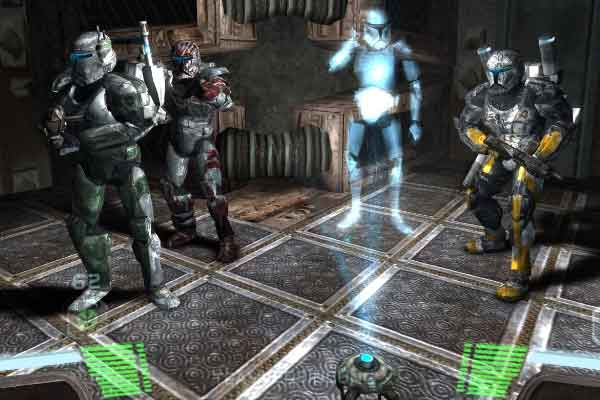
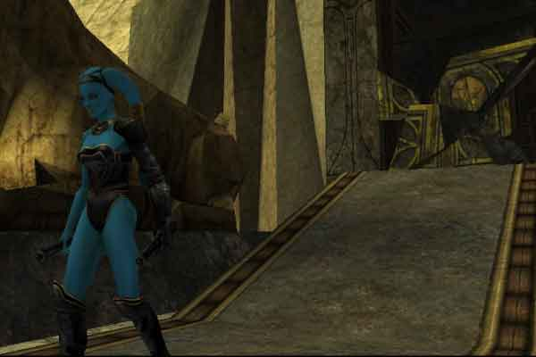
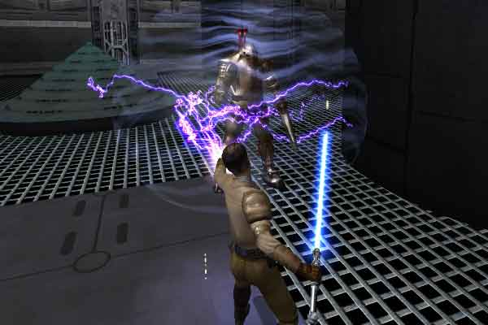
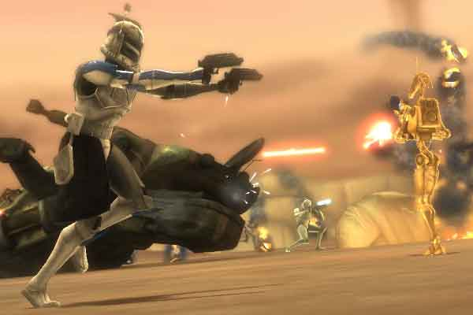
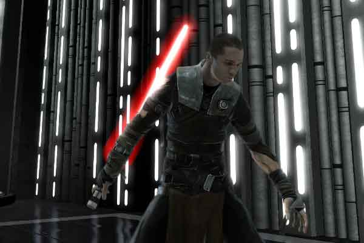

O **[Star Wars Day](https://pt.wikipedia.org/wiki/Dia_de_Star_Wars)** se aproxima e, como todo 4 de maio, fãs ao redor do mundo se preparam para celebrar a icônica saga criada por George Lucas. A data, celebrada pelo trocadilho em inglês "May the 4th be with you" (Que o 4 de maio esteja com você), transformou-se em uma verdadeira festividade para os fãs do universo de Star Wars. 

Para comemorar adequadamente o Star Wars Day, nada melhor que revisitar alguns dos **[games](https://tecextreme.com.br/categoria/games-jogos/)** mais importantes baseados na franquia. Este artigo apresenta cinco jogos essenciais que todo entusiasta deveria experimentar para celebrar esta data especial.

## Conteúdo do Post...

1. [Star Wars - Republic Commando](#star-wars-republic-commando)
2. [Star Wars Jedi Knight: Jedi Academy](#star-wars-jedi-knight-jedi-academy)
3. [Star Wars Jedi Knight II: Jedi Outcast](#star-wars-jedi-knight-ii-jedi-outcast)
4. [Star Wars: The Clone Wars](#star-wars-the-clone-wars)
5. [Star Wars: The Force Unleashed](#star-wars-the-force-unleashed)
6. [Conclusão](#conclusao)

## Star Wars - Republic Commando

Lançado em 2005, Republic Commando se destaca no universo dos jogos de Star Wars ao apresentar uma abordagem tática e realista. Diferentemente de outros títulos que focam nos jedis e na Força, este game coloca o jogador no comando de uma esquadra de elite de soldados clone durante as Guerras Clônicas.

O jogo se diferencia pela mecânica de trabalho em equipe e pela narrativa madura, mostrando um lado mais obscuro e militar da galáxia. A campanha acompanha o Esquadrão Delta em operações especiais, permitindo que o jogador emita comandos táticos enquanto lidera os companheiros de esquadrão.

Republic Commando é um jogo diferente dos demais da franquia Star Wars. Em vez de focar na luta entre jedis e siths, ele mostra a guerra das clones de um jeito único, o que faz dele uma boa opção para quem quer aproveitar o Star Wars Day de forma diferente.

## Star Wars Jedi Knight: Jedi Academy

Considerado um dos melhores jogos da série Jedi Knight, Jedi Academy tem como um dos seus grandes destaques o sistema de combate com sabre de luz, que na época, em 2003 (Ano de lançamento), era considerado muitíssimo avançado. No game, o usuário consegue criar e personalizar o próprio aprendiz Jedi e escolhe se o aprendiz criado, vai seguir o caminho do mal ou do bem. 

Para quem está comemorando o Star Wars Day, esse título é uma ótima pedida, especialmente para quem gosta de duelar com sabres de luz. Você pode escolher entre vários estilos de luta, usar dois sabres ao mesmo tempo ou até experimentar o famoso sabre duplo, igual ao do Darth Maul. Além disso, dá para criar o sabre de luz como o usuário quiser e personalizar o personagem também.

Outro ponto legal é que o jogo oferece liberdade na hora de completar missões e evoluir com os poderes da Força. Este jogo é uma excelente oportunidade de viver o universo de Star Wars neste dia tão especial para a franquia.

## Star Wars Jedi Knight II: Jedi Outcast

Antecessor de Jedi Academy, Jedi Outcast merece destaque próprio nesta lista de jogos para o Star Wars Day. O jogo acompanha Kyle Katarn, um personagem querido do antigo universo expandido, em sua jornada para reconectar-se com a Força após renunciar aos caminhos jedi.

O que faz de Jedi Outcast um jogo tão especial é que ele mistura muito bem o uso de armas de fogo com o combate usando sabre de luz. Isso dá ao jogador mais opções na hora de enfrentar inimigos, deixando a experiência mais dinâmica e divertida. A progressão do protagonista de mercenário armado a poderoso usuário da Força proporciona uma curva de aprendizado satisfatória que reflete o crescimento do personagem.

Durante as celebrações do Star Wars Day, revisitar este clássico permite apreciar uma narrativa complexa que explora os dilemas morais do universo Star Wars de forma madura e cativante.

## Star Wars: The Clone Wars

Baseado na aclamada série animada, Star Wars: The Clone Wars transporta os jogadores para as intensas batalhas do conflito que dividiu a galáxia. O jogo captura a essência da guerra em larga escala, permitindo controlar veículos icônicos como AT-TEs e speeders.

Para o Star Wars Day, esse título proporciona a chance de reviver eventos marcantes da era prequel, assumindo o controle de figuras icônicas como Anakin Skywalker, Obi-Wan Kenobi e Mace Windu em cenários detalhados e grandiosos.

O game se destaca pelo modo cooperativo, tornando-o uma excelente escolha para celebrar o Star Wars Day com amigos, recriando as grandes batalhas que ajudaram a definir esta era da galáxia muito, muito distante.

## Star Wars: The Force Unleashed

Concluindo nossa lista de jogos imperdíveis para o Star Wars Day, The Force Unleashed apresenta aos jogadores Starkiller, o aprendiz secreto de Darth Vader. Este título revolucionou a forma como os poderes da Força eram representados nos videogames, com física de destruição avançada e habilidades espetaculares.

O jogo explora o período entre os episódios III e IV, oferecendo uma narrativa que complementa a saga cinematográfica com eventos importantes que ajudaram a formar a Aliança Rebelde.

O game The Force Unleashed, deixa o usuário explorar o que tem que melhor no poder da força, o que torna o game uma escolha ideal para curtir no Star Wars Day. Os jogadores podem lançar inimigos longe usando a telecinese ou descarregar raios de energia capazes de abalar até os adversários mais fortes.

## Conclusão

O Star Wars Day representa uma oportunidade perfeita para redescobrir estes clássicos que ajudaram a expandir o universo da saga para além dos filmes. Cada um destes cinco jogos oferece uma perspectiva única sobre diferentes aspectos e eras da galáxia, proporcionando experiências variadas para todos os tipos de fãs.

Seja assumindo o papel de um soldado clone de elite, um padawan em treinamento ou o poderoso aprendiz de Vader, estes títulos permitem que o Star Wars Day seja celebrado de forma interativa e memorável. Ao explorar estes jogos, é possível aprofundar a conexão com o rico universo criado por George Lucas e entender por que, mesmo após tantas décadas, Star Wars continua a inspirar gerações de fãs.

Que a Força esteja com todos neste Star Wars Day!
